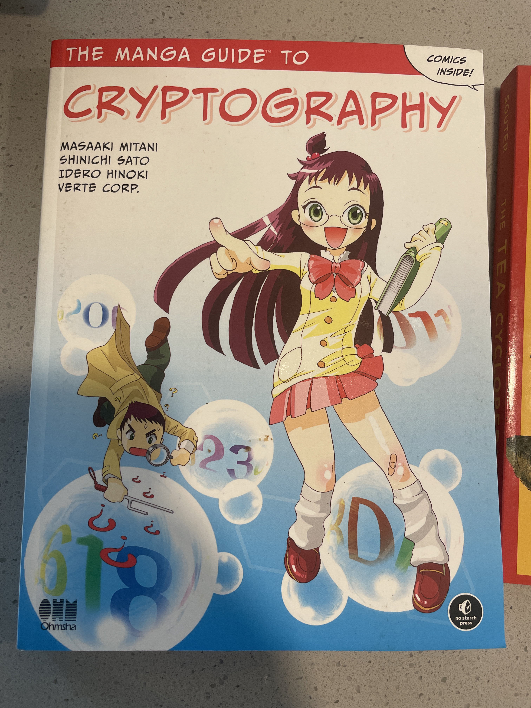
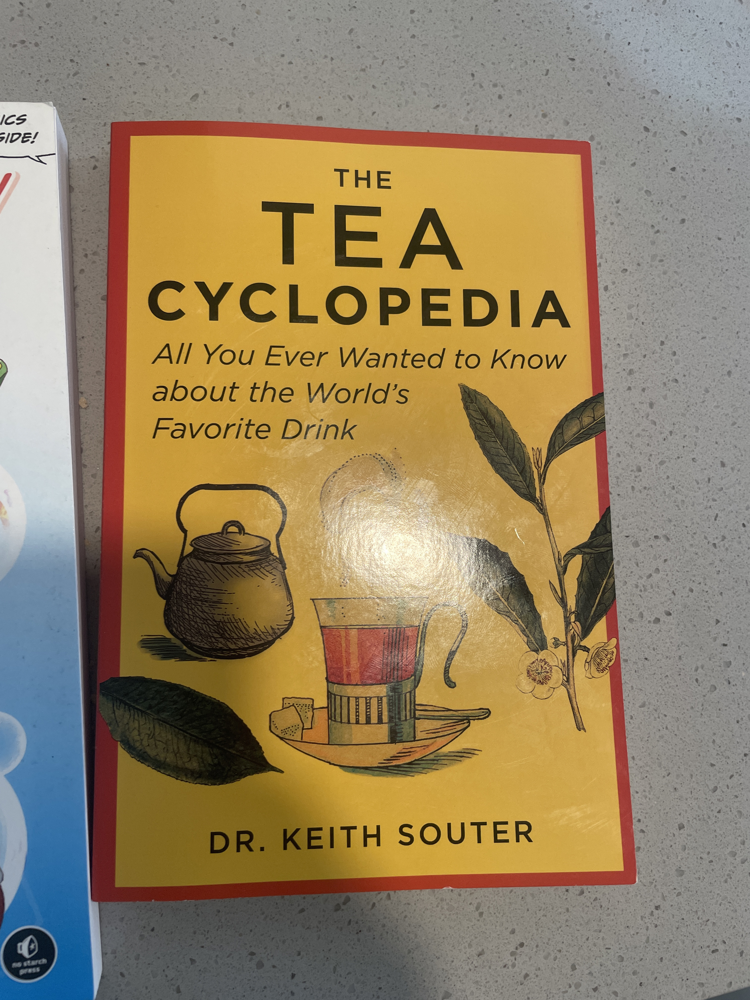
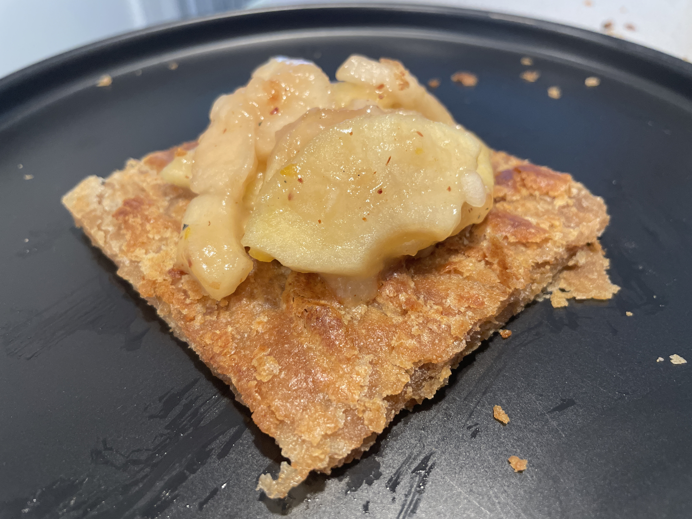
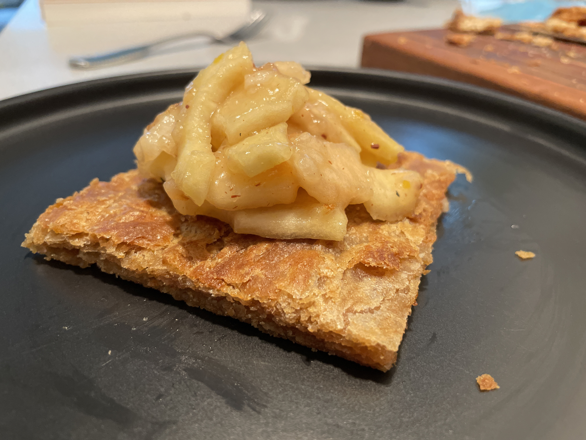

- #chalgen to prevent scanning of domains, you can make them look like: challenge.0Dho.ctfirl.com since that will only be discoverable if you know the random subdomain
- #chalgen it seems that
- #tea americas test kitchen tea video
- letterbox, good reads for movies
- beetle juice good movie #movies
- nope, jordan peele what am I supposed to say how is the movie I’ve been better #movies
- TODO improve description of website
	- what should I have right now you sound like a tech founder and slightly unreliable and if you frame it in a way that other people can relate to they might not be as weirded out when you first describe it
- {{query (or (todo todo) (todo doing))}}
  query-table:: true
- 
	- #randommic
- #bookstore Ada Technical book store
	- #food #coffee candied yam latte
- LATER figure out how bagels are made
  :LOGBOOK:
  CLOCK: [2022-11-06 Sun 12:53:33]--[2022-11-06 Sun 12:53:35] =>  00:00:02
  CLOCK: [2022-11-06 Sun 12:53:36]--[2022-11-06 Sun 12:53:42] =>  00:00:06
  :END:
- {{query (or (todo todo) (todo doing))}}
  query-table:: true
- Talk to Brad about PKM
- **13:06** [[quick capture]]:  {{video https://m.youtube.com/watch?v=1jPmnDZ6ab8}}
- **13:07** [[quick capture]]:  https://stallman.org/saint.html
- **13:08** [[quick capture]]: 
- 
- 
- #geoguesser https://m.youtube.com/c/RAINBOLTGEO
	- espotini grass
- #sogoodicouldpie   #pi^2
- #climbing #crazy https://m.youtube.com/watch?v=QE-nO2-czUY
- work on CTFg
	- got ory auth integrated
	- DONE refactoring schema to use uuids
	  :LOGBOOK:
	  CLOCK: [2022-11-06 Sun 19:10:13]--[2022-11-07 Mon 11:58:56] =>  16:48:43
	  :END:
	- DONE get graphql queries to work
- https://google.aip.dev/general