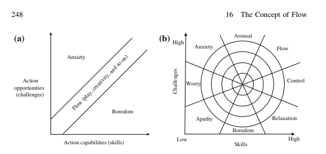

- browsers should support markdown rendering https://ipfs.io/ipfs/bafybeid7lt7snuzcvcmfqs5a5hlc5fmk3xmflz4hx2qa7c674vm3rpsdvm/why-we-should-have-markdown-rendered-websites.html
- divergent thinker starter kit
	- financial security
	- safety
	- food
	- drugs
	- jazz
	- sourdough baking
- #ctfirl #challenge https://discuss.secdim.com/t/technical-analysis-of-optus-api-security-challenge-three-must-to-have-api-security-controls/335
- http://www.hrenatoh.net/curso/nadigi/livro%20flow%20experience.pdf
- https://blog.trailofbits.com/2022/11/10/divergent-representations-variable-overflows-c-compiler/
- #ctfg 
- 9 to 5, 5 to 12
- https://tromzo.com/
- security engineer meeting
	- important ip
	- 100 to 1
	- no benchmarks
	- #owasp CDM https://owasp.org/www-project-cyber-defense-matrix/
	- helpful for people starting out in security
		- SOC
		- Healthcare
	- OSS security solutions are "good enough" for most security problems
	- the problem falls in governence
	- what should a good vuln management dashboard look like?
		- governence
		- dedupe
		- triage
		- compliance
		- supress
		- exceptions
	- PCI ASV https://www.pcisecuritystandards.org/assessors_and_solutions/become_asv/
	- project discovery https://projectdiscovery.io/#/
	- cast bishop fox https://bishopfox.com/platform
	- asset note https://assetnote.io/
	- detectify https://detectify.com/
	- ferraday
	- find the rhythm of the business
		- what actions do people expect to be able to perform on vulnerabilities?
	- manage the state machine for vulnerabilities
	- reduce context that someone needs to keep in their mind
	- bsides segment tracking risk
	- source of running results
	- orchestration of scans is not desirable
	- scans are different than reporting
	- coverage metrics
	- is the roll-out of a vulnerability management effort successful?
	- post triage queue
		- sla extensions
	- where do the vulnerabilities come from?
		- pentests
		- bug bounty
	- demonstrate how bug classes are killed
	- breadth vs depth of vulnerability remediation?
		- breadth -> high fidelity, high risk findings
	- oss rollout takes time
	- compliance requirements
		- sla document
		- soc2, how many criticals in a month
		- low sev tasks, compliance requirement time bombs
	- junior sec eng turns on tools, adds a bunch of vulns to backlog that sla document says needs to be resolved, compliance becomes annoying
	- jira and other comms programs _must_ be supported
		- comms have to be intuitive
	-
- what is a server #liveoverflow https://www.youtube.com/watch?v=VXmvM2QtuMU
- shotgun mic #microphones #streaming https://www.sweetwater.com/store/detail/AT875R--audio-technica-at875r-line-and-gradient-condenser-microphone
	- https://www.youtube.com/watch?time_continue=209&v=NgvS9vEgVrM&feature=emb_title
- https://www.keesafety.com/safety-railings/kee-klamp #standing-desk #setup
- #keyring #arch https://www.keesafety.com/safety-railings/kee-klamp