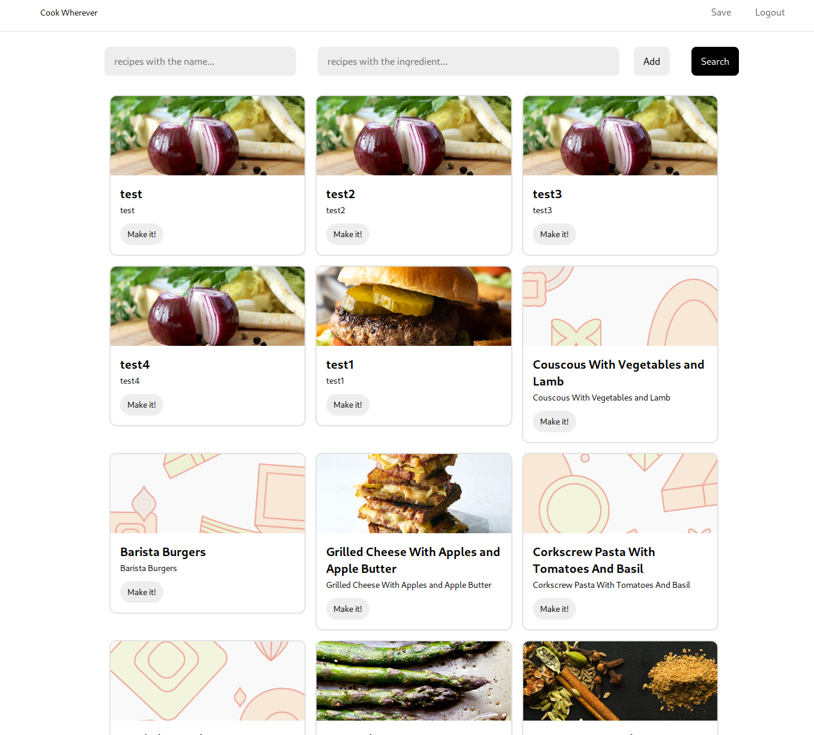
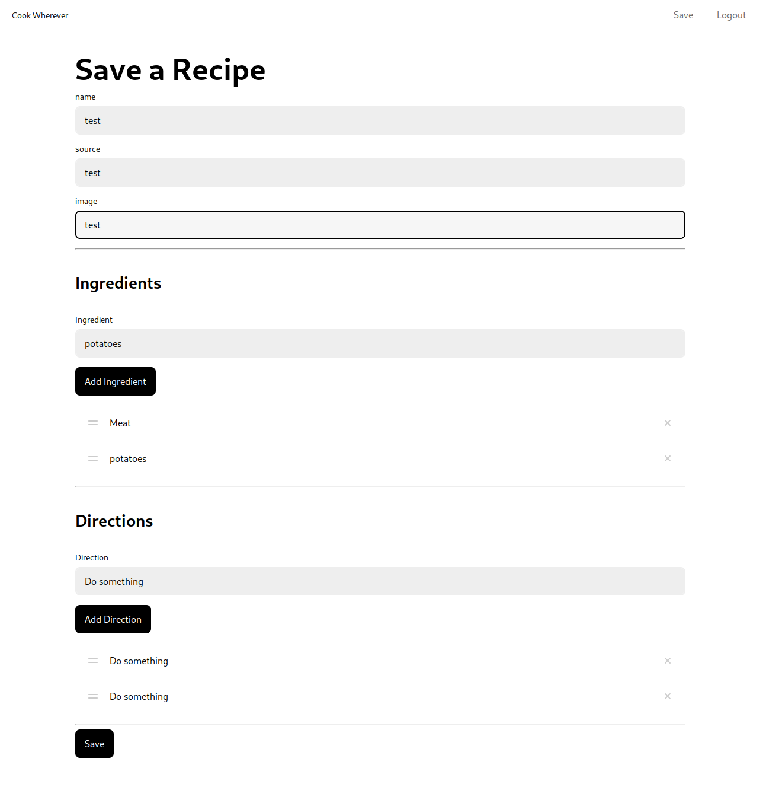

- example picture for web dev https://picsum.photos/
- https://blitzjs.com/docs/file-structure
- 
- 
- bacteria are not bad, they can be good
- [[lunasec/work]] fix first party code downloading
- https://blitzjs.com/docs/manifesto
- github to discord https://gist.github.com/SGTGunner/50d6a3cc0d489cf779f77695ba3e22ea
- [[communities/online]] https://orbit.love/blog/how-to-migrate-a-community-from-slack-to-discord
- https://crdt.tech/