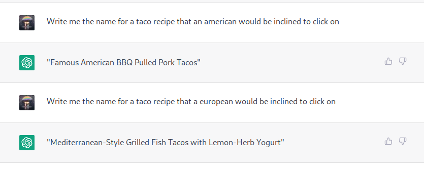

- 
- https://www.npmjs.com/package/react-player
- social media embed https://justinmahar.github.io/react-social-media-embed/?path=/story/embeds-facebookembed--main-example
- python ide https://thonny.org
- navigating through life it’s like building a good and bad list
- open source #chatgpt https://github.com/LAION-AI/Open-Assistant
- https://docs.arcan.tech/2.8.0/inspect_project/
- 
- local multiplayer games https://itch.io/games/platform-web/tag-co-op
- image magick vulns are still relevant? why? lol https://blog.doyensec.com/2023/01/10/imagemagick-security-policy-evaluator.html
- Create a new java app https://start.spring.io/ #java/bootstrap bootstrap new java repo
  id:: 63c89734-4b95-4e9a-b82f-237c79448c0f
- assetnote
	- riskiq
	- intrigue
	- cyber trail -> mandiant
	- recorded future
- all competitors have been bought up by bigger companies
- most customers are word of mouth
- cloudflare, every stage of the company is different, savor it
- different approaches to security, not considering risk
- nuclei
- gardner
- https://www.sidechef.com #cookwherever