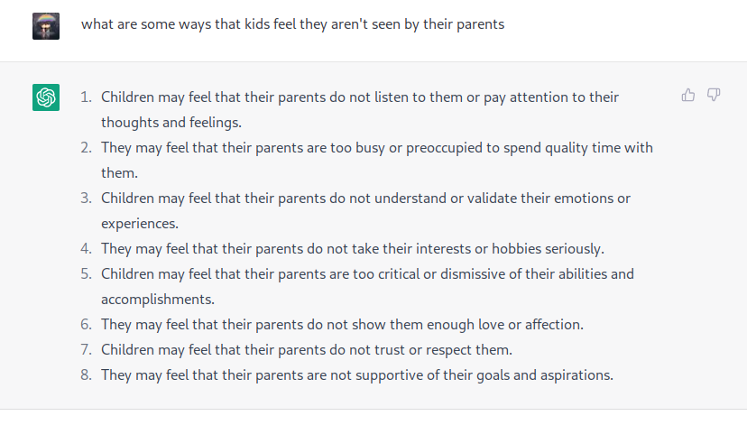
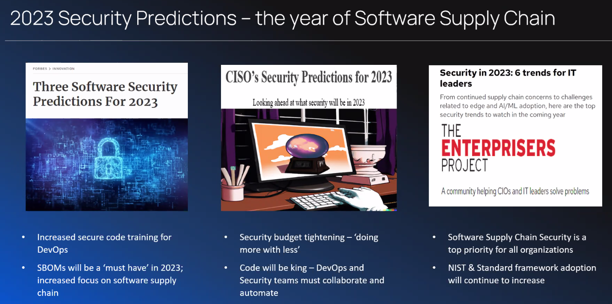
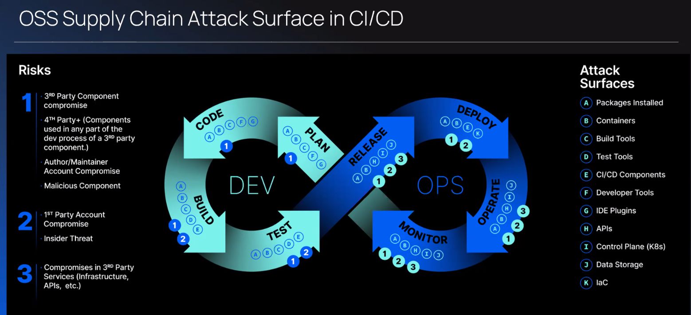
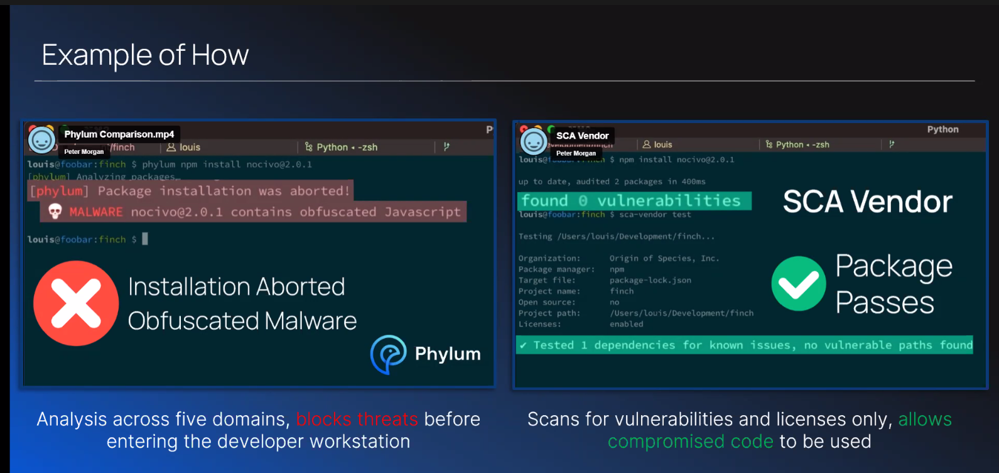
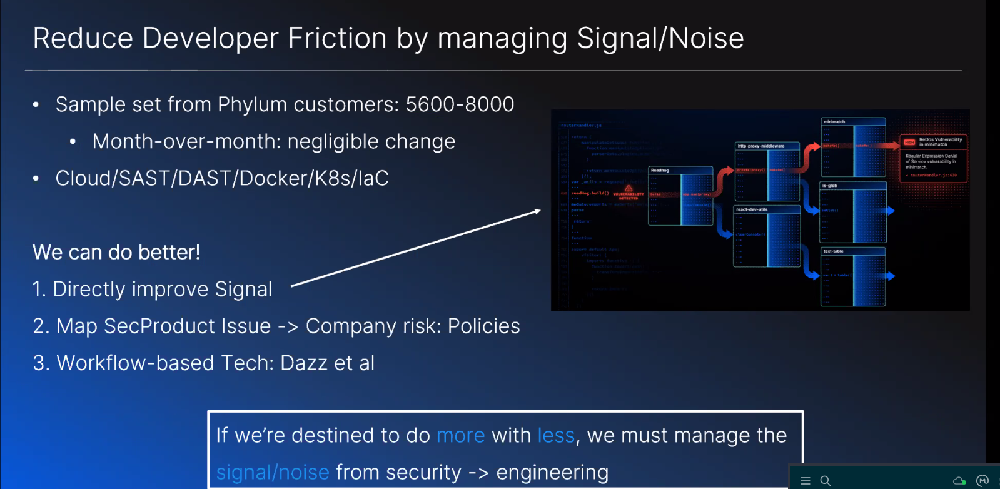

- https://github.com/RuntimeTools/appmetrics
- 
- vulnerabilities in 3rd party #javascript/libraries modules from hackerone https://hackerone.com/nodejs-ecosystem/hacktivity?filter=type:all
- https://snyk.docs.apiary.io/#reference/projects/project-dependency-graph/get-project-dependency-graph snyk api
- phylum software supply chain predictions
	- 
	- attack surface is huge
	- cannot control how open source software changes
	- 
	- ephemeral builds means less traceability/forensics
	- phylum npm install nocivo@2.0.1
	- 
	- 
	- https://www.dazz.io/ workflow for security response
	-