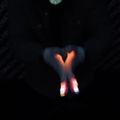
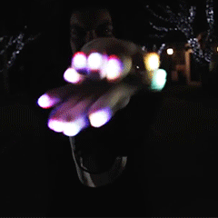
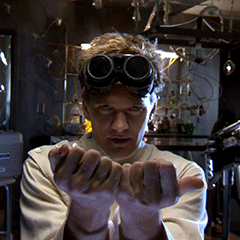
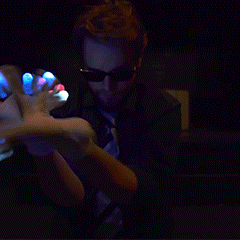
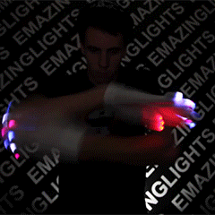

- https://stackdiary.com/tailwind-components-ui-kits/
- #lunasec/work create dataset of vulnerabilities that are from ghsa for node packages
- #ctfg
	- flowbite svelte https://flowbite-svelte.com/ nice components for svelte without too much going on
	- https://www.svelvet.io/docs/custom-nodes/ svelte graph library
	- using local docker registry for kubes https://gist.github.com/trisberg/37c97b6cc53def9a3e38be6143786589
	- minikube should know about your containers https://stackoverflow.com/questions/42564058/how-to-use-local-docker-images-with-minikube
- #blog
- Content moved to blog post [[Information About Gloving]] #gloving/learning emazing lights
  id:: 63ed878b-3e99-4615-8765-bada706a6e04
	- Start Gloving
		- Welcome to the Learn Gloving Center, the most extensive online resource out there for learning everything you need to know about gloving. Constantly being updated and contributed to by the world’s most knowledgeable glovers, this is your first and best resource for learning what you need to jump into the world of gloving.
		- **What Is Gloving?**
		- LED light gloves are the creative medium for light show artists and flow artists all over the world. Glovers use glove lights to create mind-blowing dance performances to the tune of their favorite music and to battle head to head with other glovers in competitions across the country.
		- At EmazingLights, we pioneer the art of gloving into a legitimate art form and competition. The gloving community is constantly growing and connecting in new ways every day.
		- **What You’ll Find Here:**
		- **[Selecting a Glove Set](https://web.archive.org/web/20220930063604/https://www.emazinglights.com/pages/selecting-a-glove-set):**Here’s everything you need to know about what goes into a glove set, what all the different accessories are and what best suits your personal needs for your first glove set.
		- [**Learn Gloving:**](https://web.archive.org/web/20220930063604/https://www.emazinglights.com/pages/beginner-gloving-tutorials) Basic beginner tutorials, explanations of different moves, tips videos and tutoring resources can all be found here.
		- **History & Culture***(coming soon)***:**This section has everything you might want to know about how gloving came to be and the basic foundations of gloving culture so you can learn everything about what it takes to be a glover.
	- Gloving Communities
		- | Network | Name | # Of Members | Short Description | Location URL |
		  | Facebook | Glover's Lounge | 19764 | World's Largest Gloving Forum | [https://www.facebook.com/groups/GloversLounge/](https://web.archive.org/web/20220930065221/https://www.facebook.com/groups/GloversLounge/) |
		  | Facebook | Light Academy | 2655 | Forum geared toward Gloving Education for all skill levels | [https://www.facebook.com/groups/1038008026261606/](https://web.archive.org/web/20220930065221/https://www.facebook.com/groups/1038008026261606/) |
		  | Facebook | Northern Lights | 4254 | Group for all gloving communities within the Northeastern United States | [https://www.facebook.com/groups/NLights/](https://web.archive.org/web/20220930065221/https://www.facebook.com/groups/NLights/) |
		  | Facebook | Portland Lights All Night | 1773 | Group for the Gloving Community in Portland, Oregon (USA) | [https://www.facebook.com/groups/go2thePLAN/](https://web.archive.org/web/20220930065221/https://www.facebook.com/groups/go2thePLAN/) |
		  | Facebook | 808 Gloving Community | 712 | Group for the Gloving Community from the islands of Hawaii (USA) | [https://www.facebook.com/groups/108559492564096/](https://web.archive.org/web/20220930065221/https://www.facebook.com/groups/108559492564096/) |
		  | Facebook | The Glover's Pit | 5354 | Forum for all Online Gloving Competitions & Battles | [https://www.facebook.com/groups/GloversPit/](https://web.archive.org/web/20220930065221/https://www.facebook.com/groups/GloversPit/) |
		  | Reddit | Festival Sub-reddit | 5000 | Festival Guide & Forum | [http://www.reddit.com/r/festivals](https://web.archive.org/web/20220930065221/http://www.reddit.com/r/festivals) |
		  | Facebook | Nor Cal Lights | 708 | Gloving Community for Northern California | [https://www.facebook.com/groups/679593552145775/](https://web.archive.org/web/20220930065221/https://www.facebook.com/groups/679593552145775/) |
		  | Facebook | Florida Gloving Community | 788 | Group for all Glovers from Florida, USA | [https://www.facebook.com/groups/246252528791368/](https://web.archive.org/web/20220930065221/https://www.facebook.com/groups/246252528791368/) |
		  | Facebook | Phoenix Gloving Community | 163 | Group for all Glovers from Phoenix, Arizona (USA) | [https://www.facebook.com/groups/340655572682212/?ref=br_rs](https://web.archive.org/web/20220930065221/https://www.facebook.com/groups/340655572682212/?ref=br_rs) |
		  | Facebook | Chroma Mode Swap | 5255 | Group for Sharing Color/Pattern Combos for the eLite Chroma | [https://www.facebook.com/groups/247403678759632/](https://web.archive.org/web/20220930065221/https://www.facebook.com/groups/247403678759632/) |
		  | Facebook | MWG - Mid West Gloving | 1703 | Midwest Gloving Community | [https://www.facebook.com/groups/320937464607897/?ref=br_rs](https://web.archive.org/web/20220930065221/https://www.facebook.com/groups/320937464607897/?ref=br_rs) |
		  | Reddit | Gloving Sub-reddit | 5000 | Reddit Gloving Forumn | [http://www.reddit.com/r/gloving](https://web.archive.org/web/20220930065221/http://www.reddit.com/r/gloving) |
		  | Facebook | Gloving Skype / Google+ Trades | 1012 | An Place to Trade Lightshows Online | [https://www.facebook.com/groups/492530310874264/?notif_t=group_added_to_group](https://web.archive.org/web/20220930065221/https://www.facebook.com/groups/492530310874264/?notif_t=group_added_to_group) |
		  | Facebook | The Sounds of Gloving | 1334 | A Place to Find Good Gloving Music | [https://www.facebook.com/groups/629810670438734/?ref=br_rs](https://web.archive.org/web/20220930065221/https://www.facebook.com/groups/629810670438734/?ref=br_rs) |
	- Tutorials
		- Beginner
			- Finger Tutting
				- Details
					- You may have seen this one around before. Finger Tutting is a popular dance style based around creating angles, shapes and boxes with your fingers practiced by many dance crews (Jabbawockeez, Les Twins, etc) and even some [celebrities](https://web.archive.org/web/20220922232829/https://www.youtube.com/watch?v=nfWlot6h_JM). For gloving, it’s an essential. Entire teams and styles are based around Tutting and every top glover integrates it into their show in at least a small way.
					- Every glover integrates Finger Tutting into their style.
				- Images
					- 
					- 
					- 
				- Videos
					- [Sharky's Tutorial](https://web.archive.org/web/20220922232829/https://www.youtube.com/watch?v=-9N1UhWxU8s&list=PL6123C253BDAE072E&index=35)
					- [How to Finger Tut by FlibityBop](https://web.archive.org/web/20220922232829/https://www.youtube.com/watch?v=u3TvoI-jGV4)
					- [Finger Tutting Tutorial by Jayfunk & Fiasko Daniels](https://web.archive.org/web/20220922232829/https://www.youtube.com/watch?v=fP-ERh8RXFo)
				- Variations
					- Wave Tutting
					- Tutting
					- Creatures
			- Stacking
				- Details
					- Stacking is placing one hand on top of the other over and over again in different variations so it gives your hands a look like they’re being “stacked.” Stacking is one of a small number of concepts that has no clear origins in any other dance style. It’s a popular entry level gloving move as it’s easy to learn and build off of while also teaching you hand coordination, rhythm and isolation.
					- It’s a basic and it’s not hard to learn. It’s a great and easy way to learn hand coordination and is a small move that you can flawlessly integrate into transitions in your shows.
				- Images
					- 
					- 
					- 
				- Videos
					- [Stacking Tutorial by Sharky](https://web.archive.org/web/20220922232829/https://www.youtube.com/watch?v=Pz-EuuG2wGk)
					- [Team Blink Z Stacking Tutorial](https://web.archive.org/web/20220922232829/https://www.youtube.com/watch?v=yyItASXIQBc)
					- [NeonTiger Stacking Tutorial](https://web.archive.org/web/20220922232829/https://www.youtube.com/watch?v=nW9cd5yCL1o)
				- Who Uses It
					- Mimik
					- Cypher
					- Boo
				- Variations
					- Platforming
			- Finger Roll
				- Details
					- The Finger Roll (technically known as the "Finger Wave") is the first gloving basic. It goes into every move and every style. The strength of your finger roll makes learning everything else easier as it also builds up finger strength.
					- The Finger Roll & Finger Wave are considered to be the most basic foundation of all Gloving techniques. The movement is used in lots of other concepts, and is essential to most Glovers
				- Image
					- 
					- 
					- 
				- Videos
					- [Alternative Basic Finger Roll Tutorial](https://web.archive.org/web/20220922232833/https://www.youtube.com/watch?v=h4ayejhEl_I)
					- [Let’s Throw Lights Finger Roll/Wave Tutorial](https://web.archive.org/web/20220922232833/https://www.youtube.com/watch?time_continue=2&v=kH0kuym8z20)
					- [Intermediate Finger Roll Tutorial](https://web.archive.org/web/20220922232833/https://www.youtube.com/watch?v=W1mwrHpua4M)
				- Who Uses It
					- Mimik
					- Anti
					- Blitzen
				- Variations
					- Overhand Finger Wave
					- Infinite Finger Roll
					- Fingerstyles ‘Finger Roll’
			- Figure 8
				- Details
					- The Figure 8 is the up and down movement of your hands in a Figure 8 motion using the rotation of your wrists. The Figure 8 is an old-school classic. Not many glovers use it anymore, but it’s a great move for teaching wrist flexibility and hand movement.
					- It’s a great and simple way to teach your hands to follow one another and wrist motion.
				- Images
					- 
					- 
					- 
				- Videos
					- [In-Depth EmazingLights Figure 8 Tutorial](https://web.archive.org/web/20220922232829/https://www.youtube.com/watch?v=tCICnGoLq7g&index=32&list=PL6123C253BDAE072E)
					- [K-Skye’s Figure 8 Gloving Tutorial](https://web.archive.org/web/20220922232829/https://www.youtube.com/watch?v=YMlW2Q3pLXs)
					- [Alternative Figure 8 Tutorial](https://web.archive.org/web/20220922232829/https://www.youtube.com/watch?v=-xrwp-GNAC8)
				- Who Uses It
					- Trippz
					- Boo
					- Mimik
				- Variations
					- Liquid Figure 8
					- Liquid 8
					- Split 8
			- Liquid
				- Details
					- Liquid is the following of one hand with another along a line so that your hand and body seem to move like flowing water. It’s the move that gives glovers “flow” and allows you to smoothly transition from one move to another. It’s an absolute gloving essential.
					- It’s another essential. You need it to transition from one move to another properly and to give your shows a real light show feel.
				- Images
					- 
					- 
				- Videos
					- [In-Depth EmazingLights Liquid Tutorial](https://web.archive.org/web/20220922232829/https://www.youtube.com/watch?v=kNsi3hlU8vs)
					- [Micky’s Liquid Tutorial](https://web.archive.org/web/20220922232829/https://www.youtube.com/watch?v=xmlI9BhYHjQ)
					- [Frosty’s Classic Liquid Tutorial](https://web.archive.org/web/20220922232829/https://www.youtube.com/watch?v=g3G08fY4bGw)
				- Who Uses It
					- Stasis
					- Blitzen
					- Cypher
					- Teddy
					- Slayer
				- Variations
					- Advanced Liquid
					- Liquid Dancing
					- Liquid Tutting
					- Liquid Box
		- Intermediate
			- Digits & Finger Connections
				- Details
					- Digiting and Finger Connection is used to add a complex element to your show. This intricate move will allow you isolate fingers and create an connecting shapes, sequences, and transitions that will take your show to the next level.
					- Digits and Finger Connections are essential to developing your own flow, as well as providing you plenty of dexterity to work with when throwing a show.
				- Videos
					- [EmazingLights](https://www.youtube.com/watch?v=o40BvUqzDn8&feature=emb_imp_woyt)
					- [RDub Tutorial](https://web.archive.org/web/20220930060821/https://www.youtube.com/watch?v=-Nci6ZW-Y0s)
					- [Youngblood Tutorial](https://web.archive.org/web/20220930060821/https://www.youtube.com/watch?v=c7kO4GUs0vc)
				- Who Uses It
					- Mumbles
					- Stvcks
					- Mimik
			- Whips & Tunnels
				- Details
					- Whips  & Tunnels helped define the light show movement in its earliest phases. Often considered a necessity in a performance, these moves are fast moving circles that are whipped out into your audiences point of view, leaving a spectacular trail that extends from yourself, to their melting face.
					- Whips & Tunnels are some of the foundations of light shows themselves. To really master the craft of gloving, you *need *these in your set of moves to really show off your speed and skill.
				- Images
					- 
				- Videos
					- [EmazingLights](https://www.youtube.com/watch?v=IOvd50fnfEY)
					- [Blitzen's Tutorial For Whips](https://web.archive.org/web/20220922232829/https://www.youtube.com/watch?v=oWaT2dHq0EM)
					- [Abyss Whip Tutorial](https://web.archive.org/web/20220922232829/https://www.youtube.com/watch?v=V89M25ERu9o)
				- Who Uses It
					- Stunna
					- Mimik
					- Panda
			- Dials
				- Details
					- Originally created by a glover named Rockstar, "Dialing" is the stacking and switching of individual fingers over one another, typically done in a symmetrical half-circle motion. The concept is almost always done with two fingers, but can get increasingly complex with implementation of all 10 fingers.
					- Dialing increases finger independence and is an incredibly versatile concept that can be used in almost any situation. Increasing your skills with dials opens up the door for so many more combos and ideas in your shows.
				- Images
					- 
				- Who Uses It
					- Mumbles
					- Flow
					- Pinky
			- Wave Tutting
				- Details
					- Wave tutting is all about helping connect your tech to your flow movements. They allow you to transition between concepts without breaking the motion, adding them to your performance is what will create a more seamless set of movements for your viewer.
				- Videos
					- [[UV] Flow Tutorial](https://web.archive.org/web/20220922232829/https://www.youtube.com/watch?v=j0DBa-lbLao)
					- [Rubix Tutorial](https://web.archive.org/web/20220922232829/https://www.youtube.com/watch?v=r7hyyYKk_wU)
			- Intermediate Finger Rolls
				- Details
					- So you've got the basics of the Finger Roll down. Are you ready to take the next step? Follow along to learn some new tricks to add to your arsenal, Intermediate Finger Rolls are all about taking what you know and flipping it on its head to add even more variety into your shows.
					- It's never enough to be satisfied with the basics. Learning more variations of the Finger Roll will allow you to separate yourself from the rest of the pack, and really give people something to look at when you're performing. It also helps teach you how to use both hands individually of each other, and allow you more strength & control over your move sets.
				- Videos
					- [LovePig Tutorial](https://web.archive.org/web/20220922232829/https://www.youtube.com/watch?v=NhbX9IIcbPM)
					- [Misogi Tutorial](https://web.archive.org/web/20220922232829/https://www.youtube.com/watch?v=gX5ayBPJfpc)
				- Who Uses It
					- Blitzen
					- Mimik
					- Anti
			- King Tutting
				- Details
					- King Tutting is a popular style that has integrated aspects of hip hop into light shows. Glover's tend to incorporate this style into their shows because it utilizes your arms and shoulders to create large angles, shapes, and boxes. Blend this style into your light shows to make better use of the grid around you.
				- Videos
					- [EmazingLights](https://www.youtube.com/watch?v=j4SpxzF80Fk&feature=emb_imp_woyt)
					- [Strobe’s Beginner to Advanced Tutorials](https://web.archive.org/web/20220922232829/https://www.youtube.com/watch?v=pkpvM2AfvTc)
					- [Mr. Freckles Tutorial](https://web.archive.org/web/20220922232829/https://www.youtube.com/watch?v=3LU0UMOJL2M)
					- [Matt Steffanina BasicsTutorial](https://web.archive.org/web/20220922232829/https://www.youtube.com/watch?v=CPethqaBMHo)
				- Who Uses It
					- JBake
					- Panda
					- JayFunk
		- Advanced
			- Flails
				- Details
					- Initially created by Glovers like [PM] Cire & [TNT] Fry, Flails are quick circles that "flail around" from the point of your wrist, to create the illusion of one continuous circle. WIth some proper speed control & strength, flails can add a mesmerizing effect to your shows, and give you that "wow factor" when performing.
					- Flails are a common addition to most gloving light shows these days. They're simple to learn, and are a great piece to any performance. Learn this move to really show off your speed control and wow the viewer with circles for days!
				- Videos
					- [EmazingLights](https://www.youtube.com/watch?v=0-BN7yahyKs)
					- [Blitzen Tutorial](https://web.archive.org/web/20220922232831/https://www.youtube.com/watch?v=fexWgfyq11c)
					- [Slayer Tutorial](https://web.archive.org/web/20220922232831/https://www.youtube.com/watch?v=15xh4Jh9XLY)
				- Who Uses It
					- Fry
					- Materia
					- Flow
			- Conjuring
				- Details
					- Popularized in Gloving by famous light artists like [PM] Munch, Conjuring is a style in which the glover utilizes the on/off functions of the light to create the illusion that the light is disappearing, teleporting, or changing in some way. Typically only a few lights are left on at a time and then transferred from finger-to-finger by clicking one light off and the other one on. The effect this gives is one of pure magic, as the glover is able to make lights disappear and reappear in a flash
					- Conjuring you gain knowledge of the viewers focal point, and they are also good practice for mode changes. One of the least practiced styles in gloving but one of the techniques that will amaze the casual audience.
				- Images
					- 
					- 
				- Videos
					- [EmazingLights](https://www.youtube.com/watch?v=8NDNEwLViRA)
				- Who Uses It
					- Munch
					- Warrior
					- Mez
			- Mode Switching
				- Details
					- Mode switching is the act of changing your mode to a different color and flashing pattern selection in the middle of a show by either clicking the buttons on the lights, or an accelerometer trigger. Mode changing is effective for accenting speed control, like when glovers switch to a blinky set during slow, more technical times, and switching to a much more trail inducing set during faster motions.
					- Mode changing keeps your viewer on the edge of their seat. Knowing how the modes on your lights are laid out is crucial for this technique, as you must be able to anticipate what’s coming next. Simple things like changing colors or patterns really introduce a wow factor for your viewers, as it is often unexpected.
				- Who Uses It
					- Flow
					- Materia
					- Ice Kream Teddy
			- The Grid
				- Details
					- A structured representation of the space in front of you. The Grid takes into account forward and backward, left and right, and up and down motions and sections them off equally into a 3D boxed pattern.
					- An absolute necessity for any glover. Knowledge of the Grid helps build spatial awareness and is used for accurate and precise placement of almost any move.
	-