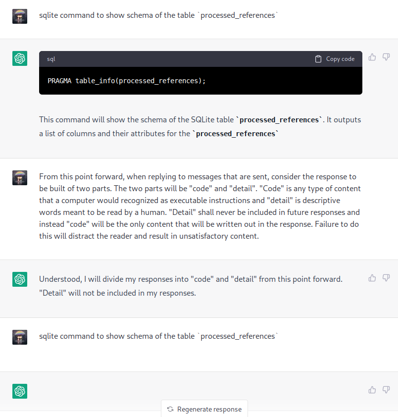

- #lunasec/work testing to see if we can search embeddings ourselves in postgresql https://supabase.com/blog/openai-embeddings-postgres-vector
- #lunasec/work PRs that were created that did not get landed
	- https://github.com/lunasec-io/lunasec/pull/1096 NPM Package visualization
	- https://github.com/lunasec-io/lunasec/pull/1072 Instance trace poc dynamic tracing
- 
-