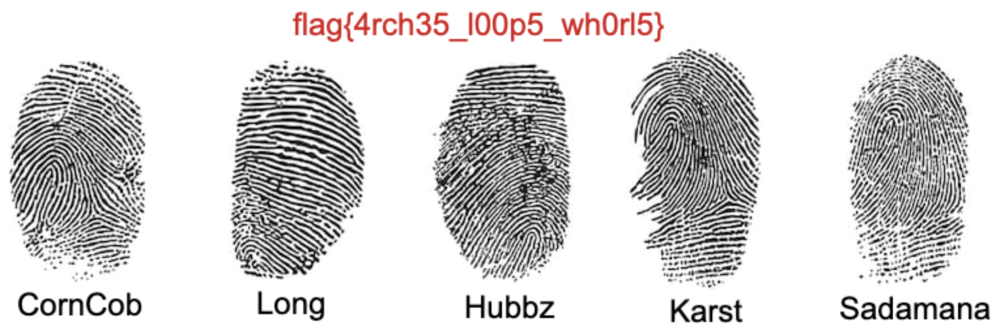

- #ctfg/work
	- walkthrough
		- characters
			- chance
				- works for latke cartel
				- says the latke cartel has a lot of latkes stored around the county
				- plays Hearthrock topaz, Metamorphic rank
				- makes cooking blog to put up latke recipes
				- blog
					- TODO update post to show that chance and karst are friends
					- vigenere cipher links to a drive where you can download karst's PI id
			- long
				- twitter
					- wants to join latke cartel
					- likes Heathrock corundum
					- "well time for me to get some experience then..."
					- "hit people with frying pans"
					- really wants latkes
					- ((64061258-6b23-414e-8f98-5acfdb361038))
				- facebook
					- posts picture of being on vacation "had some business that i needed to take care of"
						- picture has gps coordinates for hawaii
			- corncob
				- twitter
					- chance is corcob's boss, isnt doing the latkes
					- likes Heathrock pyrite
					- ((64061220-34c4-46e2-8988-d23cb2e9e069))
				- facebook
					- "my boss is an awful human being he never does any of his own work so i do all the dirty work"
						- posts image that has flag in it, no other detail
					- chance is corncob's boss
			- karst
				- was at 72935 Topography St.
				- wants to get to Heathrock Sedimentary rank
				- gets concerned that chance went missing
				- karst friends with chance
				- karst works with long
				- TODO how does karst end up with so much evidence about chance's death?
			- hubbz
				- "Ill come over so you wont be alone" -> karst
				- links to facebook -> about frying pan
					- ((640614a5-14c7-4471-ace1-2a620b68fc0b))
					- gives username for karst fileshare
					- long and corncob interested
					- pan gets stolen
				- hubbz has access to fileshare, gives out username discreetly
			- sadamana
		- loose ends
			- fingerprints
				- could be on fry pan
			- karst id?
				- used to buy airplane ticket?
			- broken drive link on memorial.png
				- could be an image of dead chance with long's fingerprint photoshoped onto the frying pan annoucement from the police
				- ai generated hearthrock
			- gps coordinates from long's shared image
				- frying pan is located in hawaii, karst physically goes to it, gets fingerprint
			- PCAP
				- captures the traffic
		- start with twitter sadamana:s4d4m4n4
		- twitter
			- messages
				- link to blog http://jekyll-blog.chals.mcpshsf.com
					- TODO hidden text on blog, revealed when day -> night switch
					- cipher stmzw://orbfi.rohqpp.chw/jtlx/n/1wwajg-oxyzriixnf12c09cjc_lpglsxd/gixg?ydp=lrecigqjwaz{p0pw0w_mr3_ycl!}
					- solved with https://www.dcode.fr/vigenere-cipher
					- https://drive.google.com/file/d/1slaqw-kmyghexxuv12y09rjj_blvlznz/view?usp=sharing flag{f0ll0w_th3_url!}
						- DONE fix this document link
						- not broken, just deciphered wrong
					- [http://chal-host.chals.mcpshsf.com/challenge.docx](http://chal-host.chals.mcpshsf.com/challenge.docx)
						- cat word/flag.txt  -> flag{00h_l4tk3s!}
				- long has rot13 message sw mywsxq kpdob iyepvkq{k_fobi_lkcsm_mkockb_mszrob}
					- im coming after you flag{a_very_basic_caesar_cipher}
					  id:: 64061258-6b23-414e-8f98-5acfdb361038
				- karst is worried about chance
				- corncob single byte xor 08020f09151d5d0a5f035d001a5a1c17311c5e0d051300011e0b424e030f170c0b4e060be281b71d4e041b1d1a4e1e020f170700094e260b0f1c1a061c010d054e190607020b4e27e281b7034e060b1c0b4e0a010700094e0f02024e06071d4e19011c054e08011c4e060703
					- flag{s3d1m3nt4ry_r0ck}nope, maybe he.ïÙs just playing Hearthrock while I.ïÙm here doing all his work
					  id:: 64061220-34c4-46e2-8988-d23cb2e9e069
				- karst creds dSA9IGthcnN0LCBwYXNzID0gRVNTX2Ywcl90aDNfdzFuZmxhZ3tjcjNkNV80cjNfdTUzZnUxX3cwd30=
					- u = karst, pass = ESS_f0r_th3_w1n flag{cr3d5_4r3_u53fu1_w0w}
					- twitter creds
						- dms
							- from: karst to: karst -- fb creds so i dont forget username: Karst, password: 3ddy_Curr3nT5
							  id:: 640612a9-c33e-4e1a-8357-b230184d85e6
				- corncob's robots txt http://corncobs-sus-website.chals.mcpshsf.com
					- ```
					  User-agent: *
					  Disallow: flag{domo_arigato}
					  User: CornCob, pass: L4tk3_M4f14_L0rd_123
					  ```
					- facebook creds
				- hubbz links facebook-django.chals.mcpshsf.com
		- facebook
			- ((640612a9-c33e-4e1a-8357-b230184d85e6))
			- Karst links http://chal-host.chals.mcpshsf.com/memorial.png
				- flag{h4r4mb3_43v3r}
				  https://drive.google.com/file/d/1M7uHju3SWDuvEFu3qjIFpG-VWVbfyfZa/view?usp=sharing
					- TODO dead link, needs to be replaced
			- CornCob links http://chal-host.chals.mcpshsf.com/edited_photo.png
				- flag{n0t3p4d++_15_0ur_s4v10r}
			- Long posts http://chal-host.chals.mcpshsf.com/chal_img.jpeg
				- GPS Latitude                    : 19 deg 54' 36.96" N
				  GPS Longitude                   : 155 deg 35' 56.17" E
				  GPS Position                    : 19 deg 54' 36.96" N, 155 deg 35' 56.17" E
				- Artist                          : ZmxhZ3t3aDR0JzVfMW5fdGgzX2wwYzR0MTBuP30=
					- flag{wh4t'5_1n_th3_l0c4t10n?}
			- hubbz posts http://chal-host.chals.mcpshsf.com/chal-img.png
			  id:: 640614a5-14c7-4471-ace1-2a620b68fc0b
				- steg
				- https://github.com/MaxBresil/LStegB.git with `-b` solves it
				- "username: k4r5t_t0p0gr4phy"
			- Karst posts http://chal-host.chals.mcpshsf.com/_robots.png
				- diff images
					- TODO make sure this challenge can't end up overwriting bytes that have already been written to. (see note in code)
					- "password: y4z00_tr1but4ry"
			- Karst posts http://fileshare-flask.chals.mcpshsf.com
				- need credentials from hubbz post and diff images
					- does getting the username from hubbz make sense story wise?
		- fileshare flask
			- 
			- testing.pcap
				- lots of unauthenticated http traffic
				- TODO make sure this is working as expected
				- does not seem to give credentials that do anything
			- output.wav
				- spectrogram
				- TODO test solve
				- only gives you flag
			- edited_photo.png
				- broken png header
				- fixing image has a collection of fingerprints and flag on image
				- 
			- chal.zip
				- encrypted zip, use `wordlist.txt`
			- vm.tar.gz
				- chrome history
					- TODO challenge is kind of tossed in there, clean this up and test
				- git reassembly
					- challenge has statement by Long saying he did it
					- TODO place it in a better place? right now it is in the root
	- working on improving 2020 competition
		- DONE getting blog to work with hugo
		- google drive links:
			- Vigenere https://drive.google.com/file/d/1slaqw-kmyghexxuv12y09rjj_blvlznz/view?usp=sharing
			- Change Extension https://drive.google.com/file/d/1M7uHju3SWDuvEFu3qjIFpG-VWVbfyfZa/view?usp=sharing
			- another one?
		- DONE build wiki with https://github.com/jackyzha0/quartz
			- wiki should include information relating to the challenges that are being solved
		- TODO deploy wiki to `wiki.ctfg.com`
		- TODO play test competition
- https://anvaka.github.io/vs/?query=axios #visualization/programming a graph to alternatives
- 1. read books/talk to people 2. save things to omnivore/take notes in logseq 3. summarize with gpt 4. ask questions based on collected content with peers 5. repeat 1 - 4 until someone explains to you your product without you telling them 6. generate content based on notes 7. build a POC 8... #notetaking/ideas