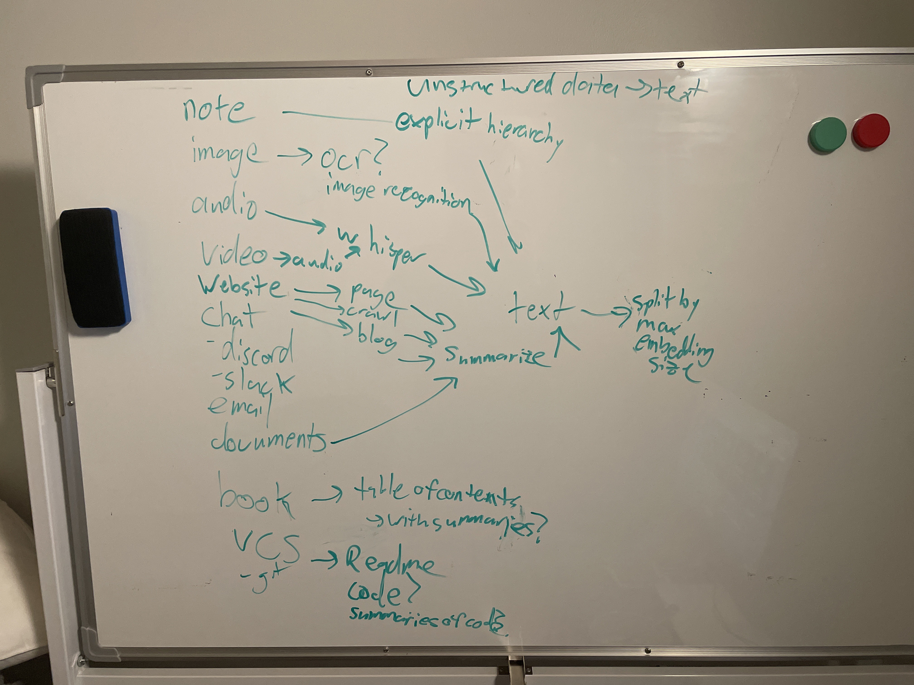
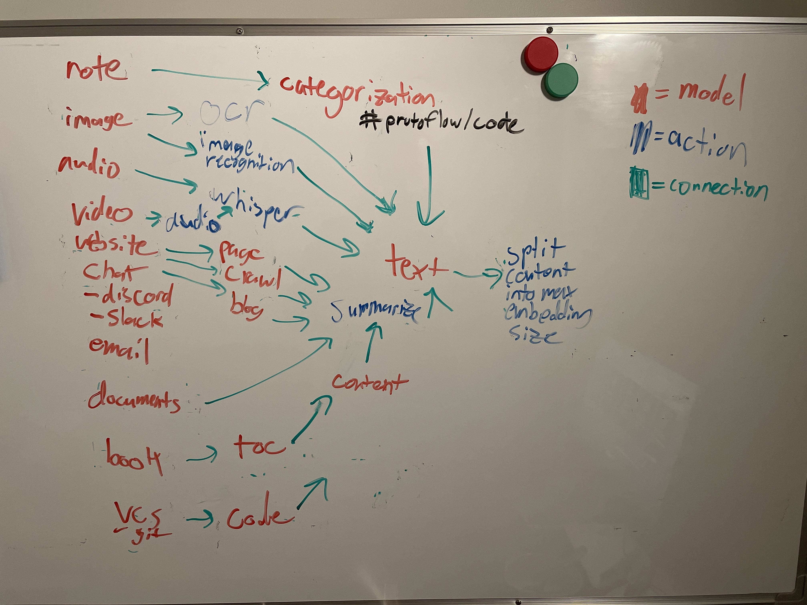
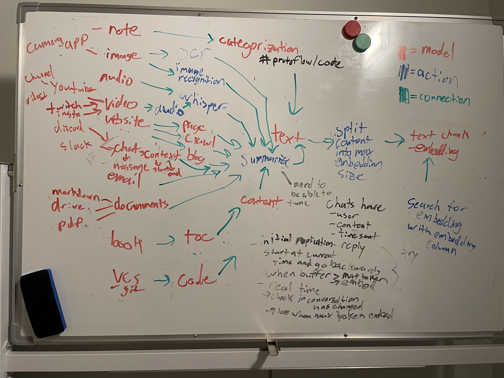

- want to see GPT-4 dealing with this situation: #protoflow
	- they: we need a new basic POST endpoint
	- us: cool, what does the api contract look like? URL? Query params? Payload? Response? Status code?
	- they: Not sure. Third-party company XXQ will let you know the details. They will be the ones calling this new endpoint. But in essence it should be very simple: just grab whatever they pass and save it in our db
	- us: ok, cool. Let me get in contact with them
	- ... one week later...
	- company XXQ: we got this contract here: <contract_json>
	- us: thanks! We'll work on this
	- ... 2 days later...
	- us: umm, there's something not specified in <contract_json>. What about this part here that says that...
	- ... 2 days later...
	- company XXQ: ah sure, sorry we missed that part. It's like this...
	- ...and so on...
	  
	  Basically, 99% of the effort is NOT WRITING CODE. It's all about communication with people, and problem solving. If we use GPT-X in our company, it will help us with 1% of our workload. So, I couldn't care less about it.
- take a picture of the whiteboard and with different colored markers ocr the channel this way you can turn a whiteboard into structured data each color would represent a different type of thing which can be configurable #protoflow/ideas
	- 
	- 
	- 
-