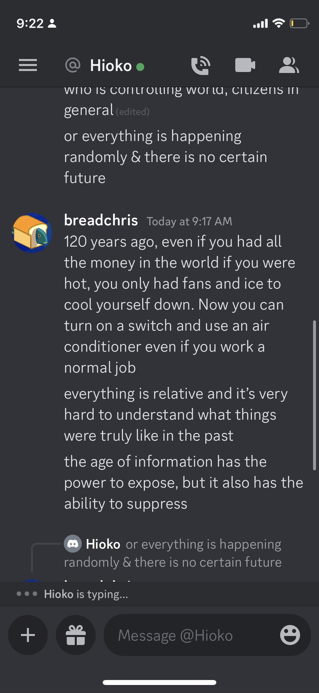
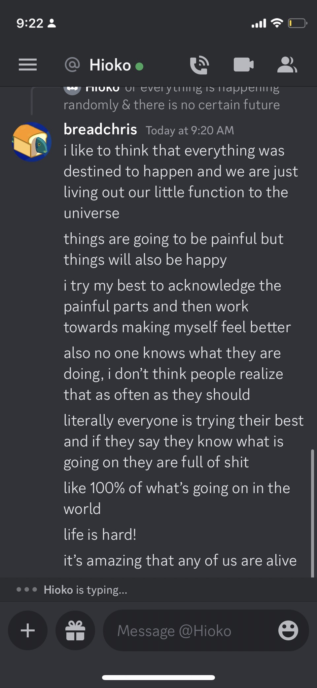

- 
- 
- #phs/alumni
	- open collective
	- form to share around
	- shared drive
- https://huggingface.co/blog/getting-started-with-embeddings #ml/search
	- https://gpt-index.readthedocs.io/en/latest/guides/usage_pattern.html#optional-save-the-index-for-future-use saving llama indexes
- #cookwherever/recipes https://everydaypie.com/oat-and-buckwheat-chocolate-chip-cookies/
- 
- 
- 
- 
- test
- asdf
- You have to see this
- asfk
- add
- 
	- [00:00.000 --> 00:06.880]  I just set up sync thing to sync between my desktop and my phone and it works
	  [00:06.880 --> 00:36.720]  pretty well. It seems to work faster than how LogSek works for syncing.
- #notetaking talk as you do normally and store it in logseq, logseq gets synced to laptop, audio files are processed and audio is written to logseq
- 
-
- 
- #ctfg/opencollective
	- CTFg is a platform for people to play and experiment with building their own cyber security competitions.
	- Over the past 7 years, a cyber security competition has been held at Montgomery College in Montgomery County, Maryland. Every year, 200 students from around the county are able to compete against each other attempting to solve an NCIS-style cyber security competition. Unlike most cyber competitions, a diverse set of skills is required to compete. Competitors are not just assessed on their ability to solve challenges, but to also document their findings and draw their own conclusions about who committed the crime. This already unique experience is made magical when physical evidence is incorporated into the challenge. 
	  
	  Funding for this project will go towards the high schoolers who have been working on the platform. Internship positions will be made available for students to acquire job experience.
- clone a website https://github.com/imthaghost/goclone
- #sifty/ideas use llama index to pull down repo and search documentation
- https://github.com/deepset-ai/haystack #ml/search