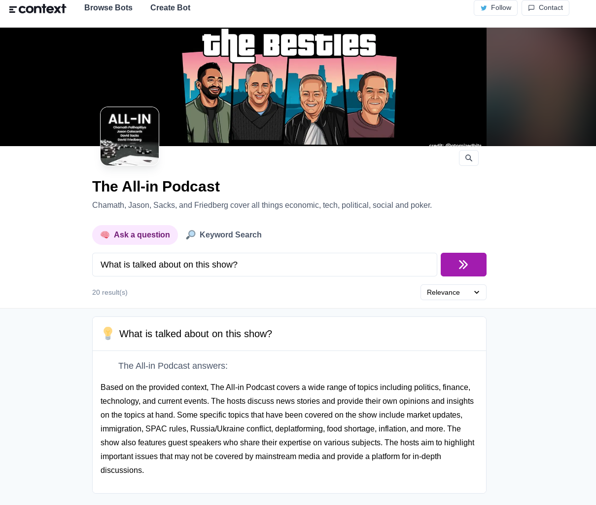

- #web/svelte/libraries narration https://github.com/stevenwaterman/narration.studio some nice code for recording and transcribing
- #ml/deploy 
  **10:07** [[quick capture]]:  https://github.com/replicate/cog a tool for bundling ml models into docker containers and setting up a prediction server
- #lunabrain/work Schema
	- trying to think about how to represent a generic interface to save different types of data
- #lunabrain/scrape https://github.com/SpecializedGeneralist/whatsnew/tree/main infrastructure for scraping and normalizing data from urls
- risk recon https://securityscorecard.com/ #lunasec/work
- https://leanpub.com/langchain #ml/learn
- #golang/libraries/ideas https://github.com/google/wire/issues/207 fix go wire's handling of multiple provides of the same type
	- they should probably end up in a slice
- #lunabrain/work Repo tool that detects what language/frameworks you are using and then
	- creates prompts that you can use easily
	- ingests documentation to let you search it easily
- #js/libraries https://remix.run/docs/en/1.14.3 a lot of nice defaults
- #ml/search Automatic documentation https://github.com/context-labs/autodoc
- #ml/search 
	- I like that you can "Ask a question" or do a "keyword" search
- #ml/bert https://tfhub.dev/google/collections/experts/bert/1 different types of BERT models
- #ml/search Algolia is smart enough to figure out a hierarchy on a page, you should be able to use this to summarize the content under it
	- maybe we should start with blog post looking content? and use goose and then markdown parser?
	- need to try to extract table of contents from a page
- #ml/search Tools linked by Hioko
	- https://github.com/BlinkDL/RWKV-LM
	- https://github.com/GerevAI/gerev