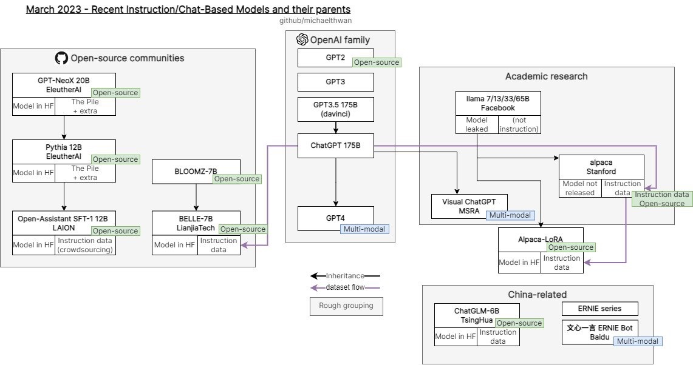

- https://github.com/facebookresearch/faiss #ml/search vector
- https://yunohost.org/#/ #hosting an operating system for shared hosting for a
- ((641befd2-c59b-42ff-94eb-686262cea43c))
	- tried playing with this, but it was pretty difficult to figure out how it works. Things don't really "snap" together"
-  #ml/technology
	- open source communities that relate to ML
	- China has its own thing going on.
- #ml/interviews #wolfram https://www.youtube.com/watch?v=z5WZhCBRDpU
	- "What did we miss?"
- #blogs https://writings.stephenwolfram.com/ Dude is a legend, damn
- #reading
- #video/editing Descript alternatives
	- https://reduct.video/
	- https://www.typestudio.co/
- #js/libraries #svelte https://github.com/jiangfengming/svelte-pilot
	- svelte router
- #notetaking/ideas Write a question and store the information underneath
	- jeopardy
- #life/sayings do something with writing write something worth reading
	- Don’t boil the ocean
- #blogs Blogs to send Sparrow
	- https://www.blog.deploy-securely.com
		- A great blog talking about how security and risk management play out at companies
	- https://mtlynch.io/retrospectives/2023/03/
		- A blog talking about the authors company and how he has been able to build it out. As someone who is goal oriented this is a perfect blog to reason about how do you build a business
	- https://dave.cheney.net
		- A main contributor to go. This is a technical blog that does a great job at explaining technical information
	- https://go.dev/blog/generate
		- of course, anything written by Rob Pike is going to be a great read as well
	- https://sive.rs
		- A very good “performer” with writing. The way that this author writes is very poetic, but not trying to sound pretentious. In other words, very “accessible” information.
	- https://www.khanacademy.org
		- if you want to learn how to teach, you should watch videos that Sal has made. The way that he communicates and build small ideas into larger ones is something that I wish more people knew how to do. Pay attention to the way that he talks. It sounds very conversational and he makes you feel like you’re talking to someone that’s in the room”
	- https://www.lunasec.io/docs/blog/
		- honestly our blog is written pretty well. I feel like we spend a lot of energy to make sure our blog posts will be understood by people. Being able to target what audience you are trying to capture is incredibly important. I thought we did our best trying to have our message hit with angry security engineers.
- I currently have milk, heavy, whipping, cream, butter, milk, orange juice, ketchup, sour cream, yeast, mayo, Caesar dressing, Dijon mustard, two tubs of cream cheese I wanted to make a cheesecake so one of them should be for cheesecake. I have heavy, whipping cream, garlic, chili sauce, which I really like. I think everyone should get that I have eggs probably need more eggs cheese, strawberries two packs I want to make a strawberry rhubarb pie. I have two Ellenos yogurt I want to start a new yogurt thing using those starters I have red cherry tomatoes, which I like to just grab a snack on. I have two bags of carrots because I think they’re two bags bag of carrots celery  shiitake mushrooms parsley beats I want to cook with beets. It Is are also good forever so I like I just having them around. I have begin the Oscar Meyer missing OK I have a smoked salmon because I want to make bagels that also I got the cream cheese, so I wanna make bagels. I want steak strips I will I have steak strips I have cranberries cheddar cheese  turkey breast Parmesan brie think that’s a New Bree through the old one feta cheese and some nice saw me that hasn’t been touched and grab one of the ginger beers
- How does matrix work? https://matrix.org/ #search #information