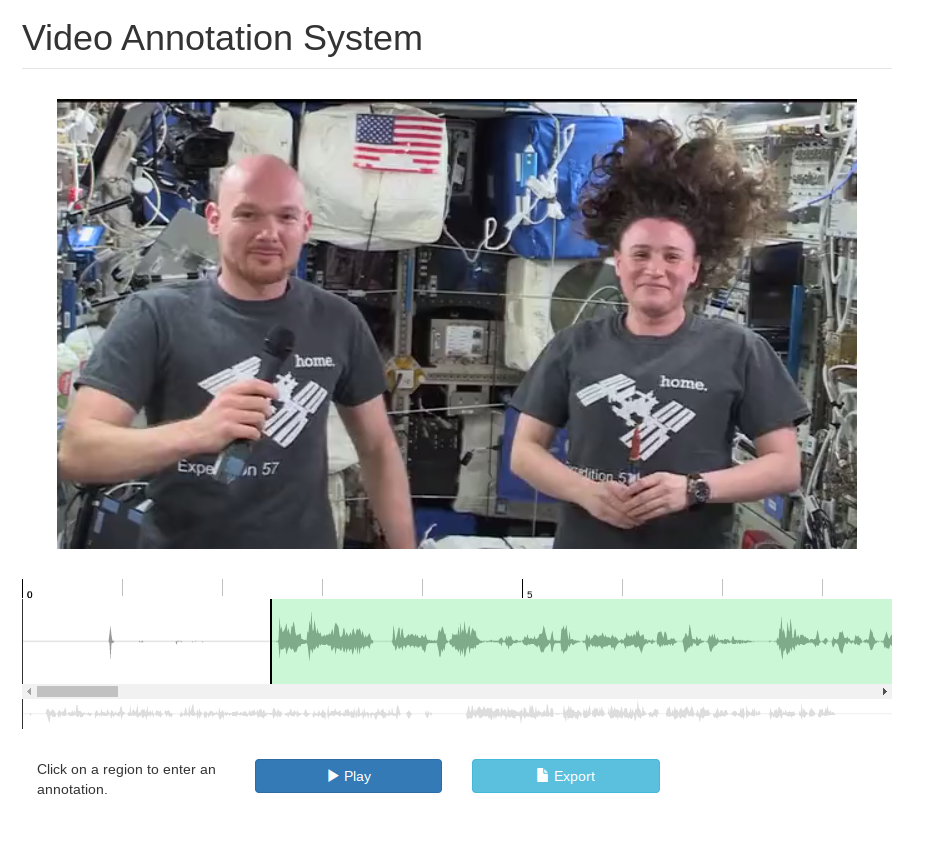
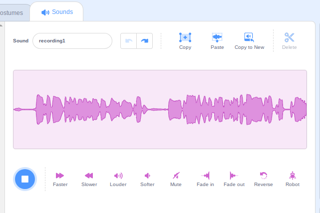

- https://github.com/vocodedev/vocode-python/tree/main #lunabrain/ideas stream voice transcription
- **11:34** [[quick capture]]:  https://github.com/bbc/react-transcript-editor
- https://github.com/gong-io/gecko
- #lunabrain/collect/audio How to record audio from the browser and edit a transcript
	- https://github.com/LLK/scratch-gui/blob/develop/src/components/sound-editor/sound-editor.jsx
	- https://github.com/LLK/scratch-gui/blob/develop/src/containers/sound-editor.jsx#L16
	- https://github.com/wavesurfer-js/wavesurfer.js/tree/master #coding/visualizations #js/libraries
		- this seems promising
	- https://github.com/linto-ai/whisper-timestamped whisper word level timestamps
		- https://github.com/openai/whisper/discussions/332
		- https://stackoverflow.com/questions/73822353/how-can-i-get-word-level-timestamps-in-openais-whisper-asr
	- https://stackoverflow.com/questions/54303632/trim-an-audio-file-using-javascript-first-3-seconds
	- 
	- 
- #blogs https://www.oliverburkeman.com/
- exploiting h264 https://wrv.github.io/h26forge.pdf #security/exploits
- #programming/music https://chuck.cs.princeton.edu/