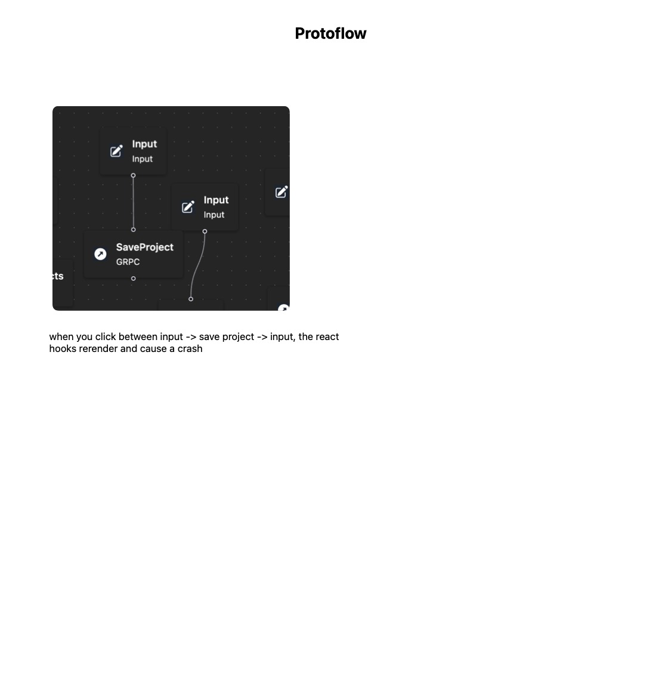

- #ml/bytesized
	- AI security
	- ai nist framework
	- https://www.nist.gov/itl/ai-risk-management-framework
	- AI is musical chair
	- models?
	- yiannis learning
		- teach me AI
			- 10 week course
- #ml/search text summary https://quillbot.com/chrome-extension?utm_medium=paid_search&utm_source=google&utm_campaign=chrome_extension_premium&campaign_type=search&gclid=CjwKCAjwvdajBhBEEiwAeMh1U5bHT3AfGStwPSZ8wMnfRy3CEflO12YUbJXYQckk8hoooXNZKsmOshoC2RMQAvD_BwE
- #security/organizations https://ecs-org.eu/
- #protoflow/work
	- #protoflow/ideas/visual Running Workflows
		- when you run a workflow, you should be able to view all data that came from the different blocks as well as any errors that you encounter
	- when running workflows, pass around backpack which can store arbitrary info between calls
	- When workflows are running, there needs to be a way to list and cancel workflows
- 
- #stream/ideas Evolution of architecture
	- knowing when to make the transition from one technology to another
	- one postgres to a thousand things