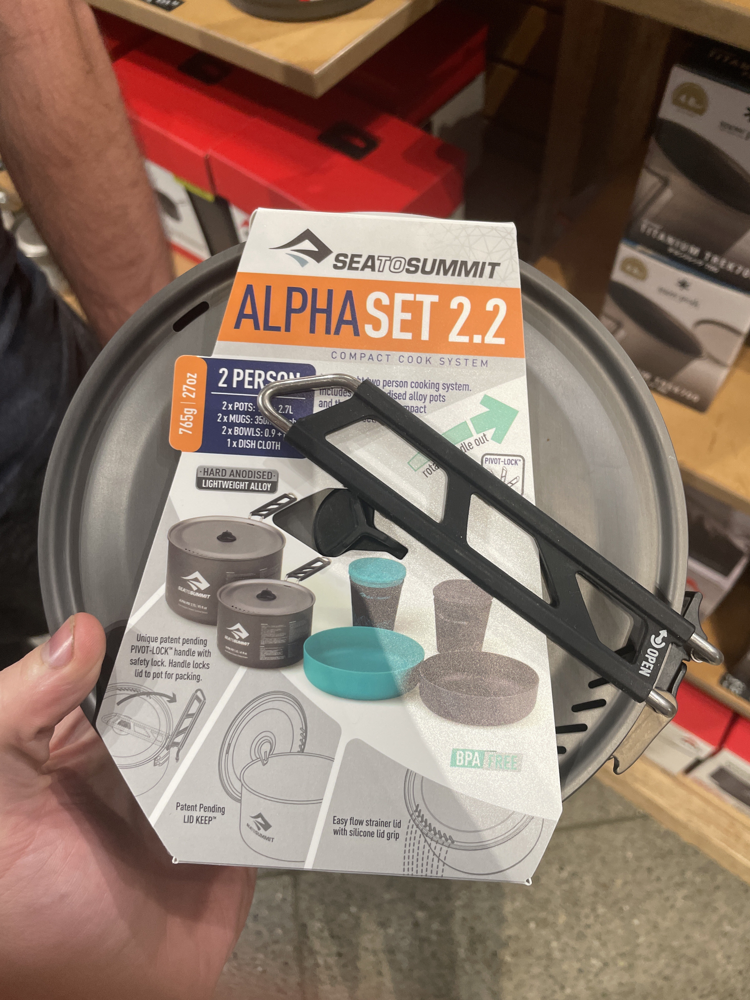

- genesis base camp stove #camping
	- 
	-
- #protoflow/ideas #blog/ideas The Web as you Want it
	- Imagine opening up the internet to a page that you control. Where you can program what it is that you see by dragging around blocks. I’m sure that doesn’t sound amazing to many people. Maybe people want Silicon Valley to think for them when showing them what “the internet” looks like. Our computers are so insanely powerful, yet we go to the same 4 websites every day to see the same endless stream of content. That app idea you had a few years ago is collecting dust, but still all too relevant to your day job. You feel it missing, but you can’t build it because you don’t know how to program.
	- So the thing is, I am calling bullshit. We know way too much about programming and our technology is way too powerful to not have more people’s dreams of building an app come to life. We figured out a lot with html, css, and other programming languages, I think it’s time we make the simple possible again. Let people run wild with pages with shitty css, but let them also do cool stuff like building a webrtc chat room where you can spam random html into the chat. If you want to do that today with “modern” recommendations for tech, have fun learning what React is and then deal with arcane babel transpilation errors because the graphql code gen library is generating ESM 6 when your code only supports commonjs. Seriously? Let’s write some html people. We learned that templating gets the job done pretty well for CRUD.