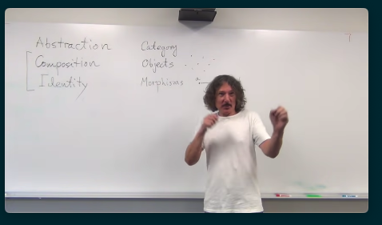

- #protoflow/work
	- how can you cancel a workflow?
		- you need to cancel all the subscriptions
		- the connector, when Connect is called, returns a cancel function which can be used when the workflow is stopped
	- figure out a way to make a node id a derived value?
		- why can't a node be a url?
			- a git url
				- github.com/protoflow-labs/protoflow/pkg/node.New?name="name"
				- you can convert
			- a base node could have instead of name, user friendly name, as well as description
			- if you are using chatgpt to start your code, the description that you enter is then passed to chatgpt and then you have the default implementation
	- https://reactflow.dev/blog/mind-map-app-with-react-flow/
- #lunabrain/companies https://www.multiplayer.app/ something to do with teams?
- #lunabrain/ideas
	- can you fine tune a whisper model?
		- https://huggingface.co/blog/fine-tune-whisper
	- how easily can you fine tune this model?
- #xctf/ideas Code escape room
	- Shaders can be built to have as the visual that you can hide things in. You can let people play with shader properties? https://www.shadertoy.com/view/mtScRc
- #xctf/ideas
	- programming music https://musicforprogramming.net/latest/
	- lofi music while solving challenges
- #golang/library
	- https://github.com/pion/webrtc/blob/master/examples/README.md building a streaming system
- #lunabrain/ideas
	- write a discord bot that records what someone is saying and then start talking like them in the discord
		- the prompt is also being fine tuned based on how they talk
- #golang/library https://github.com/mndrix/golog/forks datalog
- #protoflow/ideas
	- can datalog be used to represent data flow?
- #category
	- {{video https://www.youtube.com/watch?v=p54Hd7AmVFU&list=PLbgaMIhjbmEnaH_LTkxLI7FMa2HsnawM_&index=2}}
	- abstraction
	- composition
	- identity
	- category
	- {{youtube-timestamp 10}}
	- 
	-