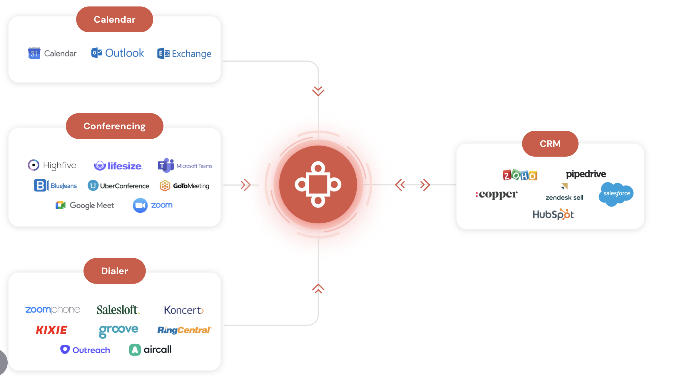

- #lunabrain/work
	- the watch app should extract a summary and phone number from what is being talked about
	- questions should show up on screen
	- notable information should show up on screen
	- i want to have groups so i can share things with people
	- i want to be able to tag things like i do with my twitter categories in logseq
		- i think there is a need for creating a graph between content so you can link things up and traverse them https://github.com/dpapathanasiou/simple-graph
	- large files are a problem, need to break them up into max 25mb chunks and upload them and transcribe them as such
	- #lunabrain/companies https://www.avoma.com/
		- 
			-
- #lunabrain/ideas
	- timeline of information
		- over time, we collect information. we lose information because it is not tethered to some memorable place in time. if information were attached to something memorable for us, then our ability to remember it increases.
		- browsing the web
			- visiting a website is the start time, leaving it is the end time
			- zoom out of a search journey, you should be able to get a gist of what was attempting to be done during that time
- #life/sayings less is more, so don't bore
- #life/observations a general principle about people that you want to optimize for is: you are going to meet and be around a lot of people in your life, and you are *always* the average of your 5 closest people. "closest" means people who you have the most time spent communicating with in any given day, they could be in person or remote. since you will meet/know so many people you are going to have to *filter* them. you filter people by being your true authentic self. this goes for even people you think are "better" than you, such as managers or people you believe are more technical.
-