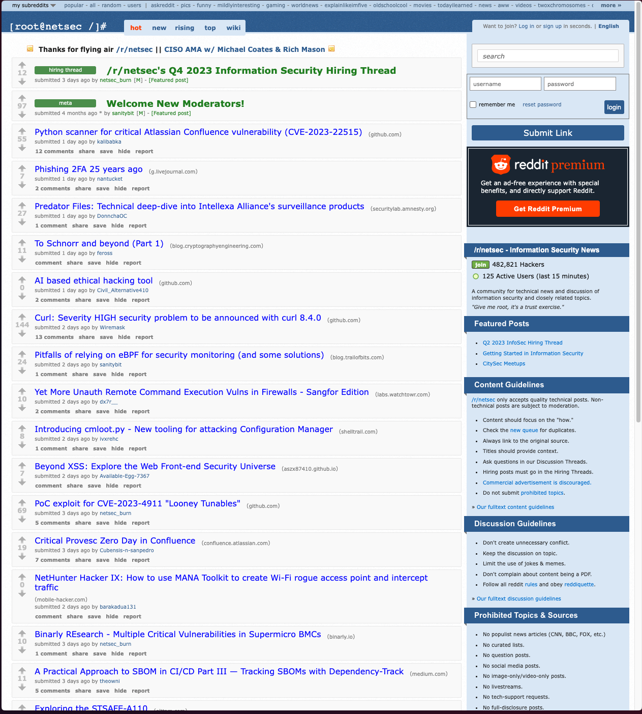

- #lunabrain/work
	- I want to be able to leave notes when i am looking at something easily.
	- only show a user's data
	- make the interface look like reddit
		- upvotes, downvotes
		- 
		- what if you made reddit for teams of people?
		- what power user tools would you want?
		- you can have cards for different types of information, and optional metadata
		- you can track specific people and what they upvote
		- reddit with short form content
	- what if you could cast content to your chromecast?
		- To implement Chromecast functionality in a SwiftUI-based app, we need to bridge some UIKit components to SwiftUI and use `UIViewControllerRepresentable` to manage the integration. Here's a basic example to get you started with casting an image using SwiftUI and the Google Cast SDK:
		- **1. Setup:**
		- Make sure you've already integrated the Google Cast SDK using CocoaPods:
		- ```ruby
		  pod 'google-cast-sdk'
		  ```
		- **2. Create a Cast Button for SwiftUI:**
		- First, we'll create a `CastButton` SwiftUI view that wraps the UIKit-based `GCKUICastButton`.
		- ```swift
		  import SwiftUI
		  import GoogleCast
		  - struct CastButton: UIViewRepresentable {
		    func makeUIView(context: Context) -> GCKUICastButton {
		        let castButton = GCKUICastButton(frame: CGRect(x: 0, y: 0, width: 24, height: 24))
		        castButton.tintColor = .gray
		        return castButton
		    }
		    
		    func updateUIView(_ uiView: GCKUICastButton, context: Context) {}
		  }
		  ```
		- **3. Create a SwiftUI View to Display the Cast Button and Cast an Image:**
		- ```swift
		  struct ContentView: View {
		    var body: some View {
		        VStack {
		            CastButton()
		                .frame(width: 24, height: 24)
		            
		            Button("Cast Image") {
		                castImage()
		            }
		        }
		    }
		    
		    func castImage() {
		        let mediaMetadata = GCKMediaMetadata()
		        mediaMetadata.setString("Your Image Title", forKey: kGCKMetadataKeyTitle)
		        mediaMetadata.addImage(GCKImage(url: URL(string: "https://your-image-url.com/image.jpg")!, width: 480, height: 720))
		  - let mediaInfoBuilder = GCKMediaInformationBuilder(contentURL: URL(string: "https://your-image-url.com/image.jpg")!)
		        mediaInfoBuilder.streamType = GCKMediaStreamType.none
		        mediaInfoBuilder.contentType = "image/jpeg"
		        mediaInfoBuilder.metadata = mediaMetadata
		  - let mediaInformation = mediaInfoBuilder.build()
		        let mediaQueueItem = GCKMediaQueueItem(mediaInformation: mediaInformation)
		  - GCKCastContext.sharedInstance().sessionManager.currentCastSession?.remoteMediaClient?.loadMediaQueue([mediaQueueItem])
		    }
		  }
		  ```
		- **4. Initialize Google Cast SDK:**
		- Ensure you've initialized the Google Cast SDK, as shown in the previous UIKit example, within the `AppDelegate.swift` or an appropriate initializer.
		- Remember, this example provides just a basic setup. You might want to expand upon this, handle various session states, manage errors, and improve the user experience when working with a real-world app. Always refer to the official Google Cast SDK documentation for best practices and further functionalities.
	- what if you could see all of your friends liked videos?
		- To get a user's liked videos from YouTube using Go, you'll use the YouTube Data API v3, specifically the `playlistItems` method on the `likes` playlist. However, fetching a user's liked videos requires OAuth 2.0 authorization since it involves accessing private user data.
		  
		  Here's a basic function outline:
		  
		  **1. First, install the required Google API client library**:
		  
		  ```bash
		  go get google.golang.org/api/youtube/v3
		  go get golang.org/x/oauth2/google
		  ```
		  
		  **2. Write the Go function**:
		  
		  ```go
		  package main
		  
		  import (
		  	"context"
		  	"log"
		  	"os"
		  
		  	"golang.org/x/oauth2"
		  	"golang.org/x/oauth2/google"
		  	youtube "google.golang.org/api/youtube/v3"
		  )
		  
		  func GetLikedVideos(clientID, clientSecret, accessToken string) {
		  	ctx := context.Background()
		  
		  	config := &oauth2.Config{
		  		ClientID:     clientID,
		  		ClientSecret: clientSecret,
		  		Scopes:       []string{youtube.YoutubeReadonlyScope},
		  		Endpoint:     google.Endpoint,
		  	}
		  
		  	token := &oauth2.Token{
		  		AccessToken: accessToken,
		  	}
		  
		  	client := config.Client(ctx, token)
		  	service, err := youtube.New(client)
		  	if err != nil {
		  		log.Fatalf("Error creating new YouTube client: %v", err)
		  	}
		  
		  	call := service.PlaylistItems.List("id,snippet").PlaylistId("LL").MaxResults(50) // "LL" is a special playlist ID for liked videos
		  	response, err := call.Do()
		  	if err != nil {
		  		log.Fatalf("Error fetching liked videos: %v", err)
		  	}
		  
		  	for _, item := range response.Items {
		  		log.Printf("Liked video ID: %s, Title: %s", item.Snippet.ResourceId.VideoId, item.Snippet.Title)
		  	}
		  }
		  
		  func main() {
		  	clientID := os.Getenv("YOUTUBE_CLIENT_ID")
		  	clientSecret := os.Getenv("YOUTUBE_CLIENT_SECRET")
		  	accessToken := os.Getenv("YOUTUBE_ACCESS_TOKEN") // You would typically fetch this via an OAuth2 flow
		  	GetLikedVideos(clientID, clientSecret, accessToken)
		  }
		  ```
		  
		  **Notes**:
		- The `clientID` and `clientSecret` are obtained by setting up an OAuth 2.0 client ID via the [Google Developers Console](https://console.developers.google.com/).
		- You need to get the `accessToken` by going through the OAuth2 flow. This code assumes you've already done that.
		- Ensure that you've enabled the YouTube Data API v3 for your project.
		- This example retrieves a maximum of 50 liked videos for simplicity. Adjust as needed.
		- Because accessing liked videos is a private action, you absolutely need OAuth2 authorization. An API key won't suffice for this operation.