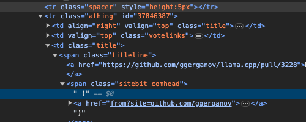

- #lunabrain/work
	- collect and share your structured thoughts
		- you can drop thoughts into something that lets you go deeper, such as with logseq
	- how can you easily build collections of URLs?
		- how can you index URLs so that someone can discover them easily?
	- Driven people will use AI to generate drafts of ideas that they can react to
	- Prompt packs
		- For different people, and their relevant use cases, create packs of prompts that people can use to transform content
		- I am a developer and I see an article about code that is interesting
			- I want to go deeper, so I use a code prompt to write some example code I can run that relates to the blog post
		- I am in sales and I want to
	- tried out https://github.com/connectrpc/connect-query-es#quickstart
		- I feel like i don't like it because the service.method pattern is more clear than useQuery(...)
	- generate content to SEO friendly site with https://github.com/adityatelange/hugo-PaperMod/tree/master?
	- plugin: connect-query
	  opt: target=ts
	  out: ./studio/src/rpc
	- i want to build the tinder for my information
		- react swipable
	- if you want to have sources of information, like logseq, do you need a dedicated source type?
		- maybe groups have sources they can import from
	- when you have a source, such as hackernews, youtube, github, etc. in order to replicate the data, and upsert when needed, you need a key for the data, so you know if the parent of the content already exists in the database
		- An option here is to use a series of tags to identify a piece of content, as well as a content hash?
			- 
				- this is an example hackernews item that has the ID 37846387
			- The identifier here is straight forward, if we go to scrape hackernews again, the tag "hackernews/37846387" should already exist, and if the content hash, also determined by the source scraper, is the same, nothing is done, if it has changed, then add a new version of the content
				- we want to try to keep the previous content around as much as possible
			-
		- If no content has the keys
- #chrome/extension/dev publishing
	- https://developer.chrome.com/docs/webstore/register/
	- https://developer.chrome.com/docs/webstore/publish/