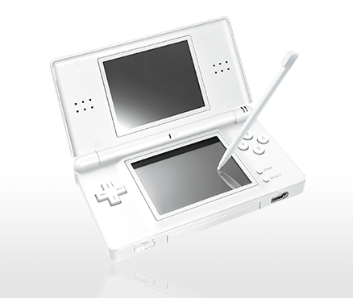

- #lunabrain/work
	- I want the chrome extension to have
	- i need to setup ci/cd so that i can push and not have to worry about having it built correctly
		- maybe just build to different folders "build" and "dist"
- #nintendo/consoles The consoles I used to have
	- 
	- 
	- 
	-