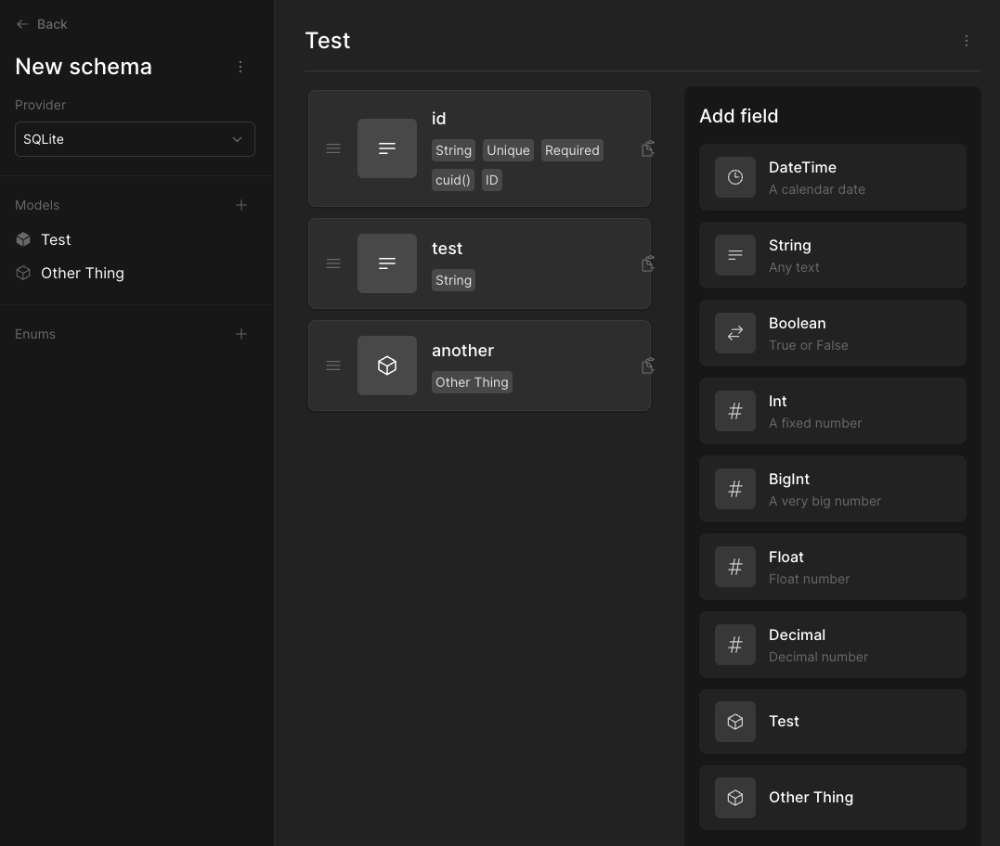
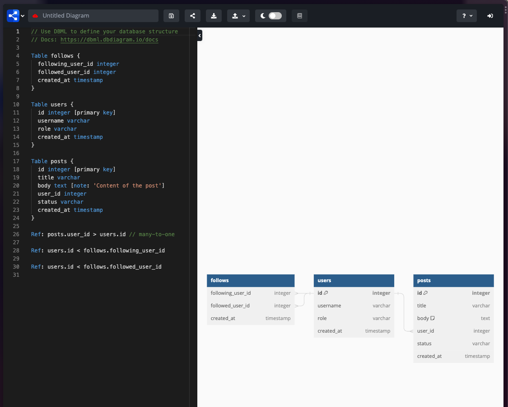
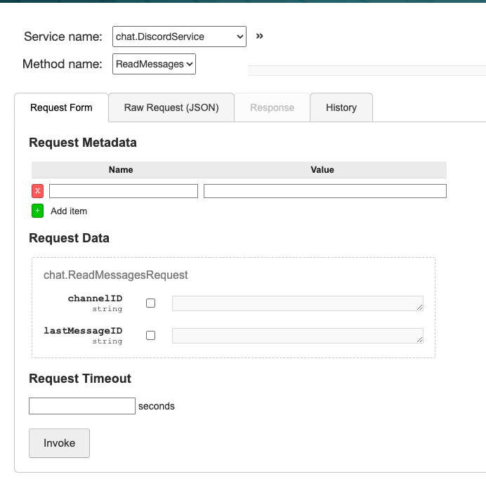
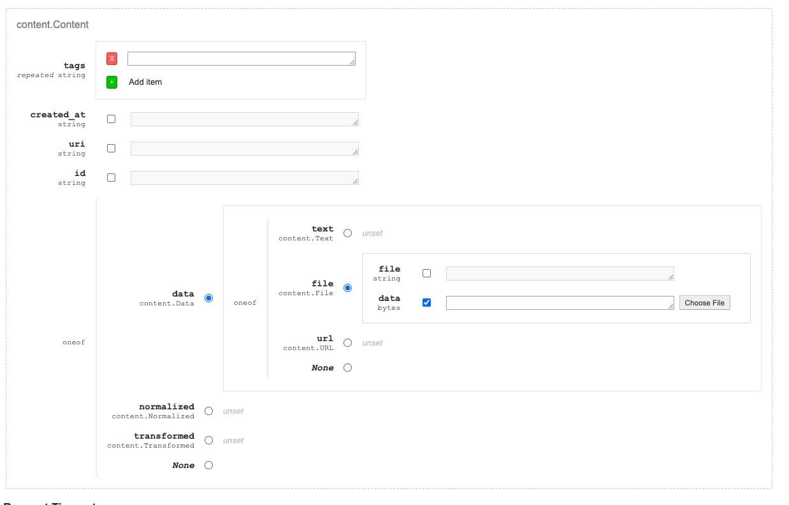

- #protoflow/work
	- need to work on the presentation #conference/seagl/talk #protoflow/talk
		- figure out what I want to say about it
		- i want to make it a debugging tool
		- what are the 3 questions that I want someone to walk away from the talk asking themselves?
			- Are there things that I have felt in programming that are like LEGOs for code?
			- When I play with code, what do I want to build?
				- Is it something simple, complex?
			- Do I want to write more code with my friends?
	- When you have the chat open, you can click on a block
		- the block view should have a search
	- #protoflow/talk
		- notes
			- https://docs.google.com/document/d/1T2oXT8hn8teHTqUMksfTCQojD1RGg4IjYqxkRvK7zoU/edit#heading=h.ekd4wja6dotv
		-
		- grpc builder and tester
			- it is difficult to get started prototyping a feature, try to take as much required setup you need
			- grpc is pretty good for this
			- https://connectrpc.com/
				- makes it easy to integrate with different languages
		- future, data streams between methods
			- https://rxjs.dev/ really cool library for bringing reactive programming to an imperative language
			- https://github.com/ReactiveX/RxGo/ someone ported this to Go
			- make this scale and durable https://temporal.io/
				- include some look into the code of temporal to see how it is an abstraction of how go works, so you can change the underlying channel behavior of rxgo to work with temporal
				- anyone working on this would be a huge help
			- streaming data to and from a website
				- https://github.com/connectrpc/connect-es/issues/419
				- this would be super helpful for someone to work on, i would love to have webchat
		- project ideas
			- webchat
	- The interface should be service oriented, and it should be easy to
		- add new services and methods
		- update the type of a method/service
		- kind of like https://www.prismabuilder.io 
		- or maybe https://dbdiagram.io/ 
			-
	- look at grpcui for inspiration
		- 
		- 
- #lunabrain/work
	- what are the features that I want to show kevin?
	- I need to make tags connected to groups
		- i think i updated the model
	- you need to be able to comment on posts
	- you can host whatever static content you want off of "domain.lunabrain.com"
		- maybe you need approval to do this
	- production might be broken
	- add an alpha disclaimer at the top
		- make login only?
	- social login?
	- create a prompt type
		- need to add text input? finish the markup content saving
	- I want to be able to take my chat gpt conversations and turn those into blog posts
		- extension extracts the content from the page
			- or by watching network requests?
		- content is saved in lunabrain
		- you can "publish" the content to your personal site "username.lunabrain.com" using hugo?
	- would you pay for a service where based on your browsing history (which you can set whitelists/rules for), you get AI generated blog post drafts that it sends to you and after a thumbs up from you/minor edits you get to publish it to a personalized domain "<username>.site.com"  which is SEO optimized
		- what about collaborating on cultivating refinined resources via voting and commenting with a group
		-