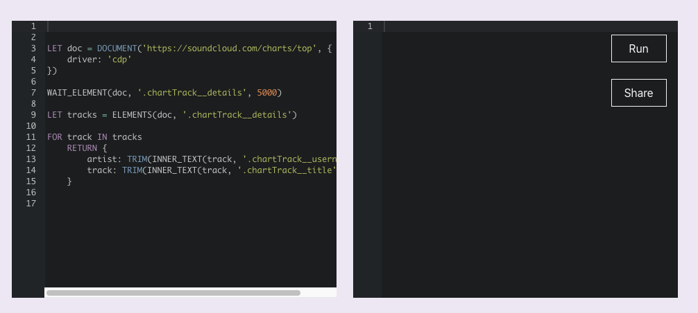

- #protoflow/work
	- #protoflow/talk
- #lunabrain/work
	- could a group really just be a tag?
	- turn chatgpt sessions into blog posts
	- I also think that the timeline has some potential
	- turn high signal resources into something that is a part of your brain
	- it would be cool to have a ferret runner so that you can take websites and restructure them
		- 