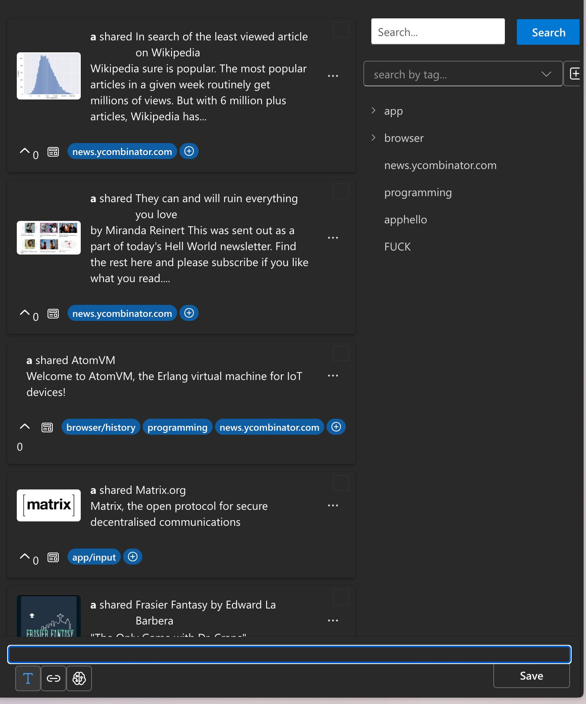
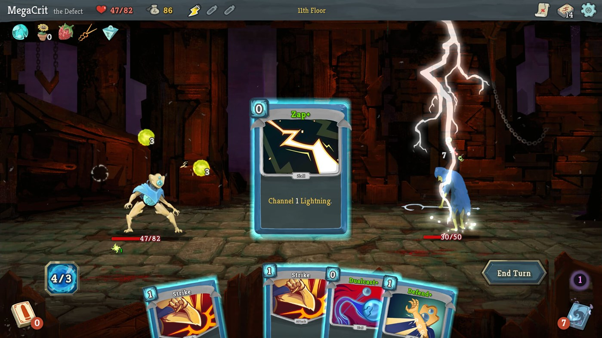
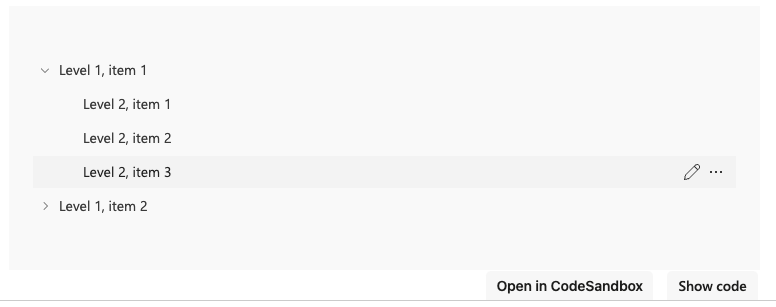

- #lunabrain/work
	- A data point that keeps coming back up for me is how people, even if they can (not blocked by their company) don't use chatgpt. I think us and our friends use chatgpt because we are just motivated, creative individuals. I think skepticism gets in the way of a lot of people.
	- I have been thinking about "AI Personas" more and if you have an abundance of high signal information (based on browsing history, chatgpt sessions, blog posts from HN) you can make a pass over it with some pre-defined chatgpt prompts.
	- I am writing my talk rn, and while I wasn't able to just say "write my talk" based on my notes, I can take all of my notes and have AI "mine" them for some more cohesive trends, and those trends can be represented as an overview that I can refine.
	- The mental model that I have been trying turn into a POC has been thinking of content as "cards" that you can "hold". When you hold content cards, you simply group them together in a "pile" to share with others or run a prompt over them to create another content card.
		- 
		- 
	- I like to think of resources we come across similar to cards we might use in a card building game. When you are playing slay the spire, you want to have a synergistic deck of cards to win. When you are trying to write a paper, email, talk, code etc. you want to have a cohesive set of high signal resources to use as the foundation of what you are writing about.
	- but of course, to do this manually is only reserved for power users, and you need this to appeal to people who don't want to put in the effort to get the results.
	- I think if you make it easy for power users to define the, for a lack of better term, "optimal strategy" for how to build your "deck of cards" or resources then you could provide value for non-power users.
	- For example, I could define a way of determining if tabs you have open are valuable or not and those rules run in your browser extension and save the tabs for you.
	- If I want to start building a collection of resources that someone might need to work on a feature, I could start to try to shape out what the code looks like based on using my own "mental reasoning engine" or my brain, to collect resources to then share with people
		- https://chat.openai.com/share/135f5d62-af4e-4138-98ac-ff8a7ae3f677
	- Being able to easily amass resources and assigning them to a particular resource to have shared context on what to do is very helpful. Discussions are built around first party resources.
	- What if you have a standup, create an issue,
- #protoflow/work
	- Try to get the generator in a better position
		- initial generation
		- incremental addition of services and methods
		- 
		- try to put everything simply into a protobuf service creator
- #discord/channels
	- cohere https://discord.gg/X7DxJKqf
	- haystack https://discord.gg/haystack
	- nat.dev https://discord.gg/ASYvAbhF
	- replicate https://discord.gg/d9hgt6Jf
	- langchain https://discord.gg/tFZ3UXtw
	- llamaindex https://discord.gg/QKXH2G4z
	- midjourney https://discord.gg/midjourney
	- lastmileai https://discord.gg/PjUEGGvP
	- datasette https://discord.gg/D4hF6kKh8N
	- lightning ai https://discord.gg/p7MBSRKGsN
	- nlplanet https://discord.gg/dbMeEqBYue
	- chatgpt hackers https://discord.gg/8GKspuZp
	- learning machine learning https://discord.gg/vzBKN9fG
	- /dev/invest https://discord.gg/vd932jSE
	- lmsys https://discord.gg/Z8EBtard
	- grasp https://discord.gg/p7xpuKAW
	- serp https://discord.gg/Mz2Wn7nZ
	- plaud https://discord.gg/C9pGeWZt
	- perplexity https://discord.gg/perplexity-ai
	- gpt-engineer https://discord.gg/MNHMfFQq
	- angstrom ctf
	- pwn.college https://discord.gg/ZdAqZVnp
	- picoctf
	- val town https://discord.gg/BVb4nvDW
	- motion canvas https://discord.gg/c2mr5bfC
	- fyne toolkit
	- almond force https://discord.gg/XJg6E8vhcg
	- reflect https://discord.gg/XB79qjcX
	- quartz https://discord.gg/mgX6JqU6
	- logseq https://discord.gg/logseq
	- filmot https://discord.gg/B28wK2pu
	- project saturday https://discord.gg/RVRwdGjs
	- floneum https://discord.gg/knx3B4r6
	- myscale https://discord.gg/WPSxckg5
	- thousand birds https://discord.gg/jR5QZ5VBD6
	- filtr https://discord.gg/BAwZDhMS
	- bad computer https://discord.gg/5dYRhcam
	- joshua weismann https://discord.gg/DVUq7T4d
	-