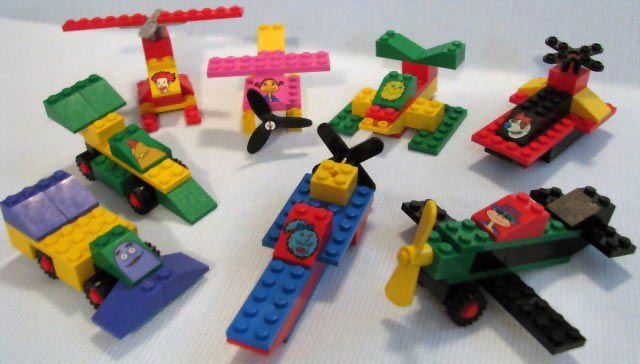

- #protoflow/work
	- I need to make the tree code simpler
		- Create a new service
		- Edit service methods
		- Should just be a frontend for the protobuf file?
	- #code/python python buf connect
		- version: v1
		  plugins:
			- plugin: buf.build/protocolbuffers/python
			  out: gen
			- plugin: buf.build/grpc/python
			  out: gen
			- plugin: buf.build/protocolbuffers/pyi
			  out: gen
	- Can I get the hello service working for go and js?
- #protoflow/talk #conference/seagl
	- I want people to refine their sense on what a LEGO for code feels like
	- We should strive to build code that feels like this so that we can try to make coding more accessible to ourselves and others
	- #protoflow/talk/stories #seagl/talk
	  id:: 6539846f-8127-41b9-a0b6-c52538d73748
		- You want to code with LEGOs, not Mega Blocks
		- We tend to have pretty good judgement, even as kids, what toys are better than others
		- I want coding to feel more fun, like I am snapping LEGOs together.
		- Legos
		  collapsed:: true
			- My email: chrislegolife@gmail.com
			- The first LEGO set I ever had came from Mcdonalds
			- 
			- I noticed that these pieces didn't have to be arranged in the way I was told to do so by the instructions. I could build whatever I wanted.
			- I remember how deeply satisfying it was to arrange and rearrange this limited set of pieces into whatever I could think of. With a little imagination a crude representation could become what I wanted it to be.
			- Buying and building LEGOs became a fixation for me. Turning a whole section of the basement into my lair filled with new sets, partially disassembled sets, and random pieces from eroded sets from years past.
			- I think my mom got me a Mega Blocks set once and somehow the pieces ended up in one of these bins. Whenever I was looting around for pieces and I came across these pieces, they would immediately throw them away. But even if a single LEGO piece was found laying around the house, I would pick it up and return it to the bin.
			- It is an honest mistake Mom, Mega Blocks look so similar to LEGOs why would I care so much?
			- There are many design principles that keep LEGO being LEGO. And the brand has only ever faltered when they deviated from this set of design principles.
			- I also loved putting together IKEA furniture, felt like LEGOs for furniture?
			- Denmark and Sweden are pretty close, they have a thing for simple systems over there.
		- Building something simple
		  collapsed:: true
			- Is there a quintessential LEGO build, maybe a car/house?
			- LEGO City was one of their most popular lines
			- For code, you might think of a TODO app
			- What could be simpler, and fundamentally helpful than displaying a list of things on a screen for someone to use a computer to help them keep track?
			- If you search "TODO MVC" you will find an endless number of projects, that all look quite different, trying to show you how to code this.
			- These projects are really cool, you can see how people approached this problem with different technology
			- You get excited, want to extend these examples but...
				- Dependencies are out of date
				- There are no types to help you read the code
				- The code is just plain incomprehensible
			- It is like taking apart a LEGO build to find that the pieces were actually all Mega Bricks and you can't reuse them
			- It is worse when Mega Blocks have found their way into the language itself
			- isOdd
			- The operating system?
			- Nvidia drivers
			- The hardware?
			- TODO
			- With the explosion of open source software and packages that flying off the package registry's shelf, how can you tell which ones are more like LEGOs vs Mega Blocks?
		- Cooking
		  collapsed:: true
			- I don't play with LEGOs anymore, but I like to cook
			- I like to think of recipes as really just the composition of different recipes together to make something even more complicated
			- Peanut butter and jelly
				- Peanuts + blender = peanut butter
				- Stawberries + pectin = jelly
				- flour + water + yeast + salt = bread
				- bread + peanut butter + jelly = pb&j
			- We don't really write recipes like this though
			- Except for literally [Cooking for Engineers](https://www.cookingforengineers.com)
			- If I want to make cool things in the kitchen, I have to follow normie language for expressing recipes
			- But I can't unsee the building blocks, I _have_ to have something that speaks to this
			- What does it look like?
			- A language? I am not an expert, also I want to be able to send this to my mom
			- I want to make a recipe site that feels effortless to follow, regardless of experience in the kitchen, or with the last brain cell I have.
			- There are hard problems in software development, and building good looking websites is certainly one of them
			- Trying to rapidly prototype features in the site as I came across them in the real world was really fun, but also insanely frustrating
			- As a side project, there was no months of planning by an engineering team to discuss and agree upon the best way to build this. Changes came sporadically and were layered on top of my desperate attempts to try to get React to do the thing that I wanted it to.
			- After 7 attempts at trying to build it with countless different technologies, I arrived at an app that I still not happy with.
			- As a solo dev who isn't constrained by a deadline, this process was incredibly enlightening.
			- I had learned that "modern" recommendations on how to build a web application are insanely confusing and I frankly have no idea how any developer working on a site does their job. Seriously, mad respect
			- Any one of the 7 attempts I could have doubled down on to ship so that people could use it. But none of them felt right!
		- I needed to stop following what people were recommending what I should or should not do with code and focus on the things I have learned as a programmer.
		- Learn a mental model, not a language
			- Languages can be a rabbit hole
			- Your skilled programmer friend tells you that everything is going to be written in Rust. You should just learn it now right?
			- Languages shape the way that we approach problems fundamentally. If there is a language feature or library that we can use, there is always the option to use it.
			- We try to slap ourselves on the wrists to avoid known pitfalls with linter rules and compiler checks.
			- What if a language was so simple that there are not that many pitfalls to begin with?
			- Go was developed by some smart people at Bell Labs, and later was refined at Google to solve its realtime, world-scale problems
			- The language prioritized simplicity above all else which has led to a lot of interesting effects
			- You can _always_ see the underlying code because all modules are just git repos
			- Go blog posts teach you way more than syntax, they teach you a mental framework
			- There are a lot of tools for "anticipated needs" you might have as a developer that Go meets
			  collapsed:: true
				- go run
				- go test
				- go mod
				- go bench
				- go fmt
				- go build
			- These are usually 3rd party libraries you need to "be in the know" about for your language
			- The type system is so painfully, and meticulously simple, generics have only been introduced recently
			- LEGOs have rigid plastic connectors, unless you melt them, you can't mold them into a sculpture, you have to play by LEGO's unfailable rules in order to compose them together to build a sculpture
			- I am not trying to convince you to use Go
			- Consider the language/s you use daily, weekly, monthly, do they feel fun to play with?
			- When are they frustrating?
		- Types are the foundation
			- Types are a way to communicate intent
			- A programmer defines their intent to the computer, the compiler/runtime holds them to that
			- Types instruct others who want to play with the code, how to go about it
			- If types are too simple, they don't convey enough
			- if they are too complicated, they become incomprehensible
			- Protobuf is type system that has been refined over the past couple of decades at large tech companies.
			- GRPC, an extension of Protobuf, defines methods and their IO
				- Has a GraphQL like type introspection, which is killer
			- You can build the frontend while I build the backend. I don't even need my code to be fully written. I could just serve back some mock data from the endpoint!
			- At Uber, I saw the internal rollout of GRPC and how much easier it was to interact with the thousands of internal microservices. I could easily understand how to send or get data from any of these. Especially helpful for security.
			- It is not enough to just see and understand the types, you also need to use them
			- Protobuf has type compilers for most major languages
			- Your Javascript can become a service
		- Transforming Types
		  collapsed:: true
			- Workflows are the back bone behind any company.
			- Workflows are typically only reserved for large enterprises to schlep around invoices or work status on plane engine parts.
			- In reality, almost all of us are constantly building workflow management systems
			- I saw Cadence (now Temporal), the workflow manager, scale to the size of the world
			- All that Cadence really did was harden Go's concurrency primitives to be able to scale effortlessly and reliably
			- Temporal is a multi-billion dollar company now, but it is missing something big
			- All of the expression of a workflow is done with code, but this is not how we communicate
			- We whiteboard diagrams, draw physical arrows to show how data flows through the system
			- How do we even express a workflow generically?
			- A lot of enterprise software is built with BPMN, kind of a grind to learn and use
			- Can there be something simpler?
			- There is a whole field of mathmatical study called Category Theory, which Haskell is heavily influenced by
			- Have more questions than answers for this atm, would love to hear some ideas!
		- Protoflow
			- I tried to build this once
			- Refinery
			- Wrong abstraction, AWS, ew
			- Knowing what I know now, this project is in my crosshairs
			- Protobuf and Temporal were made by some of the best engineers in the world at a company who was pouring gasoline on their software development engine
			- The benefits of this research and engineering will not be realized by smaller development teams until more open source tools and educational resources (such as this talk) are accessible
			- I have started snapping together the bricks which I hope will be a foundational component for a lot of people to build upon
			- What I think is especially cool is that you don't even need to know Go to get value from this project
			- Protobuf is just a type system and you can compile the service stubs for any language you want to use
				- TODO example
			- What if you had a library/service that let you build strongly-typed services, connected to each other with a durable workflow manager?
			- Simple service templates with batteries included
			- Auto-generated client code, with types!
			- Control the flow of data through out the system
				- Save data and replay it for testing
				- Trace data in production, replay it locally
				- Free metrics
			- Connect and share with other people
			- Demo?
		- Parting words of wisdom
		  collapsed:: true
			- Plumbers get paid a lot because pipes dont fit together easily https://naich.net/wordpress/index.php/ever-wondered-why-plumbers-are-paid-so-much/
			- If you want to keep getting paid a lot to be a data plumber, perpetuate the system.
			- The best coders have made things fit together so many times that they make a framework to not have to keep making things go together themselves, the code makes it happen.
			- If you haven't played with LEGOs, buy a set of LEGOs. It is so nice to have things that fit together so nicely.
			- Chase that feeling with the work that you do.
			- Build the LEGOs that the next generation of developers will build with.
		- What am I going to do about it?
		  collapsed:: true
			- Drink coffee at cafes
			- Think about code
			- Write some code
			- https://github.com/protoflow-labs/protoflow
			- Talk about code
			- https://www.youtube.com/@breadchris/streams
			- Write about code
			- https://breadchris.com/
			- Code some writing
			- https://github.com/lunabrain-ai/lunabrain
			- Talk about coding some writing
			- https://www.youtube.com/@breadchris/streams
		- Some real world examples
		  collapsed:: true
			- Minecraft
			- Roblox
			- Heroku had with the [twelve-factor app](https://12factor.net/) they were on to something
	- #seagl/ideas
		- when you want to prove out your idea, you want it to be frictionless. Or at least, as frictionless as possible. The reason a good coder costs so much is that they have seen so much shit that doesn’t go together and have persevered to make it go together. The best coders have made things fit together so many times that they make a framework to not have to keep making things go together themselves, the code makes it happen. There is an article about why plumbers make so much, and it’s essentially the same reason https://naich.net/wordpress/index.php/ever-wondered-why-plumbers-are-paid-so-much/ pipe fittings.
		- When you don’t think about what pipe fittings to use, you get to focus on the fun stuff. I am not a plumber so I don’t know what the fun stuff of plumbing is, but i’m sure there is something. For coding, the fun stuff is being able to represent data in a new way that you haven’t seen before. See relationships between data for the first time, mp3 files that are now text that you can search. In the age of information, the frictionless development to production experience is nirvana.