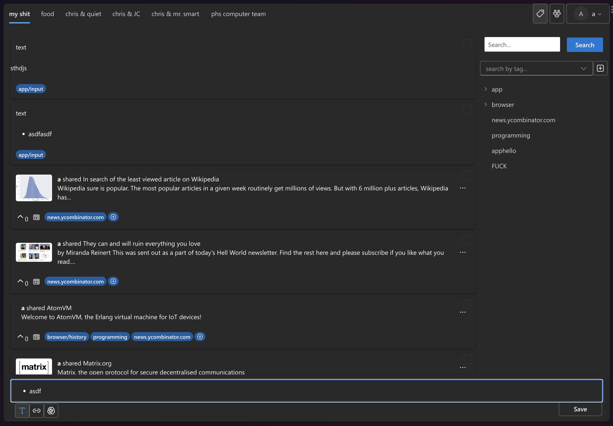
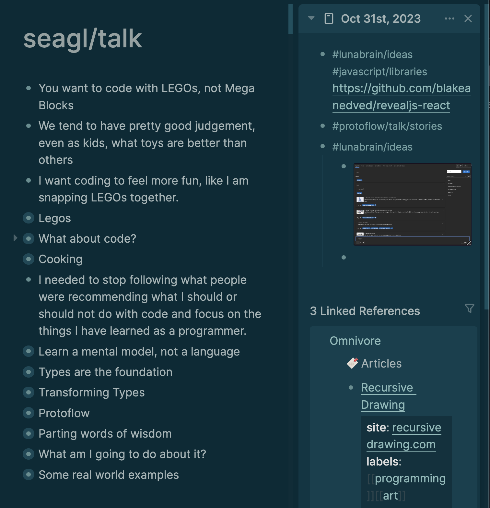

- #lunabrain/ideas #js/libraries https://github.com/blakeanedved/revealjs-react
- #protoflow/talk/stories #seagl/talk
- #lunabrain/ideas Content
	- All content changes will be kept
	- You can go back in time as to what the content looked like previously
	- Always continuously iterate on some concept, but have your previous version on hand when rewriting
- #lunabrain/ideas
	- On the right panel, a daily journal view should be default
	- The left panel is "the stream" and the right is the "sieve"
	- All of the forms of collection are what you find in the stream, whereas only the information you are interested in is saved
	- {:height 124, :width 166}
	- 
		-