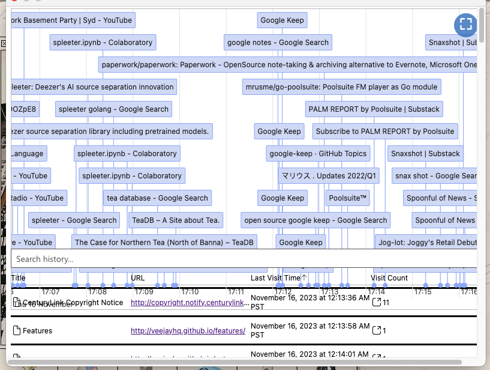

- http://veejayhq.github.io/ #dj/video
- #lunabrain/ideas People as reasoning engines
	- There is a email subscription that I want to stay on top of. There is a
- #lunabrain/work #lunabrain/extension 
	- if this is what I am looking at, there is too much going on. I want my recent browsing history to show up in a list with timestamps
	- I only want to see websites that I found interesting
- #dj/video it would be cool to split songs into parts https://github.com/deezer/spleeter
	- could probably work pretty well
	- https://chat.openai.com/share/484e0b1b-a54d-44e5-bd25-9242d87ef357
- #dj/code https://chuck.cs.princeton.edu/ide/# make some cool beats
- #lunabrain/ideas p2p chat https://github.com/szpnygo/gtc
	- make a website for this
- #recipes https://www.americastestkitchen.com/cooksillustrated/videos/2848-crispy-slow-roasted-pork-belly
	- https://www.americastestkitchen.com/recipes/15883-beet-dip-with-yogurt-and-tahini
	- https://www.americastestkitchen.com/recipes/4026-best-french-onion-soup