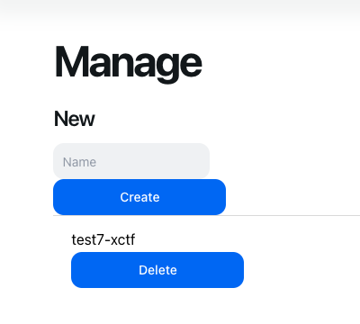

- #xctf/work
	- working on deployment management for xctf instances
	- #xctf/code github workflow build
		- ```
		  yq -i e ".services.xctf.image |= \"$(docker inspect --format='{{index .RepoDigests 0}}' $SERVER_IMAGE_ID:$VERSION)\"" docker-compose.yaml
		  ```
		- ```
		        - name: Create commit
		          id: create-commit
		          if: steps.branch-name.outputs.current_branch == 'main'
		          uses: stefanzweifel/git-auto-commit-action@v4
		          with:
		            file_pattern: docker-compose.yaml
		            commit_message: "chore: update container hash [skip ci]"
		  
		        - run: sleep 10
		  
		        - name: Invoke deploy on new commit
		          if: steps.branch-name.outputs.current_branch == 'main'
		          uses: benc-uk/workflow-dispatch@v1
		          with:
		            workflow: Kompose
		            token: ${{ secrets.GH_TOKEN }}
		            ref: master
		  
		  ```
	- got managed kubes deployment working, pretty hype
		- 
	- still need to get database backup working
	- going to focus on
- #lunabrain/work
	- #lunabrain/wants I want to finish the video clipper so that I can send great content to people.
		- I think you need to upload the video to lunabrain, and then have a follow up action where the video is clipped
			- possibly introduce new type: timestamps?
			- just parse text content applied to a video for #clips
				- easiest
	- #lunabrain/wants I want to nail the idea of a daily journal