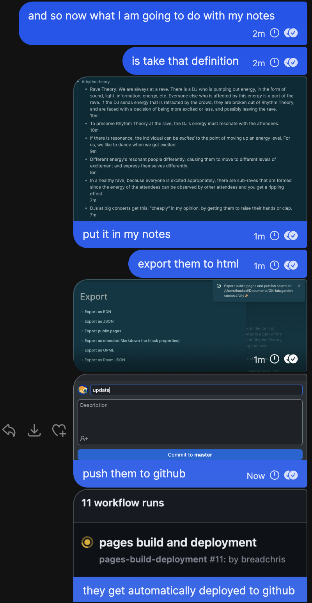
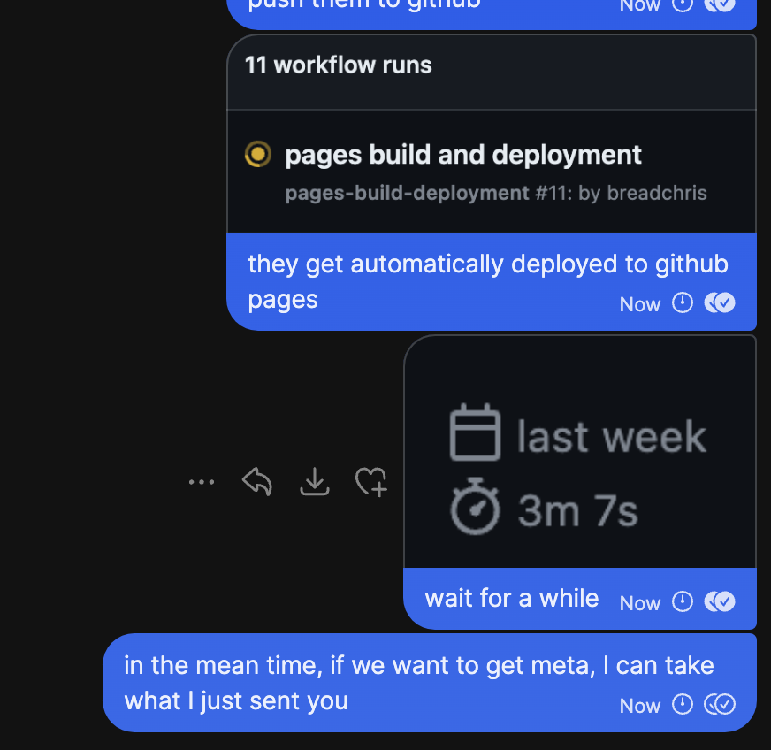

- #xctf/work
	- make story have a conclusion
- #rhythmtheory
	- Rave Theory: We are always at a rave. There is a DJ who is pumping out energy, in the form of sound, light, information, energy, etc. Everyone else who is affected by this energy is a part of the rave. If the DJ sends energy that is retracted by the crowd, they are broken out of Rhythm Theory, and are faced with a decision of being more excited or less, and possibly leaving the rave.
	  10m
	- To preserve Rhythm Theory at the rave, the DJ's energy must resonate with the attendees.
	  10m
	- If there is resonance, the individual can be _excited_ to the point of moving up an energy level. For us, we like to dance when we get excited.
	  9m
	- Different energy's resonant people differently, causing them to move to different levels of excitement and express themselves differently.
	  8m
	- In a healthy rave, because everyone is excited appropriately, there are sub-raves that are formed since the energy of the attendees can be observed by other attendees and you get a rippling effect.
	  7m
	- DJs at big concerts get this, "cheaply" in my opinion, by getting them to raise their hands or clap.
	  7m
	- Vs a skilled musician might get their crowd to sing different notes to sound out a choral chord.
	  6m
	- But this is where you have to know your audience; the big concert DJ's crowd might not know how to sing at all, which would cause the energy they express to make people less excited.
	  6m
	- If you are at a company, you have to try to observe what raves are happening and identify who is the "DJ" and who are the attendees. How are the attendees reacting to the DJ in the room? They might be hiding their feelings because they don't want the DJ to them not into the music.
	  4m
	- And in math, what I am describing is Category Theory, but that shit is so hard to learn, trying my best.
	  4m
	- The company core value from Uber that has resonated most with me, from Travis the rave DJ, was "Be an owner, not a renter"
- #notetaking/tools
	- 
	- 
- I should think about using matrix for breadchris.com