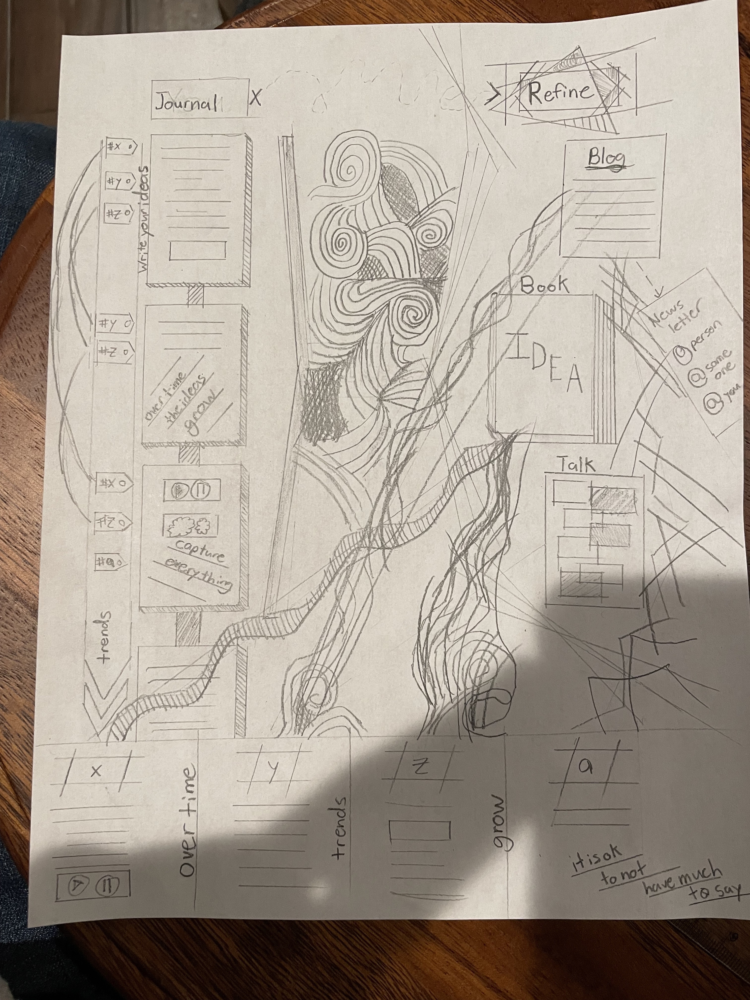

- #100DaysToOffload
	- Every year I like to have a motto that I think about from time to time throughout the year. I find mottos more transformative than resolutions as mottos tend to influence subtly but in a profound way.
	- Anyways, my motto for this year is:
	- > write every day.
	- Over this past year I started writing more blog posts and taking more notes and it feels incredibly rewarding. I like seeing the thoughts I have in my head in a medium where I can share with people for them to glance at or read deeply. I no longer feel the need to corner people into listening to my monologues.
	- Writing is incredibly liberating for my mind where ideas fly in and out constantly. I used to feel such anxiety trying to determine a purpose for writing and not wanting to publish something that isn't going to be, what I thought to be, quality writing. I was too focused on writing a post that could go viral on HackerNews that I was missing out on practice of channeling my thoughts into words.
	- What I have found is that having a bunch of thoughts laying around, they start to feel like legos you can look at and piece together over time to compose a piece that is of significant value. Observations over time, from anyone’s perspective, are incredibly valuable and having documentation around how you arrived at a conclusion is very helpful data points for others in guiding them on their own journey.
	- I have been greatly inspired by https://100daystooffload.com to commit to writing every day and try to keep up this practice. I want to see if this practice can lead to a bigger goal of mine which is to write and publish a book. I hope to inspire others to (I was going to say “pick up a pen and write”, but I'm typing this out so idk if it applies) write on whatever medium works for them and about whatever is on their mind. Humans are amazing observers and reasoners and you, yes you reader, have a perspective of the world that literally no one else has.
	- I have ideas on what a writing tools would be helpful for me to achieve this goal, AI is among them. I want to build out a service that would help me, and hopefully one day help others too!
	-  #sketch
	-