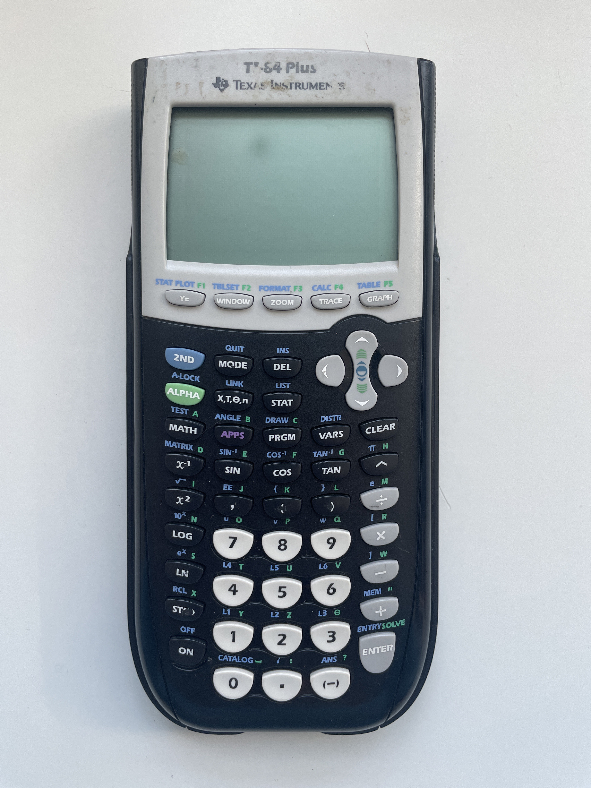

- #100DaysToOffload/ideas
	- Recognize and communicate themes like second nature.
- #100DaysToOffload/ideas
	- VIM keybindings tutorial
		- ai generate tutorial
		- vim tiptap
- #100DaysToOffload
	- I have learned about a number of programming languages over the years. Here is a brief history from what comes to mind:
		- C Basic
			- Formally learned this freshman year of high school, coding on the TI-83 calculator.
			- 
			- Coding in a resource constrained environment made you think creatively about how you could make something happen. Many were turned off by programming because it was just difficult to enter in the code, let alone debug when there were errors.
			- There were not many opportunities to get instant feedback for making something interesting happen as opposed to building websites.
		- Scheme/Dr. Racket
			- A brief stint here but I didnt really understand what was going on. I remember cons and the other one. Too many parentheses.
		- Java
			- Learning this language in the context of AP CS meant that I had put up with doing things I felt were stupid like writing code by hand. Over the course of the class I realized just how transformative this practice was. Fully developing code in my head and “running it” without the help of a computer meant that you had to really know what you were doing.
			- Seeing what this language was capable of doing was pretty eye opening. The syntax was hard to parse at first, even the hello world is pretty insane, but gradually getting a handle for how static typing worked ended up not being a big deal. I greatly appreciated the auto complete tooling that existed, even in its rudimentary form in Eclipse. Being able to use the debugger to trace problems down to the byte when running was very useful.
			- I also took a mobile applications class where we were programming Android apps, which meant getting to experience Java from an entirely new perspective. The Android SDK is such an extensive library that you are essentially learning a language within a language. You aren't required to learn new syntax since it is still Java, but all of the classes, methods, and idiosyncrasies were entirely new. Interesting to think about.
			- Analysis of algorithms was a more comprehensive look at algorithms than any college class I took. I really enjoyed being pushed in this class and programming assignments were the perfect level of challenging and interesting for me. Being exposed to this way of thinking about problem solving was pretty cool.
			- Android at Uber
		- C
			- Arduino for robotics.
			- More exposure to resource constrained environments.
			- I would learn C primarily from the perspective of security reading source code. My ability to hold a lot of code in my head increased greatly.
			- Programming languages class
		- C++
			- Shared library at Uber
		- PHP
			- Wrote a website for Northrop Grumman and got exposed to shipping production code.
			- Also, I was indoctrinated into the cult of VIM here and it changed my life.
		- HTML/CSS/JS
			- Interned at UMD writing a small website for learning things Khan Academy style.
			- Web App for northrop grumman.
			- CTF website in high school
			- Computer team website
		- Python
			- Hackathon web app in django. Really fun experience. Worked with a professional developer and he was so helpful.
		- Swift/Obj-C
			- Uber
		- JS/Typescript
			- LunaSec
		- Go
			- Uber
			- LunaSec
	- I started writing this today thinking I would cover all the major classes/projects I worked on that made me the programmer that I am today, but dang there are so many! This ended up being more of a list of things that I worked on as they came to me and maybe some observations I have about how those experiences influenced me.
	- Looking at what I have written down, the major points in my life that have influenced my programming have been: high school, Uber and LunaSec. I think it would be a good follow up post to this to start with these sections and break them down.
- #cafe #dc #coffee https://maps.app.goo.gl/17ERwSiWffF1ahC37?g_st=ic
- #coffee
- #sketch 
	- 