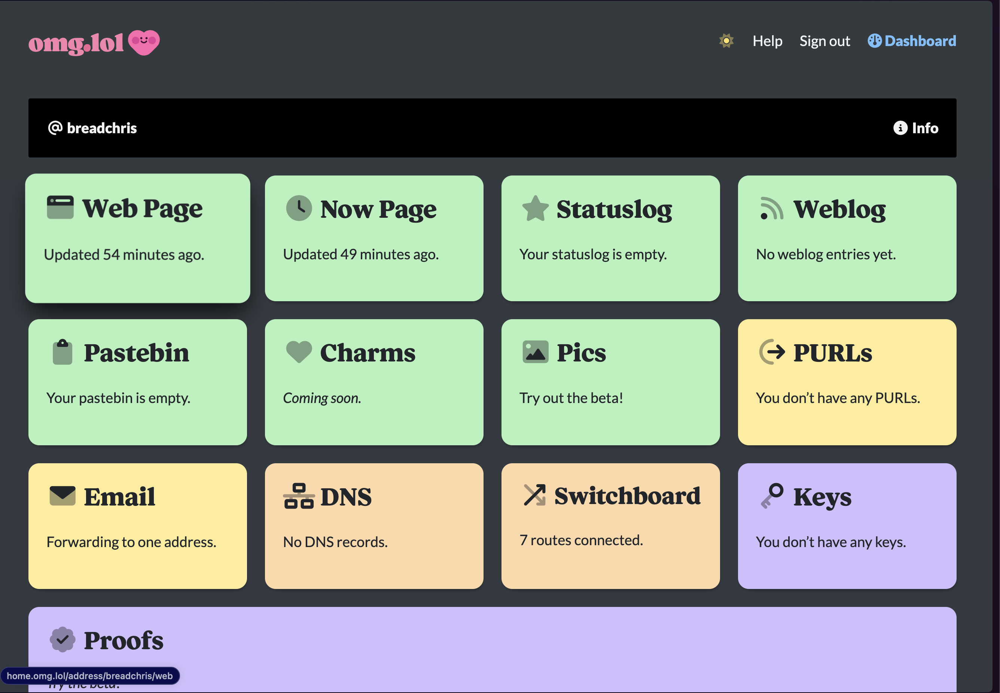

- #100DaysToOffload
	- What is something that I can build that I can get 10 people to pay $20 for?
		- I am pretty high now, lets see if I can get to this one later.
		- ok im back.
		- So I was checking out this site: https://omg.lol and I just paid $20 (a year) to check it out. Maybe this is too high for the service, but there are a lot of tools that I could see myself using. I think the UX could be a little more interesting, but the tools are cool. I could continue to develop #lunabrain and morph it into something like this.
		- I love how cute this tool is and I think if you should people enough examples of cool things being built with it, people will have FOMO. Maybe I let the first n number of users in for free (via an invite system like [lobstres](https://lobste.rs/)) (I get final approval of anyone that gets in initially).
		- 
	- I have wondered about how Steve Jobs to be so influential, so I asked ChatGPT
		- https://chat.openai.com/share/5124dfc9-90ab-4281-b4cc-814f49d65038
		- [Steve Jobs by Isaacson, Walter](https://omnivore.app/me/steve-jobs-by-isaacson-walter-18cd7db5402)
	- #highthinkies
		- -- warning --
		- if you choose to read this, do not expect content that sounds like it is coherent. I assure you, this is just a straight stream of consciousness.
		- I might go out of order when the content comes in (since my brain thinks asynchronously with information coming out)
		- Endless stream of informational content
			- So I just had a hot take on TikTok.
		- WebRTC is dead, long live WebTransport
			- 
- #lunabrain/work
	- #lunabrain/wants I want to be able to have a "run code" button in chatgpt
	- Write me a typescript react tiptap extension that opens a website in an iframe and then lets the user take a screenshot of it.
	- ```typescript
	  import React, { useRef } from 'react';
	  import { useEditor, EditorContent } from '@tiptap/react';
	  import StarterKit from '@tiptap/starter-kit';
	  
	  const IframeExtension = () => {
	    return {
	      name: 'iframe',
	      addOptions() {
	        return {
	          allowFullscreen: true,
	        };
	      },
	      addCommands() {
	        return {
	          insertIframe:
	            (options) =>
	            ({ commands }) => {
	              return commands.insertContent({
	                type: this.name,
	                attrs: options,
	              });
	            },
	        };
	      },
	      renderHTML({ HTMLAttributes }) {
	        return ['iframe', mergeAttributes(HTMLAttributes)];
	      },
	    };
	  };
	  
	  const MyEditor = () => {
	    const editor = useEditor({
	      extensions: [StarterKit, IframeExtension()],
	    });
	  
	    const iframeRef = useRef(null);
	  
	    const handleScreenshot = () => {
	      // Implement screenshot functionality here.
	      // This is a non-trivial task due to cross-origin restrictions.
	    };
	  
	    return (
	      <div>
	        <EditorContent editor={editor} />
	        <button onClick={() => editor.chain().focus().insertIframe({ src: 'https://example.com' }).run()}>Insert Iframe</button>
	        <button onClick={handleScreenshot}>Take Screenshot</button>
	      </div>
	    );
	  };
	  ```
- #lunabrain/ideas
	- "Based on what you journal, here are some blog post topics you could write about:"
		- Link to content that I journaled about
		- post title
			- different formats of title
			- different "tones"
				- educational
				- white paper
				- informal
		- generate a draft?
		- discover content to write about
			- record your thoughts
				- journal
				- audio
			- look at youtube history
			- look at hn history (high signal websites)
			- look at blog posts titles
			- look at tweets
-