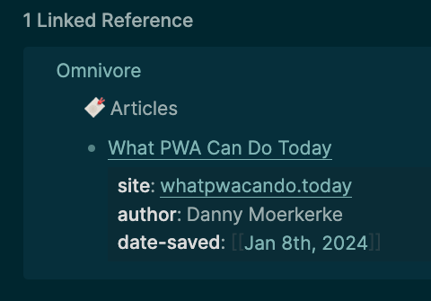

- #lunabrain/work
	- #lunabrain/wants I don't want to reinvent a note taking system. I want to take sources of things, like my notes, and then synthesize observations into published works.
		- It might be that I have some of my notes
		- I want to be able to capture an idea as effortlessly as possible and share it with others.
		- A more robust note taking system is for interconnected ideas.
		- A simple capture tool is for short, linear topics. It is not for making novel connections.
	- it seems like you should be able to start tracking content via lunabrain
		- lunabrain can send posts somewhere to be stored, such as a page in logseq
	- For the current day, I want to add a 100DaysToOffload tag to logseq from lunabrain
		- it should work like how omnivore works
		- 
		- saved as its own page
	- Added post form for metadata
- #blog