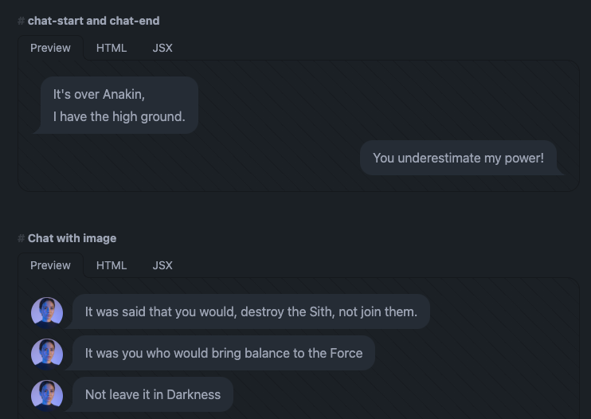

- #lunabrain/wants
	- i want to effortlessly record and transcribe audio on my computer
- #lunabrain/work
	- I want to build a chat
		- what is the simplest way to build a chat?
			- Go as the backend
				- In charge of storage of data
					- don't need this for chat to start, persistent storage is a nice to have
					- I want to think about this as a I code
				- Going to connect chatters together
					- People's browsers hit endpoints
					- data gets routed
					- we ain't even thankin about channels, servers, auth
			- JS as the frontend
				- Display the chats
					- https://daisyui.com/components/chat/#chat-start-and-chat-end
					- 
			- Protobuf as the glue between them
				- Connect rpc will gen js client code _and_ go server code
- #golang/libraries Write me a go function that walks the repo of a go application, parses every go file, finds cross references, parses and makes a graph
- #stream/notes
	- ​Any recommendations for an introduction to coding if I'm being self taught? im planning on taking the cs50x course but after that im not sure how to actually get into coding itself
		- https://www.freecodecamp.org/
		- https://www.startupschool.org/
		- https://www.amazon.com/Cold-Start-Problem-Andrew-Chen/dp/0062969749
		- https://www.amazon.com/Hackers-Painters-Big-Ideas-Computer/dp/1449389554
	- ​i think project based learning is way more valuable than reading books imo
		- Project based learning is "hands on"
			- which is sick!
		- You don't get crazy "depth"
		- project = breadth of experience, remember through different "senses" or ways of engagement, knowledge requires "materials"
		- books = long cohesive train of thought, it is easy to show a lot of ways of looking at something, what could go wrong "cheaply", knowledge costs as much as the book
		- ya need both, ya dingus!
		- response: ​Honestly? i think its the opposite, i'd say reading is breadth while PBL is depth. For me, PBL allows me to target my focus and learning on the things that are most important to me, while reading
			-
	- ​i'd like to point out that like how biology is the science of living things maths is the science of patterns. I strongly doubt you don't use any patterns.
-
	-