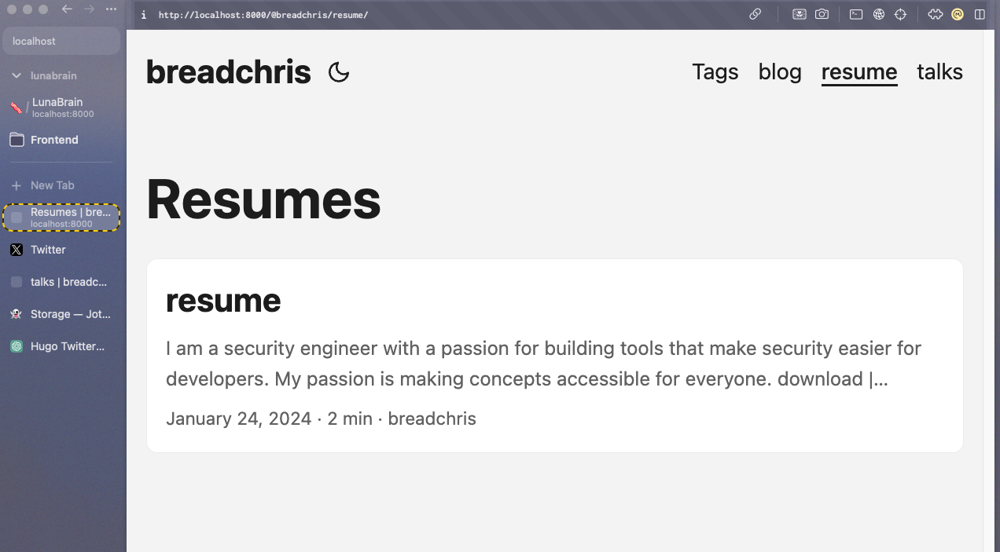

- #xctf/ideas
	- send money, get a floppy disk with game
- #stream/ideas
	- Lambda Calculus, Type Theory stuff
		- Currying
		- Types
	- Introduction to Elm
		- https://elm-lang.org/
		- exercises: [site](https://conversationengine.ddns.net/elm-intro/)
	- What does it take to implement a programming language?
		- How do you make a compiler?
		- What makes functional programming a good tool for this?
	- python function nwerc, perfectionism. [https://conversationengine.ddns.net/elm-intro/](https://conversationengine.ddns.net/elm-intro/)
- #lunabrain/work
	- able to generate site with pages that come from content
		- 
	- what if you replicated all classroom content from colleges?
		- dns enumeration