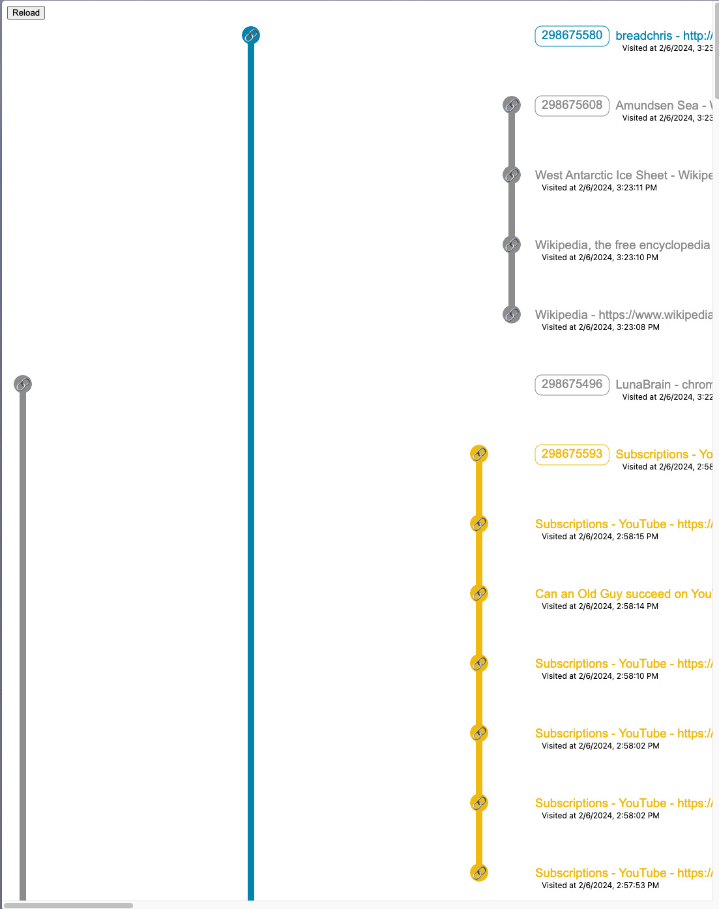

- #lunabrain/work
	- tab thing?
		- starts to lose meaning with too many tabs
			- 
		- I think the other view was on to something
		- want to get tailwindcss in the page so I can get tabs
		- when going from one tab to another, make sure the branch is working right
		- what insights do people want to see?