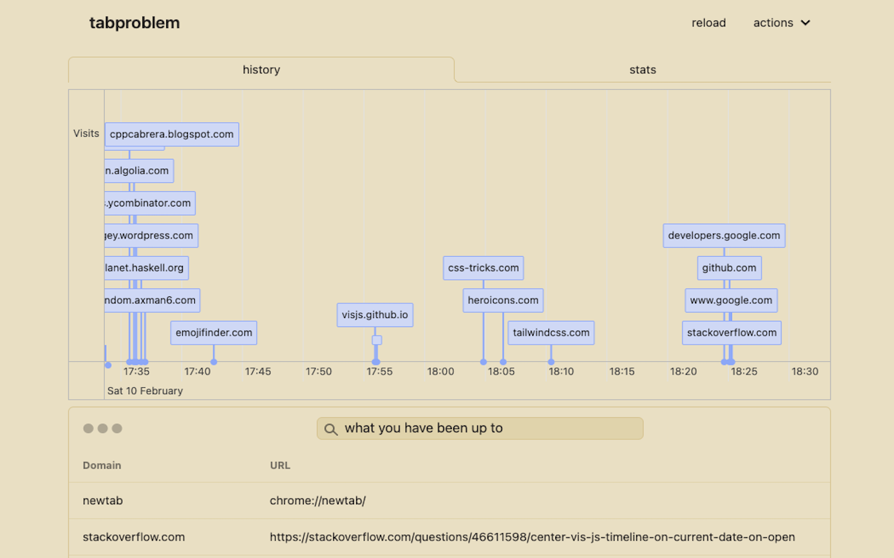

- #tabproblem/work
	- make sure focus sessions reflect when someone is actively engaging or not
	- weekly view
	- 
	-
- #replicate/producthunt
	- https://api.producthunt.com/v2/docs/rate_limits/headers
- #replicate/hackernews
	- https://github.com/alexferrari88/GoHN
- #books/writing https://www.amazon.com/Style-Clarity-Chicago-Writing-Publishing/dp/0226899152
- #books/writing Read books by Gary Provost on writing. Writing Tools by Roy Peter Clark. Draft number 4 by McPhee. They contain a variety of ideas. Writing Tools is great if you want to identify and drill techniques. Provost's books cover everything and are written well.
- #books/writing The Sense of Style