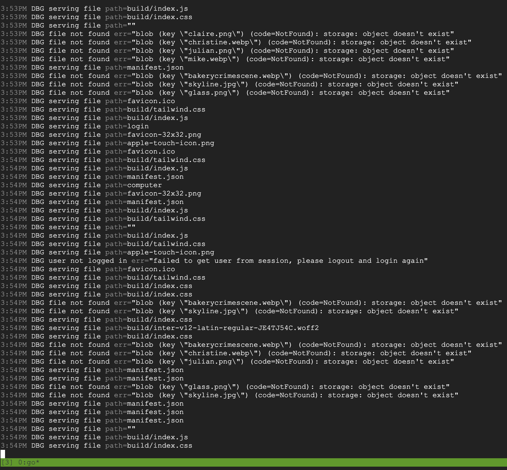
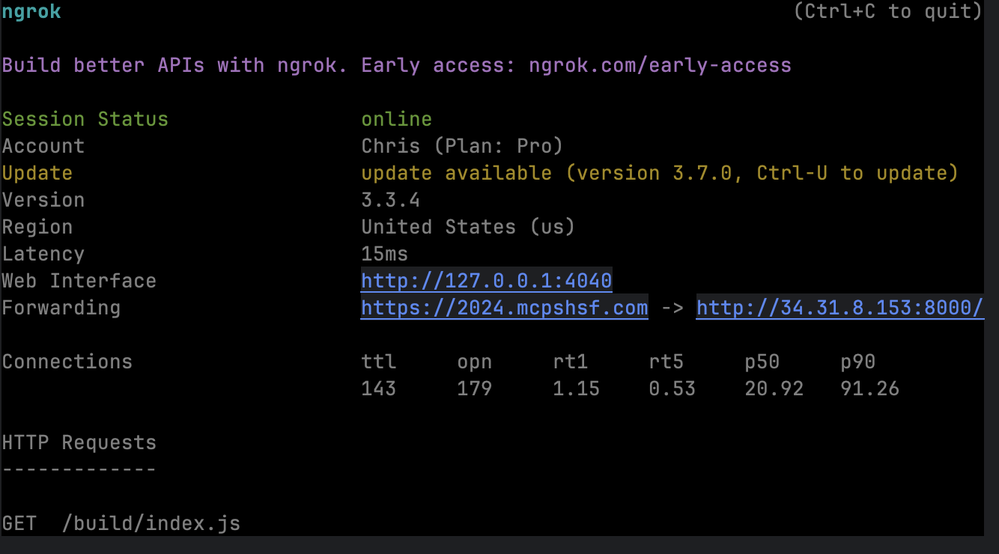

- #xctf/mcps/2024
	- running a competition
		- make a story
		- make evidence
		- 
		- put everything online
	- what happened?
		- a new system for putting things online
		- lots of people, lots of requests
		- 
		- website falls over
		- 
		- i need bigger computer
		- 
		- new computer, different connection, no security
		- 
		- need a domain with security
		- 
		- "website kind of works"
		- 
		- my laptop gets hot serving requests
	- how do you prevent this?
		- try to break your system beforehand
		-
-