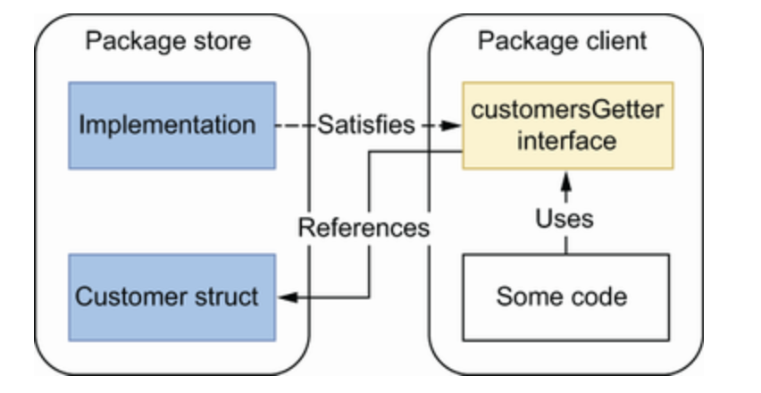

- #go/book Over using interfaces
	- Abstractions should be discovered, not created. In the case of a store and client, it is possible for the client to define the interface it needs an implementation to match on. If the store does not provide the methods that the client depends an implementation to have, then the code will not compile. This means that interfaces can stay lean.
	- 
	- This is unusual for people coming from traditional OOP languages because it is not possible to do this?