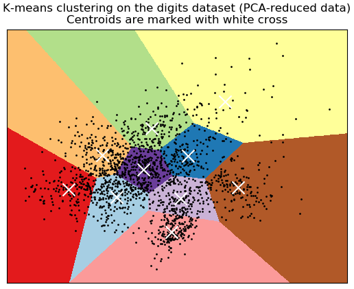

- how can reddit be better?
- "real reddit" old.reddit.com
- new reddit is horrible, horrible experience for everyone
	- company got too big
- https://old.reddit.com/r/pie/comments/z0ccsl/ive_painted_my_perfect_piece_of_pie_blueberry/
- polis
	- post "what do you think about gun control"
	- upvote downvote
	- core idea: graph how people vote on issue
		- [[draws/2022-11-20-19-01-26.excalidraw]]
		- https://en.wikipedia.org/wiki/Principal_component_analysis
		- 
		- artists upvote art, bakers upvote fruit
		- +1000 -1005 = -5
			- im sad
	- https://old.reddit.com/r/flashlight/comments/js82dw/uber_eats_driver_couldnt_find_my_address_had_to/
	- as a user, reddit is not returning on the value that I have put into it
	- https://www.vice.com/en/article/z4444w/how-reddit-got-huge-tons-of-fake-accounts--2
	- bernie was a grass roots movement, can't be used again in the same medium
		- bots come in
		- advertising companies use it up
	- tiktok https://www.reddit.com/r/videos/comments/fxgi06/comment/fmuko1m/
	-