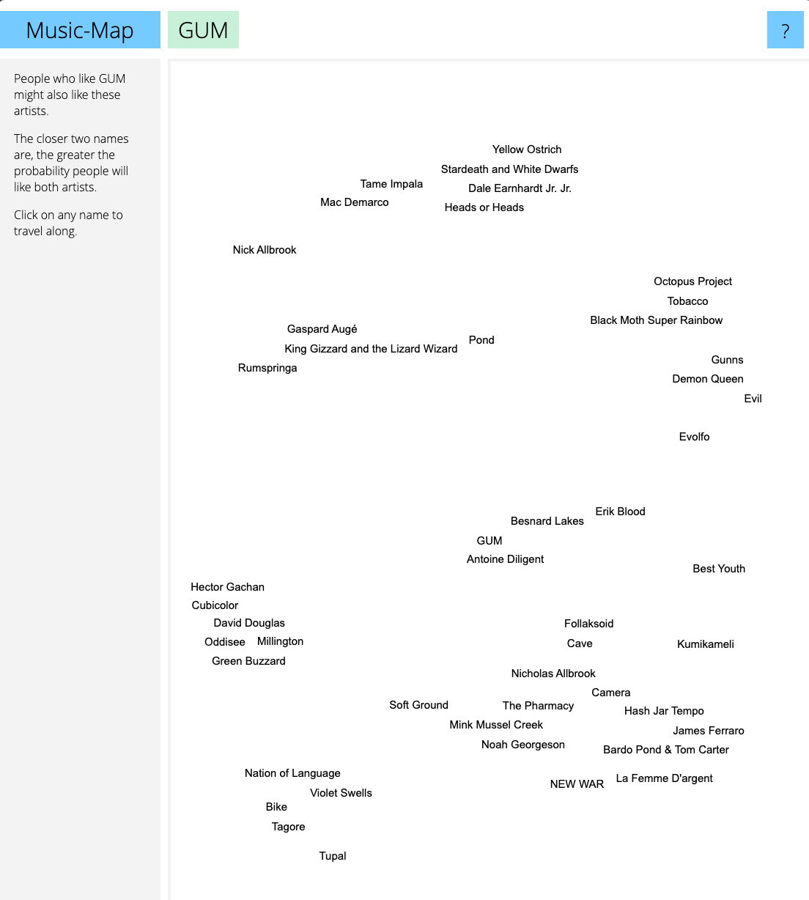

- Legos for Code
- "If you want a bathroom to keep working, someone needs to know where the shit goes." - breadchris
- "To me, ideas are worth nothing unless executed. They are just a multiplier. Execution is worth millions." - Steve Jobs
- This is what I have figured out so far
- LEGO was an idea
	- {:height 370, :width 182}
	- But there are other companies
	- 
	- What is the difference?
	- 
		- https://www.slideshare.net/HamdhanMohamed/lego-presentation-2018
	- Execution
- What makes LEGO different?
	- Innovation and Simplicity
	- {:height 230, :width 447}
	- Educational Value
	- {:height 248, :width 262}
	- Expandability and Flexibility
	- {:height 229, :width 276}
	- **Interactive and Engaging**
	- {:height 234, :width 399}
	- **Accessibility and Inclusivity**
	- {:height 306, :width 353}
- Simple
	- {:height 222, :width 186}
- Complex
	- {:height 222, :width 179}
- What about code?
	- Innovation and Simplicity
	- ```js
	  console.log( hello world )
	  ```
	- ```shell
	  npm i react
	  ```
	- {:height 290, :width 263}
	- Educational Value
	- ```python
	  if True:
	    print('it is true!')
	  else:
	    print('it is false!')
	  ```
	- {:height 255, :width 263}
	- Expandability and Flexibility
	- ```go
	  ```
	- ```typescript
	  type Winner = TicTacToe<`
	      X 1 1
	      O 2 2
	      X 2 0
	      O 0 2
	      X 1 0
	      O 0 0
	      X 1 2
	  `>;
	  ```
	- {:height 351, :width 278}
	- This is fun
	- {:height 330, :width 283}
	- This is fun
	- {:height 395, :width 276}
	- I think this is fun
	- {:height 219, :width 313}
	- Spend more time doing fun things vs the not fun things
- #conference/seagl/talk/ideas