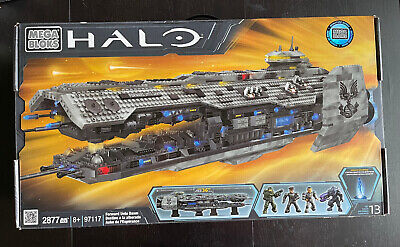
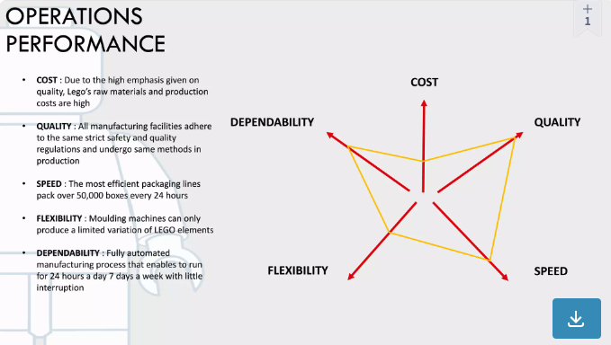
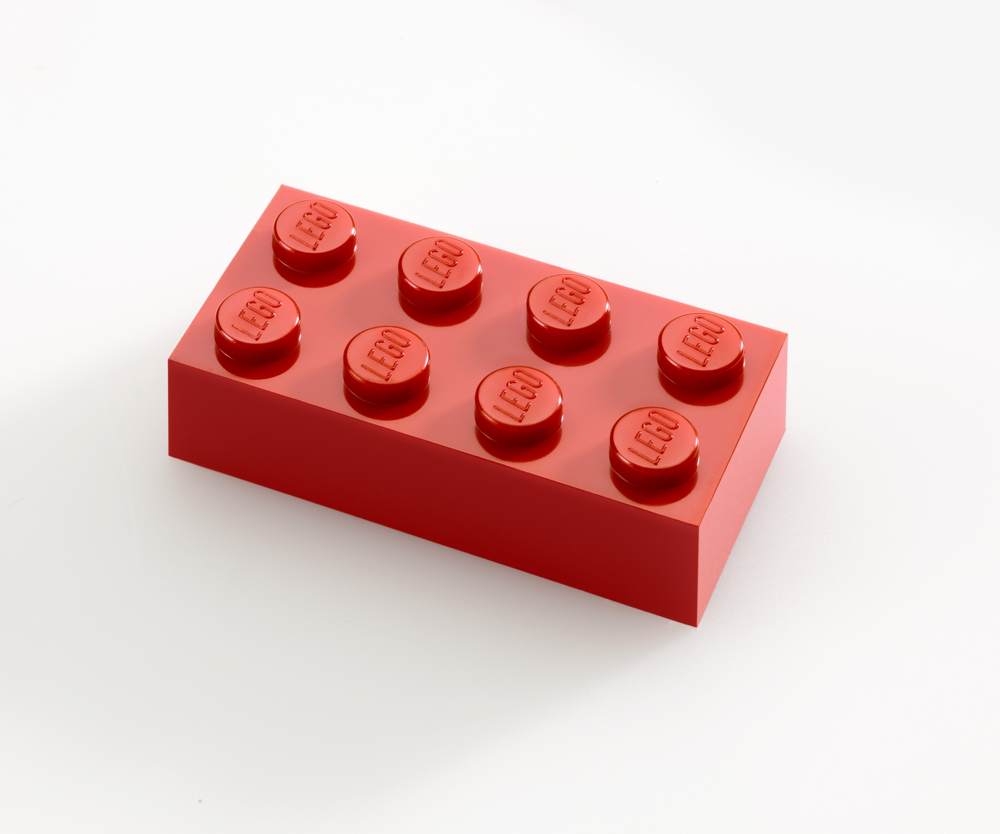
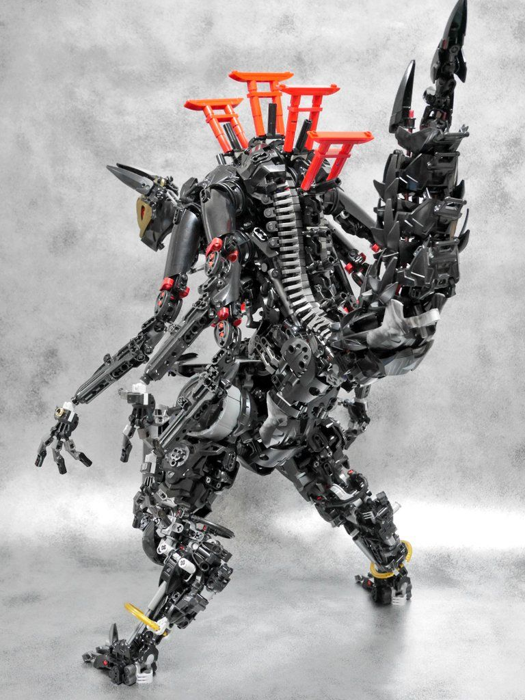
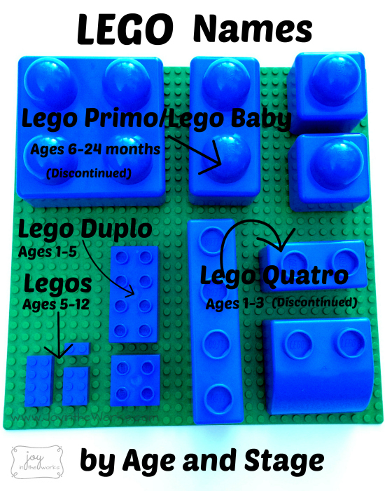
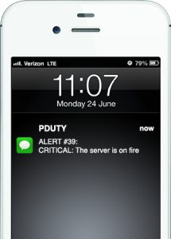
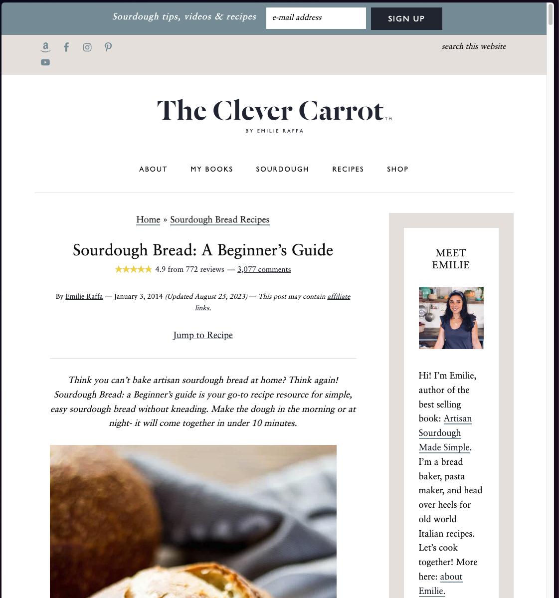
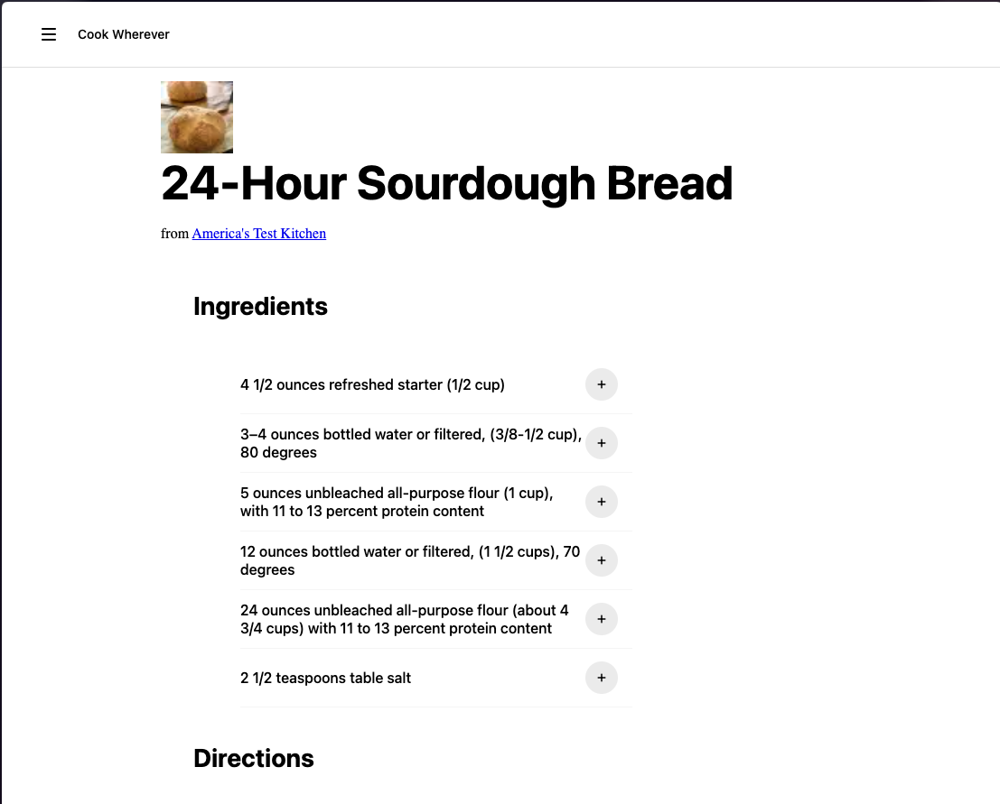
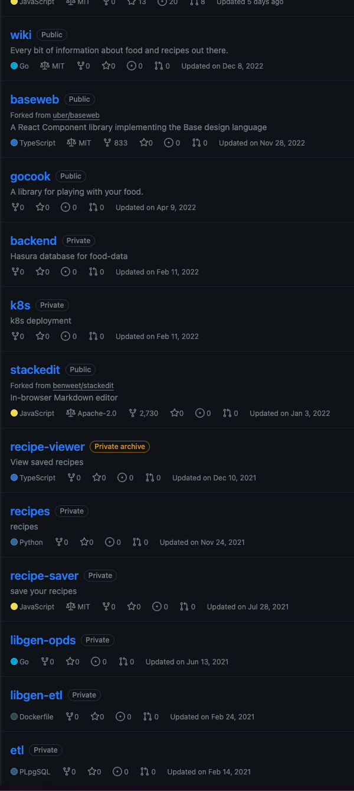

- Legos for Code
- "If you want a bathroom to keep working, someone needs to know where the shit goes." - breadchris
- "To me, ideas are worth nothing unless executed. They are just a multiplier. Execution is worth millions." - Steve Jobs
- This is what I have figured out so far
- LEGO was an idea
	- {:height 370, :width 182}
	- But there are other companies
	- 
	- What is the difference?
	- 
		- https://www.slideshare.net/HamdhanMohamed/lego-presentation-2018
	- Execution
- What makes LEGO different?
	- Innovation and Simplicity
	- {:height 230, :width 447}
	- Educational Value
	- {:height 248, :width 262}
	- Expandability and Flexibility
	- {:height 229, :width 276}
	- Interactive and Engaging
	- {:height 234, :width 399}
	- Accessibility and Inclusivity
	- {:height 306, :width 353}
- Simple
	- {:height 222, :width 186}
- Complex
	- {:height 222, :width 179}
- What about code?
	- Innovation and Simplicity
	- ```js
	  console.log( hello world )
	  ```
	- ```shell
	  npm i react
	  ```
	- {:height 290, :width 263}
	- Educational Value
	- ```python
	  if True:
	    print('it is true!')
	  else:
	    print('it is false!')
	  ```
	- {:height 255, :width 263}
	- Expandability and Flexibility
	- ```haskell
	  data Tree a = Branch (Tree a) (Tree a) | Leaf a
	  ```
	- ```typescript
	  type Winner = TicTacToe<`
	      X 1 1
	      O 2 2
	      X 2 0
	      O 0 2
	      X 1 0
	      O 0 0
	      X 1 2
	  `>;
	  ```
	- Interactive and Engaging
	- {:height 330, :width 283}
	- 
	- Accessibility and Inclusivity
- When is code fun?
	- When you get to see something happen
	- When you can take some data and make sense of it
	- When you can hand it to someone else and they can use it
- I want to help people have fun with code
	- I have taught at schools with scratch
	- I have seen how people code at Uber
	- I have some ideas about what it might look like
- What do I want to build?
	- Language
	- Framework
	- Developer tool
- Answer
- I don't know!
- Let's find out
- Some backstory, I like cooking
	- but cooking sites could be better
	- {:height 661, :width 511}
	- so i made my own
	- {:height 318, :width 536}
	- but it got complicated
	- {:height 736, :width 160}
	- why was it so complicated?
	- > It used to be the case that you needed to train to become a scribe to write words for any reason. But just as pens were taken out of the hands of the scribe during the Reformation of Europe, we must take the code out of the hands of software engineers and share it with the masses. - jzhao
	- Software engineers like to make complicated things
	- It is only code. Why does it have to be so hard?
	- ._1698116335357_0.png)
- {{video https://www.youtube.com/watch?v=FDiapbD0Xfg}}
-
- #conference/seagl/talk/ideas