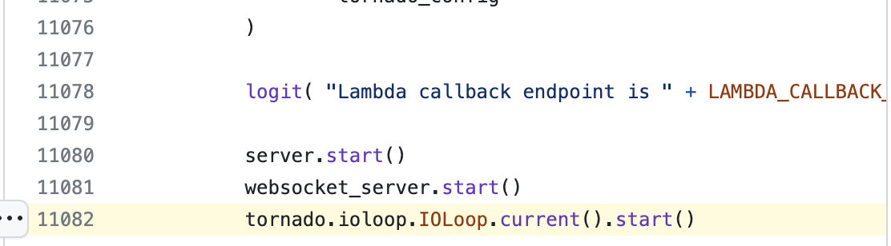

- it all started with a recipe site. when covid hit, i got super bored. I wanted to pick up a skill, and the past thanksgiving, I made an apple pie that was so good. so naturally as an engineer i went deep. I wanted to make the "perfect apple pie". Turns out my idea of perfect is something with a lot of ginger? Like we are talking spicy levels of ginger. My very white, suburbia family would disagree, but we aren't here to talk about pies (but totally follow me on ig @sogoodicouldpie, and hmu if you want one). Our story takes us to what I observed while trying to make pies. Scouring through recipe books for different pie recipes, I noticed that some books would use the imperial system and some would use the metric system. Some would use volume, some would use mass.
- If you know this secret about baking, good for you, but for those that don't I am about to change your life. If you want to make baking 10x easier, you go on amazon right now and buy a scale <insert link>. All you have to do is dump ingredients into a bowl until you see a number that is close to what the recipe is telling you. It is fantastic, it is amazing, you should do it, but also, you can't. If you are following directions from one of my favorite recipe sites, America's test kitchen, of course because it has "merica" in its name, we get our good ol' red white and blue imperial system. And even worse, they occasionally have volumetric units. So what does a programmer do when they see inferior/inconsistent data? We normalize. Turns out, this is quite a difficult problem. List of ingredients do generally follow some type of structure, but we need some ML to help us out. Fortunately, NYT has a project to do this, unfortunately it is archived. Fortunately mtlynch resurected it, and published a really cool blog series about resurecting a dead OSS project, if you are interested, I would highly recommend those blog posts.
	- https://github.com/nytimes/ingredient-phrase-tagger
	- https://mtlynch.io/resurrecting-1/
- So I first need the recipes, I can get those semi-legally? from the API/scraping the page I am on, I can normalize the ingredients, and I can get close. If the measurement is in oz I am good, but if it is volumetric I need some more processing. I am going to spare you the rabbit hole that this project became, but TL;DR I found the FDA database for nutrition facts, I can further normalize these recipes, but I had to build out this whole recipe normalizing pipeline, along the way, of course, there was scope creep and now this is what the database looks like.
	- https://fdc.nal.usda.gov/
	- https://dbdiagram.io/d/633fdc01f0018a1c5fb53234
- I promise this talk isn't just about my recipe site. I bring up this project because at this point I have rewritten this code 7, 8 times? Between the python scripts, javascript frontend, javascript backend, and now my dream of a future rewrite of this site in go, it has gotten out of hand. I have written and rewritten this project because
	- I was more of a junior application engineer at the start of this
	- wanted to use this project as a sandbox for trying different technology
- I wanted to play with things I would learn about like NLP or trying out different ways of displaying recipes. People dont want to read blog posts before they get to the recipe, let's make that simpler. Do people want to watch a video of a chef making this recipe while they cook? What does a grocery list feature look like? This seemingly simple project ended up exploding with features and complexity, which is really fun to play with.
- But holy shit is writing an application complicated. What happened to PHP? I guess django, rails, flask, aspnet still exist, but man those also kind of annoying in their own ways. Is it unavoidable that a web app framework is going to just kind of be annoying. Are there just too many things that
- If you haven't heard of htmx, I would highly recommend you check it out. It is a return to the ideas that the Internet was founded on and addresses the current shortcomings in html that set it back. I really like the book they have published because it reintroduces these concepts without saying they have the silver bullet to people's problems. There is a difference between a site and an app. There is a time and place for the React SPA and there is a time and place for an htmx application.
	- https://hypermedia.systems/
- This talk isn't even about htmx. This talk is about LEGOs. Does anyone remember spending a ton of money on these plastic foot destroyers? Maybe you still buy legos because they scratch an itch that nothing else really can quite scratch.
	- LATER picture of contest LEGO
	  :LOGBOOK:
	  CLOCK: [2023-10-21 Sat 15:07:05]--[2023-10-21 Sat 15:07:05] =>  00:00:00
	  CLOCK: [2023-10-21 Sat 15:07:06]--[2023-10-21 Sat 15:07:06] =>  00:00:00
	  :END:
- LEGO's founding principles
	- TODO
- LEGOs are toys that still attract an international fan base and range from young kids to adults. People build small "cars" with a couple of bricks all the way up to incredible feats of engineering all with the same bricks.
- LEGO was not always the "perfect" toy. There was a point in their history where they were hemorrhaging cash as they went through an identity crisis. Brand deals like star wars and harry potter did more harm than good for LEGO's identity. They had to sell LEGO land in europe to fix their problem. A kid who was dying of cancer ended up saving their brand with bionicle. It was a whole thing
- There is an unfair comparison between LEGOs and code and that is
	- the world isn't built on LEGOs, and more and more of it is being built with code every day
	- LEGOs are a premium, physical toy, code is either libre or impossibly expensive
	- But, how did LEGO just absolutely nail what a LEGO was almost a century ago??
- I think what I really want to study is how to make design decisions that have two attributes
	- Stand the test of time
	- Building things feels more like playing than working
		- Playing does not preclude things sometimes being "hard", but the underlying technology needs to _anticipate_ use cases and provide support when those are hit. There should _never_ be any unexpected behavior. It is undeniable how to use a LEGO, it will not lie to you.
		- Working is when you have to trudge through refuse of neglect because people before you could not have been bothered to build a better foundation. Typically the result of incentives being in the wrong place.
- What even is Protoflow?
	- To be honest, I don't really know.
	- I worked at Uber and got to see Cadence. A workflow orchestration system that was battle tested at Uber. The team forked it and started Temporal.
		- https://github.com/uber/cadence
		- https://temporal.io/
	- I worked at a startup building Refinery, a block editor for code and infrastructure, and it actually worked pretty well.
		- https://web.archive.org/web/20221206160058/https://www.refinery.io/
		- 
	- There was a lot of promise, but we ended up pivoting because we couldn't quite figure out a focus and who would pay for it. Also this:
		- https://github.com/refinery-labs/refinery/blob/eb49f75fab3515782ca30d85a335969d5545be45/api/server.py#L11082
		- 
	- Before pivoting, I moved the internals over to using Temporal, and it worked pretty well. The cobwebs were starting to become untangled, but it was too late.
	- We started building out a security product and ended up making a name for ourselves with Log4Shell
	- 
	- It was honestly pretty ridiculous what we ended up building. It was a SCA tool that was supposed to not suck (ehem snyk) and we built an npm replicator to determine if vulnerabilities that were being trigged on your repo were actually vulnerabilities. Turns out almost all of them arent (go figure)
		- https://github.com/lunasec-io/lunasec/blob/master/lunatrace/bsl/ingest-worker/pkg/metadata/replicator/npm.go
	- Once again, we couldn't figure out how to make money and we ended up pivoting. But I'll be damned if all along the way I was thinking about how we would have really have loved to have Refinery. We had built out all of this infrastructure in order to replicate, analyze, report, etc. and
	- It is actually a pretty funny story. I had a friend from college who was looking at hackernews back when we were building Refinery because they were looking for something similar
- You should look at my manic notes to try to capture how I ended up with protoflow sticking in my brain. I think
- There are some design goals that I want to work toward with protoflow
	- Enable seamless connection of gRPC methods to facilitate data movement.
	- Support free-formed data and data with loose or rigid schemas (JSON and Protocol Buffers).
	- Provide a composable function capability to transform data.
	- Offer abstractions for various types of resources, such as language services, blobs, docstores, RDS, and pub/sub.
	- Support development, staging, and production environments.
	- Encourage efficient local development by minimizing the reliance on virtualization.
	- Leverage existing tools and frameworks for deployment (e.g., Tilt) and production (e.g., Kubernetes).