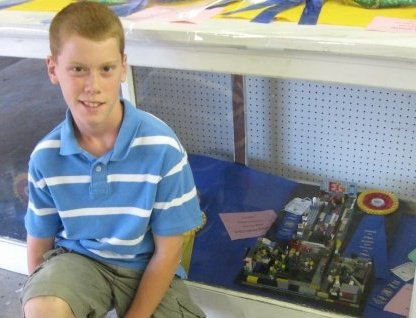
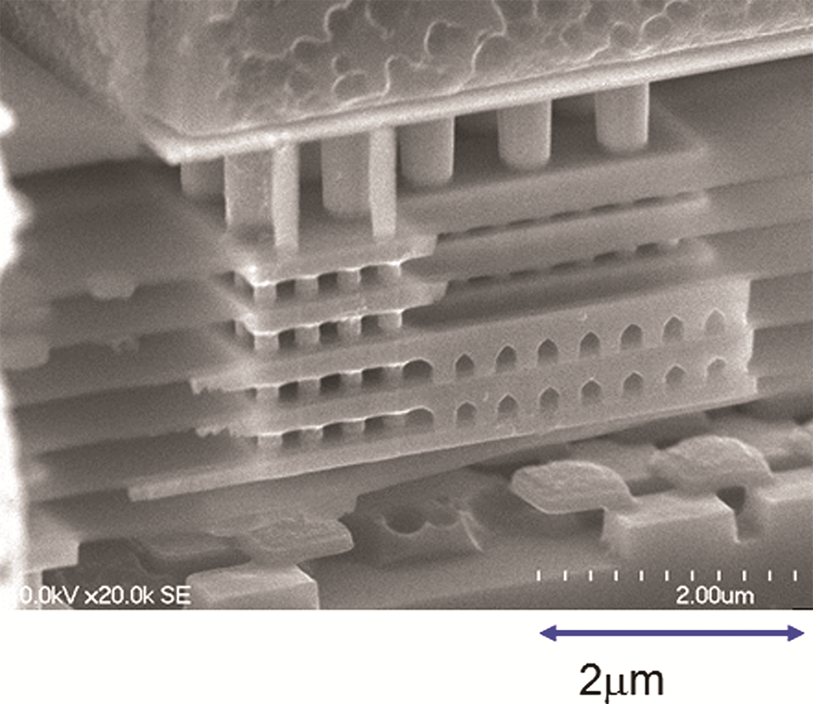
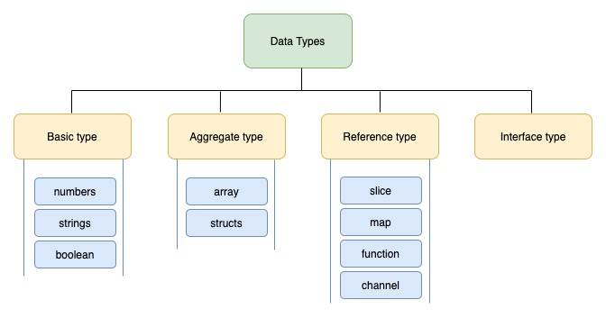
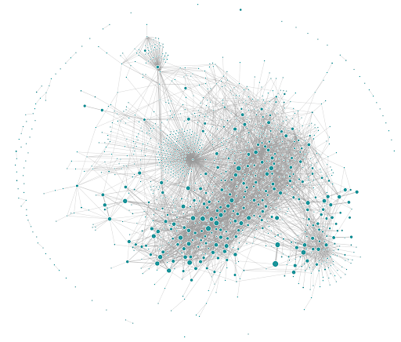

- How do you build LEGOs for code?
  
  breadchris
- I want coding to feel more fun.
- Like snapping LEGOs together.
- 
- Not like playing with Mega Blocks
- 
- I am part LEGO
	- "Automatic Binding Bricks"
	- The first LEGO set I ever had came from Mcdonalds
	- 
	- With a little imagination, it could be anything you wanted.
	- Few pieces became many possiblities
	- {:height 467, :width 641}
	- I wanted more
	- {:height 397, :width 650}
	- {:height 437, :width 713}
	- Each phase built on itself, with the same directions and rules
	- Pieces from sets were always accounted for
	- They always fit together
	- It was always fun
	- 
	- I got confidence to venture from set instructions
	- {:height 463, :width 689}
	- I loved LEGO
	- I did not like Mega Blocks
	- {:height 540, :width 572}
	- The "cheap" option
	- You can feel it when you hold them.
	- When you play with them.
	- Kids can tell the difference
	- The LEGO System means that: all elements fit together, can be used in multiple ways, can be built together. This means that bricks bought years ago will **fit perfectly** with bricks bought in the future… - Axel Thomsen (LEGO Manager 1956)
	- 
	- {:height 403, :width 713}
- What about code?
	- We don't drive cars made of LEGOs
	- ._1698758206431_0.webp){:height 402, :width 663}
	- The world runs on computers
	- and they have changed over the years
	- {:height 404, :width 713}
	- {:height 368, :width 682}
	- What are the LEGO bricks of a computer?
	- {:height 397, :width 655}
	- Machine language is effectively the CPU
	- {:height 471, :width 614}
	- Hardware is hard to play with (pun not intended)
	- {:height 447, :width 671}
	- We need something we can rearrange more easily
	- {:height 387, :width 524}
	- Cool if you want raw performance
	- ._1698824769076_0.gif)
	- Gets complicated pretty quickly
	- {:height 336, :width 508}
	- What about programming languages?
	- "Different tools for different jobs"
	- {:height 326, :width 575}
	- Can't we just have one language?
	- Maybe brainwashing will work
	- {:height 371, :width 682}
	- {:height 661, :width 393}
	- What if we make a mistake with the syntax?
	- {:height 436, :width 642}
	- What if the language changed over time?
	- {:height 397, :width 605}
	- At some point you have to commit to a blueprint of a design for a *network effect*.
	- Where can we look to for guidance?
	- {:height 358, :width 562}
	- 
	- Unix Design philosophy
	- Write programs that do one thing and do it well.
	- Write programs to work together.
	- Write programs to handle text streams, because that is a universal interface.
	- {:height 460, :width 713}
	- {:height 327, :width 655}
- Learn a mental model, not a language
	- Languages shape the way that we approach problems fundamentally.
	- Anticipate our needs.
	- 
	- 
	- Linter rules and compiler checks guide us.
	- 
	- What if a language was so simple that there are not that many pitfalls to begin with?
	- 
	- Go was developed by some smart people at Bell Labs, and later was refined at Google to solve its realtime, world-scale problems.
	- The language prioritized simplicity above all else which has led to a lot of interesting effects.
	- You can _always_ see the underlying code because all modules are just git repos.
	- 
	- Go blog posts teach you a mental framework.
	- {:height 418, :width 702}
	- There are a lot of tools for "anticipated needs".
		- go run
		- go test
		- go mod
		- go bench
		- go fmt
		- go build
	- These are usually 3rd party libraries you need to "be in the know" about for your language.
	- The type system is meticulously simple.
	- 
	- I am not trying to convince you to use Go.
	- Go has just taught me a lot about what good code should _feel_ like.
	- LEGOs have simple, rigid plastic connectors.
	- You have to play by LEGO's infallible rules in order to compose them together to build something
	- Consider the language/s you use daily, weekly, monthly, do they feel fun to play with?
	- When are they frustrating?
- Types are the foundation
	- Types are a way to communicate intent.
	- A programmer defines their intent to the computer, the compiler/runtime holds them to that.
	- Types help others who want to play with the code. (including your future self)
	- If types are too simple, they don't convey enough.
	- 
	- if they are too complicated, they become incomprehensible.
	- 
	- 
	- Protobuf is type system that has been refined over the past couple of decades at large tech companies.
	- You can build the frontend while I build the backend.
	- 
	- I don't even need my code to be fully written!
	- GRPC is a life saver with thousands of microservices.
	- 
	- It is not enough to just see and understand the types, you also need to use them.
	- Protobuf has type compilers for most major languages.
	- 
- Transforming Types
	- After understanding what type of data is available, we need to "connect" it to other systems.
	- 
	- Workflows are the back bone behind any company.
	- 
	- Typically, workflows are for schlepping around invoices or track status on plane engine parts.
	- 
	- A lot of code ends up being a workflow management system.
	- I saw Cadence (now Temporal), the workflow manager, scale to the size of the world.
	- 
	- But the workflows are expressed in code.
	- {:height 389, :width 651}
	- We communicate with whiteboard diagrams.
	- Physical arrows to show how data flows through the system.
	- {:height 537, :width 682}
	- How do we model that with a computer?
	- A lot of enterprise software is built with BPMN.
	- 
	- But it isn't that fun...because...enterprise.
	- Can there be something simpler, but still complete?
	- Category Theory? (Haskell is influenced a lot by this)
	- 
	-
- Protoflow
	- I tried to build this once
	- 
	- Wrong abstraction
	- 
	- But it started to feel like freakin' LEGOs!
	- You could:
	- Write (almost) any code, any language
	- Scale (Lambda)
	- Share blocks of code for others to use
	- pub/sub, database, storage
	- Protoflow is the continued effort.
	- It runs on your computer
	- {:height 460, :width 631}
	- Every code block is strongly typed
	- 
	- And it can run itself
	- {:height 448, :width 450}
	- Chain things together to make cool things
	- {:height 585, :width 179}
	- Maybe one day you could build entire web apps?
	- {:height 626, :width 243}
	- Soapbox
	- Protobuf and Temporal solved big problems for big companies
	- Smaller teams and projects need tools to scale
	- I want to give everyone a senior developer's brain
	- Simple service templates with batteries included
	- What if you had a library/service that let you build strongly-typed services, connected to each other with a durable workflow manager?
	- Auto-generated client code, with types!
	- Control the flow of data through out the system
		- Save data and replay it for testing
		- Trace data in production, replay it locally
		- Free metrics
	- LLM feedback??!!
	- Share your code with others
- Parting words of wisdom
	- Plumbers get paid a lot because pipes don't fit together easily.
	- If you want to be a data plumber, continue connecting pipes.
	- If you want to build LEGOs for code;
	- Write a library
	- Write a framework
	- Write a language
	- Build the LEGOs that the next generation of developers will build with.
	- If you haven't played with LEGOs, buy a set of LEGOs.
	- Chase that feeling with the work that you do.
	- We know good things when we see them.
	- History is great at showing us what things that "feel good" look like
	- I miss the Living Computer Museum
	- 
	- Go, go, go to the Connections Museum
	- {:height 505, :width 748}
- Thank you!
- I have some more stuff after this, for the curious
- 
- What am I going to do about it?
  collapsed:: true
	- Drink coffee at cafes
	- Think about code
	- Write some code
	- https://github.com/protoflow-labs/protoflow
	- Talk about code
	- https://www.youtube.com/@breadchris/streams
	- Write about code
	- https://breadchris.com/
	- Code some writing
	- https://github.com/lunabrain-ai/lunabrain
	- Talk about coding some writing
	- https://www.youtube.com/@breadchris/streams
- Cooking
  collapsed:: true
	- I don't play with LEGOs anymore, but I like to cook
	- I like to think of recipes as really just the composition of different recipes together to make something even more complicated
	- Peanut butter and jelly
		- Peanuts + blender = peanut butter
		- Stawberries + pectin = jelly
		- flour + water + yeast + salt = bread
		- bread + peanut butter + jelly = pb&j
	- We don't really write recipes like this though
	- Except for literally [Cooking for Engineers](https://www.cookingforengineers.com)
	- If I want to make cool things in the kitchen, I have to follow normie language for expressing recipes
	- But I can't unsee the building blocks, I _have_ to have something that speaks to this
	- What does it look like?
	- A language? I am not an expert, also I want to be able to send this to my mom
	- I want to make a recipe site that feels effortless to follow, regardless of experience in the kitchen, or with the last brain cell I have.
	- There are hard problems in software development, and building good looking websites is certainly one of them
	- Trying to rapidly prototype features in the site as I came across them in the real world was really fun, but also insanely frustrating
	- As a side project, there was no months of planning by an engineering team to discuss and agree upon the best way to build this. Changes came sporadically and were layered on top of my desperate attempts to try to get React to do the thing that I wanted it to.
	- After 7 attempts at trying to build it with countless different technologies, I arrived at an app that I still not happy with.
	- As a solo dev who isn't constrained by a deadline, this process was incredibly enlightening.
	- I had learned that "modern" recommendations on how to build a web application are insanely confusing and I frankly have no idea how any developer working on a site does their job. Seriously, mad respect
	- Any one of the 7 attempts I could have doubled down on to ship so that people could use it. But none of them felt right!
- Some real world examples
  collapsed:: true
	- Minecraft
	- Roblox
	- Heroku had with the [twelve-factor app](https://12factor.net/) they were on to something
- References
	- https://slideplayer.com/slide/17621474/
	- {{video https://www.youtube.com/watch?v=NVuTBL09Dn4}}
	- https://naich.net/wordpress/index.php/ever-wondered-why-plumbers-are-paid-so-much/