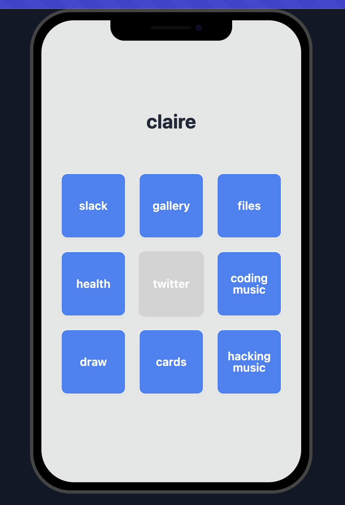
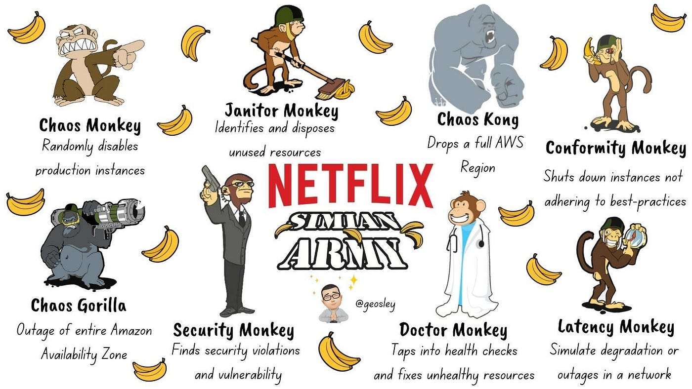
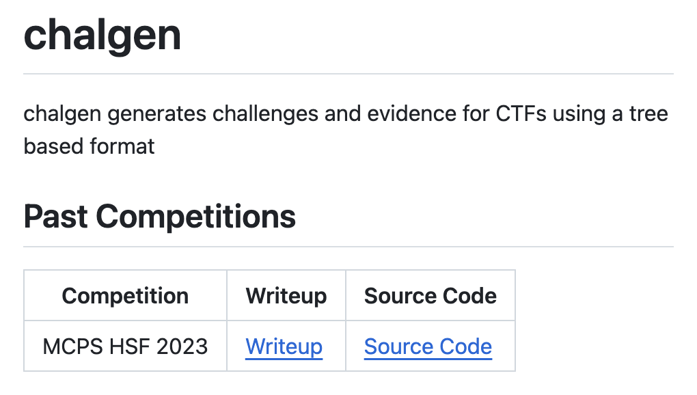
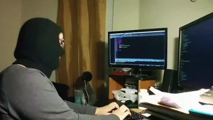

- mcphsf 2024 postmortem | how not to run a competition
  breadchris
- running a competition
	- make a story
	- make evidence
	- 
	- put everything online
	- 
- what happened?
	- a new system for putting things online
	- lots of people, lots of requests
	- 
	- website falls over
	- 
	- i need bigger computer
	- 
	- new computer, different connection, no security
	- 
	- need a domain with security
	- 
	- "website kind of works"
	- 
	- my laptop gets hot serving requests
- how do you prevent this?
	- try to break your system beforehand
	- 
	- have a fallback plan
	- {:height 264, :width 420}
	- "new" is not always better
	- 
- what's next?
	- https://2024.mcpshsf.com will be fixed in the coming week
	- mcpshsf 2025 will have these problems addressed
	- picoctf in the meantime
	- 