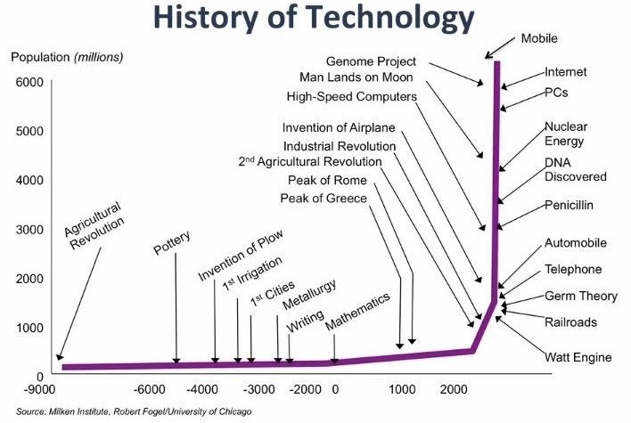
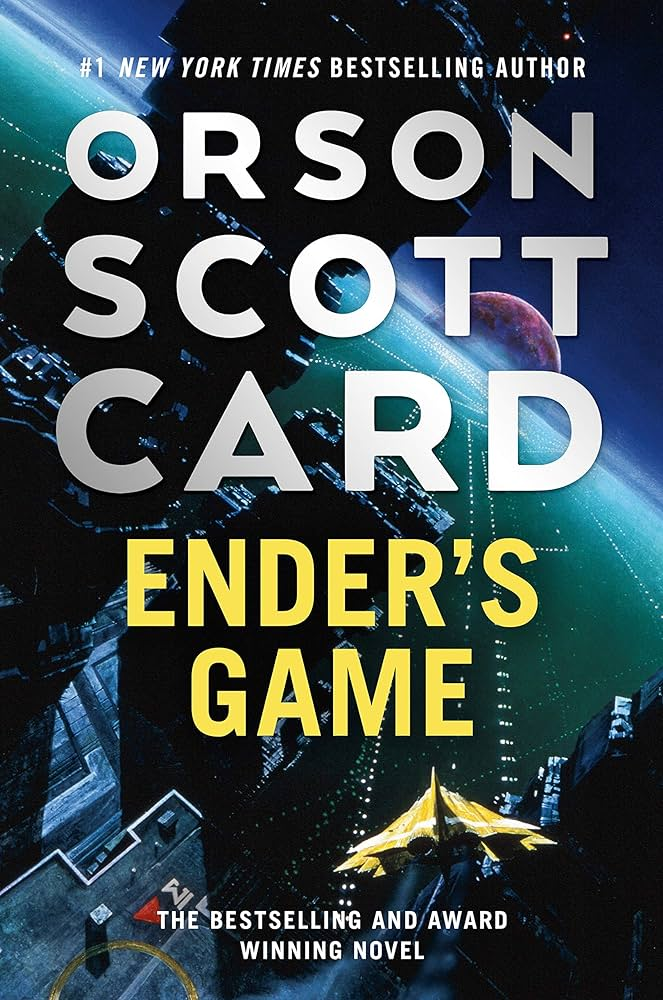
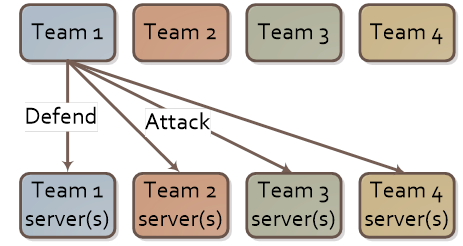
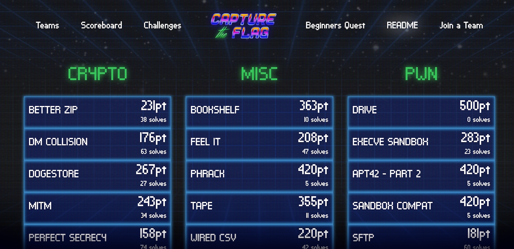
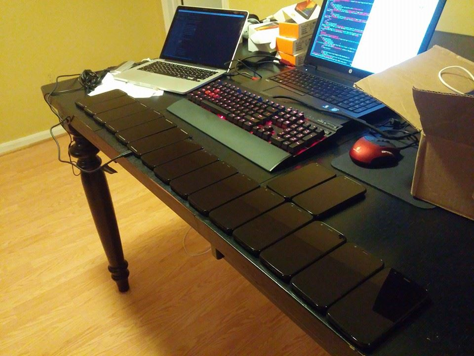
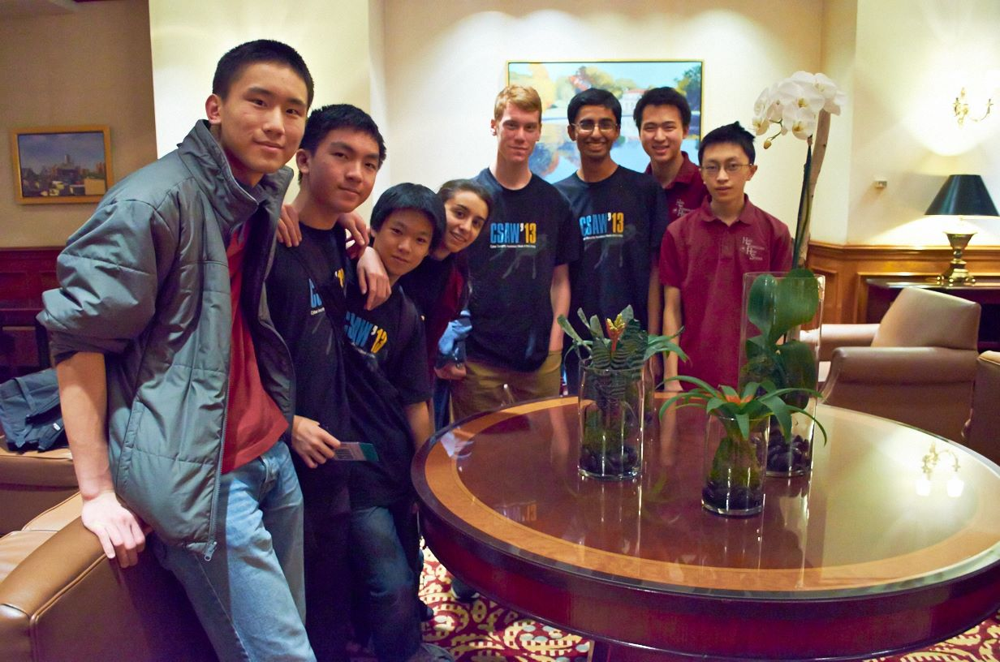
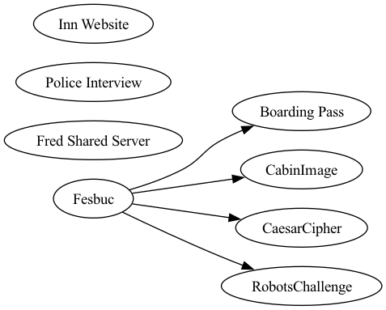
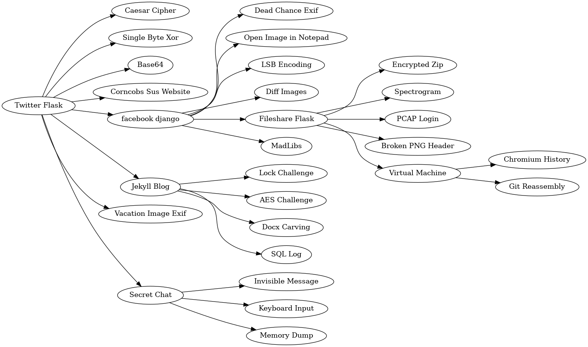

- How **you** can Build and Solve an NCIS-style, Cyber Forensics Murder Mystery
- What competitions do you know about?
- Do your students participate in any?
- How can games fit into and extend your curriculum?
	- a game does not _reliably_ teach concepts
	- it incentivizes learning
- Mongtgomery County Public Schools - High School Forensics (MCPSHSF)
	- https://mcpshsf.com
		- 2023 Walkthrough (Evidence map and 2-3 challenges)
		- flags and writeup to "stand in court"
		- analysis
		- communication
		- multiple choice _and_ free response
		- not just multiple choice
		- "Jeopardy" style
		- https://picoctf.com - Carnegie Mellon University (CMU)
	- History of MCPSHSF
		- 10 years of competing in NYU-Poly CSAW High School Forensics
			- 50 to 100 participants in online - only 1 team to finals
			- Montgomery College needed a competition
			- Chris / NYU  --- MC - MCPS
			- High School Students started their Professional network then!
			- College Students -- built and scored through collaboration with professionals
			- Problem: Scaling!
			- Solution: xctf  - with the goal to double participation next year!
- Solve...
	- https://nicek12.xctf.io
- View High School SuperTeam writeup
- Debrief
- Make your own!
	- story
		- ChatGPT
	- building challenges
- Code
	- https://github.com/xctf-io/xctf
- Another version of the presentation!
- Some history
	- security is still very new
	- {:height 390, :width 262}
	- "hacking" has still only recently been accepted
	- {:height 581, :width 273}
	- and so very few people really get this stuff
	- 
	- but it is growing
	- {:height 347, :width 532}
	- and games are at the center
	- 
- How do you teach this stuff?
	- inherently hard to teach
	- {:height 565, :width 357}
	- You can teach standards and protocols
	- {:height 444, :width 307}
	- But technology changes rapidly
	- {:height 396, :width 210}
	- And what do you focus on?
	- {:height 425, :width 562}
	- Historically you get certifications
	- {:height 304, :width 525}
	- Colleges sparsely offer courses, and even less majors
	- TODO
	- Millions of jobs go unfilled each year
	- TODO
	- Technology continues to grow exponentially
	- {:height 291, :width 534}
- What if instead of teaching, we played games?
	- {:height 434, :width 308}
	- Games teach in an imperfect way
	- You accept you will not learn everything
	- But you will learn _how_ to learn
	- Winning is the carrot on the stick to complete the game
- How do you play these games?
	- Attack and Defense
	- 
	- Most realistic to how hacking is done in the real world
	- Difficult to setup and run
	- Most popular format is: "Jeapordy-style" CTF (Capture the Flag)
	- 
	- Exposes competitors to many different technologies
	- Requires "deep learning"
	- But it isn't perfect...
	- Can be overwhelming
	- Encourages "pattern matching"
	- Notable CTFs for high schools:
	- [picoctf](https://picoctf.org/) -> CMU
	- [tjctf](https://tjctf.org/) -> Thomas Jefferson High School
	- Going from question to answer is like taking a test,
	- What if these games were easy to run _and_ emulated the real world?
- We did this at NYU
	- For many years
	- 
	- high schools from around the US would get flown to NYC
	- 
	- solve a murder mystery, with real world evidence
	- {:height 366, :width 603}
	- Competitors were Cyber Security experts for a trial and would submit their findings report to the judge
	- {:height 468, :width 528}
	- Judged by real DHS and Secret Service agents
	- finalists would get scholarship money
	- {:height 380, :width 622}
	- competitors would become creators
	- helped build cyber security programs at high schools
	- And all of this was done by student volunteers
- We ran this at a community college
	- 7 years
	- 200+ students every year
	- Everyone looked forward to it every year
- And now we are bringing it to the internet
	- [xctf](http://xctf.io/)
	- 365 cyber security education
	- All skill levels
	- Curriculum for teachers
- This competition matters a lot
	- A creative outlet for some really smart people
	- Inclusive
	- Opens career options
- The Story
	- core concept of the competition
	- cohesive
	- funny
	- open to interpretation
	- Do Now
		- Read
			- past year stories
		- Create
			- ai mad lib
- Challenges
	- Connected graph of evidence a competitor must move through
	- 
	- {:height 326, :width 561}
	- Do Now
		- solve a challenge
			- introduce the wiki
		- create a challenge?
- Grading
	- You are the judge
	- Does the "forensics expert's" report hold up in court?
	- Do Now
		- Write
			- document your evidence
			- write your conclusion
		- Read other submissions
			- https://mcpshsf.com/pdfs/b1c_HSFReport.pdf
			- Who got the most flags?
			- Who got the right conclusion?