- How you can Build and Solve an NCIS-style, Cyber Forensics Murder Mystery
- Some history
	- security is still very new
	- 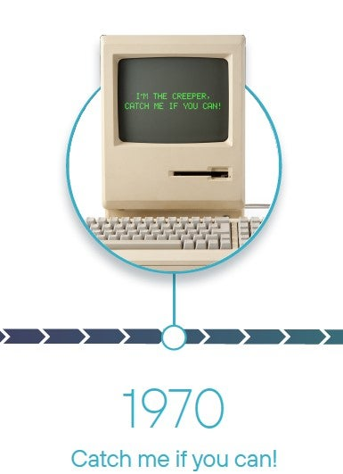{:height 390, :width 262}
	- "hacking" has still only recently been accepted
	- 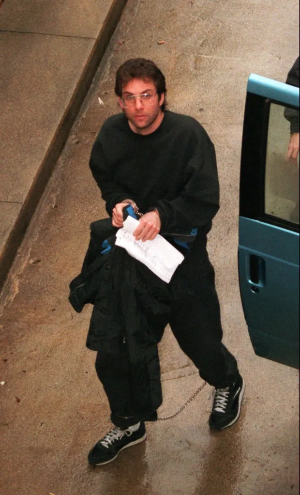{:height 581, :width 273}
	- and so very few people really get this stuff
	- 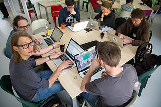
	- but it is growing
	- 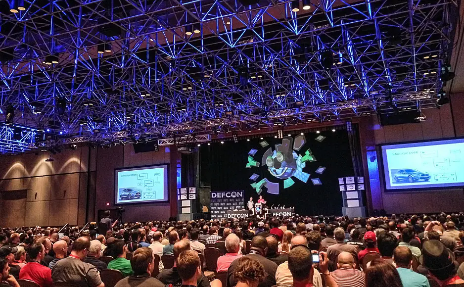{:height 347, :width 532}
	- and games are at the center
	- 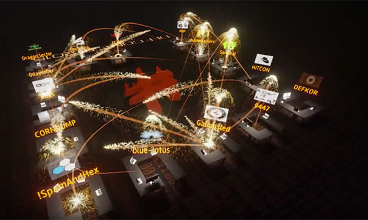
- How do you teach this stuff?
	- inherently hard to teach
	- 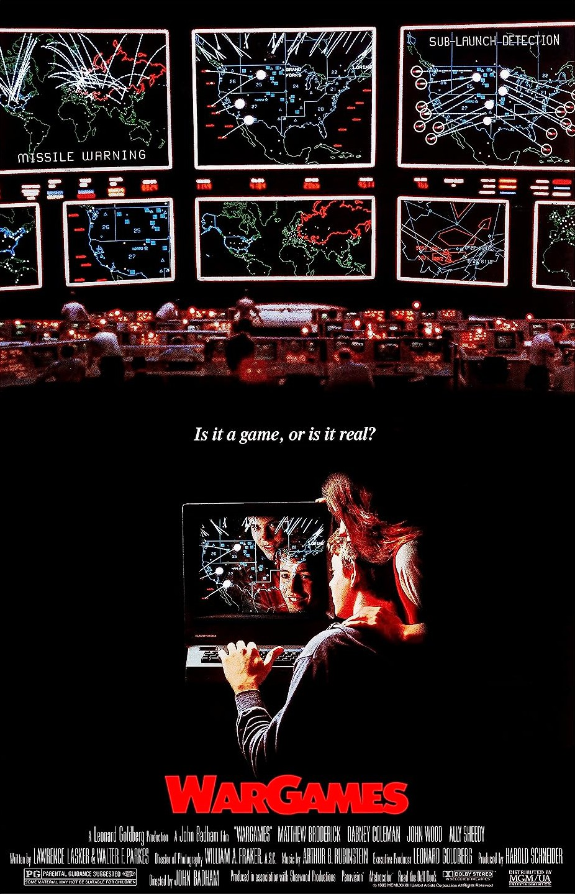{:height 565, :width 357}
	- You can teach standards and protocols
	- 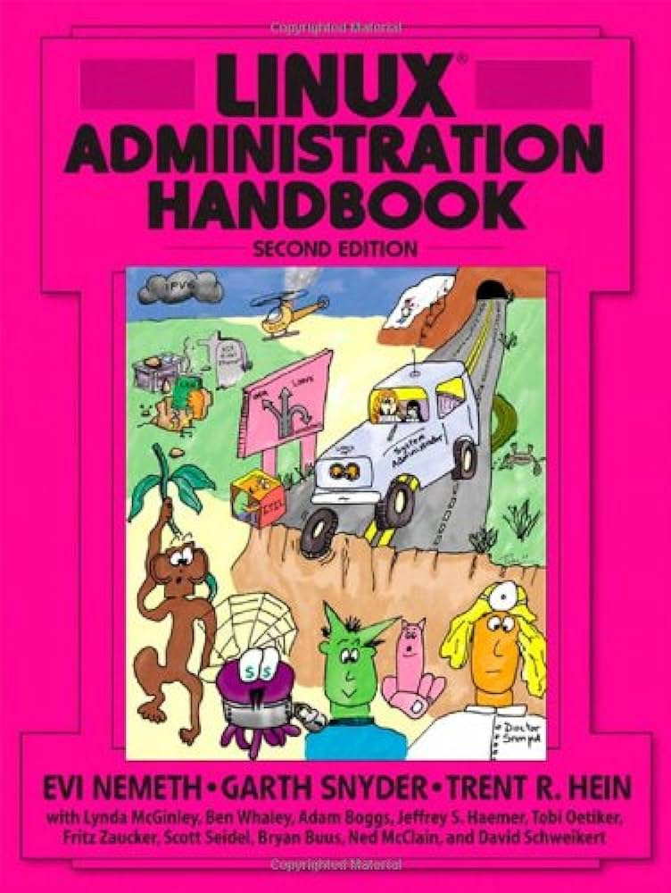{:height 444, :width 307}
	- But technology changes rapidly
	- 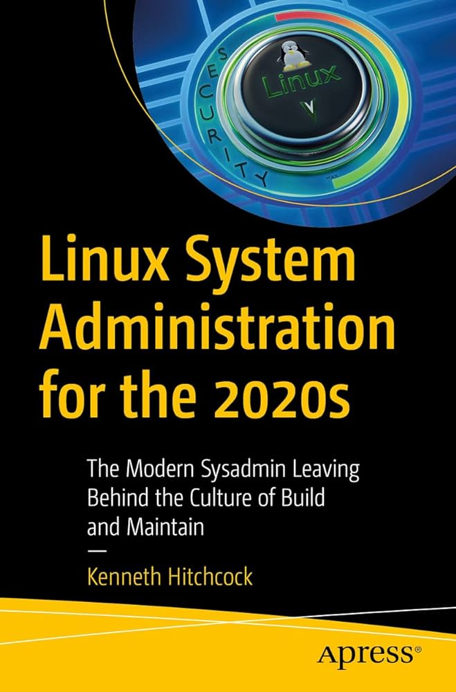{:height 396, :width 210}
	- And what do you focus on?
	- 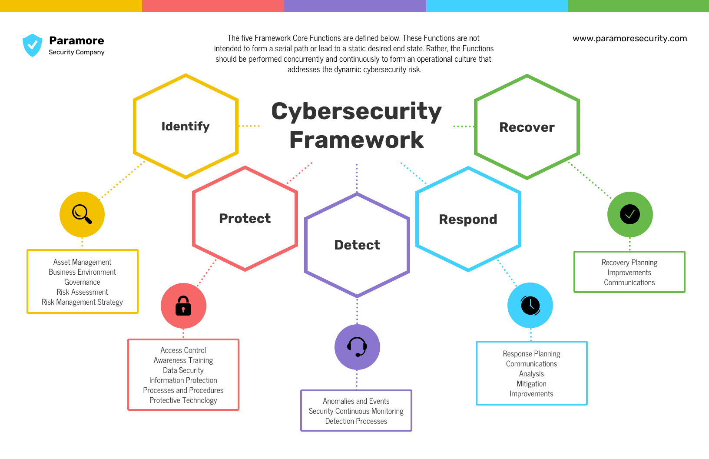{:height 425, :width 562}
	- Historically you get certifications
	- 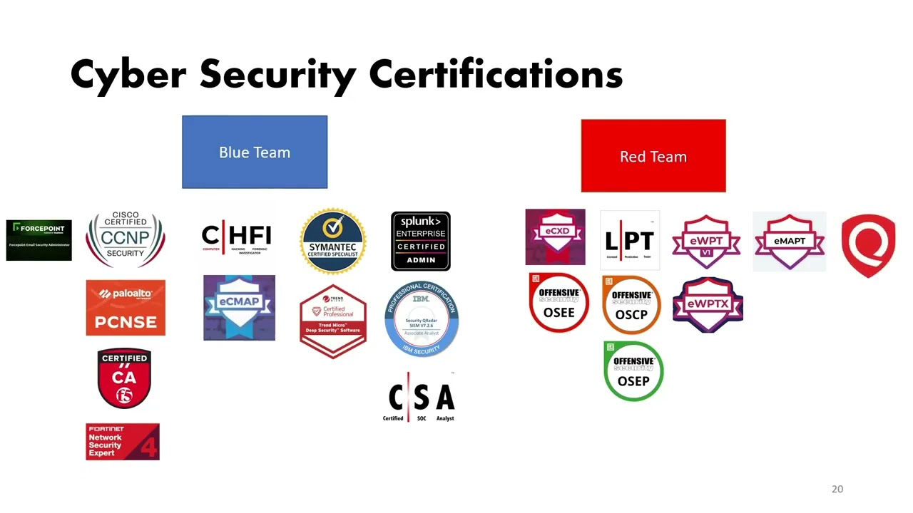{:height 304, :width 525}
	- Colleges sparsely offer courses, and even less majors
	- TODO
	-
- playing games
	- Games teach in an imperfect way
	- You accept you will not teach everything
	- You aim to teach _how to learn_
- cyber game styles
	- CTF
	- pattern matching
	- not inclusive
	- miss out on many practical skills
	- picoctf -> CMU
	- high school CTFs -> TJ
- what if hacking was just like the movies?
	- {{video https://www.youtube.com/watch?v=Vxq9yj2pVWk}}
- We did this at NYU
	- ran many for years
	- 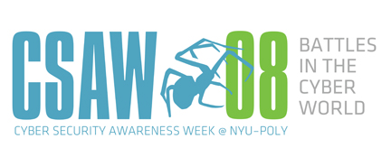
	- high schoolers from around the US would get flown to NYC to hack
	- 
	- student volunteers
	- competitors would become creators
	- helped build cyber security programs at high schools
	-
- MCPS
	- 7 years
	- community college
	- 200+ students every year
	- builds brand
	- student passion
- xctf
	- 365 cyber security education
	- curriculum for teachers
- The Story
	- core concept of the competition
	- cohesive
	- funny
	- open to interpretation
	- Do Now
		- Read
			- past year stories
		- Create
			- ai mad lib
- Challenges
	- Do Now
		- solve a challenge
			- introduce the wiki
		- create a challenge?
- Grading
	- you are the judge and jury
	- Do Now
		- Write
			- document your evidence
			- write your conclusion
		- Read other submissions
			- Who got the most flags?
			- Who got the right conclusion?