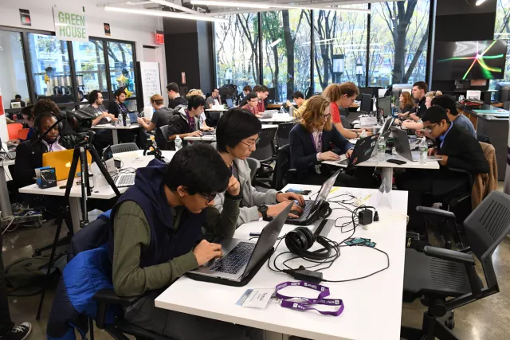
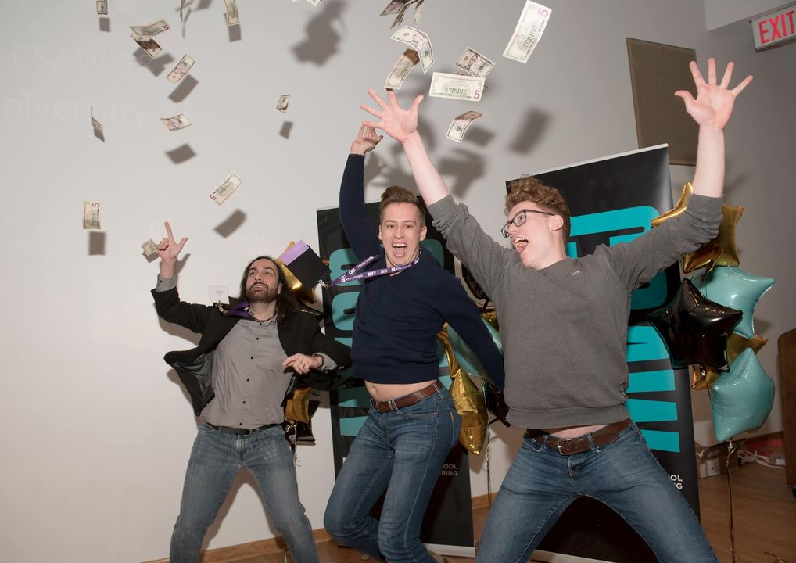
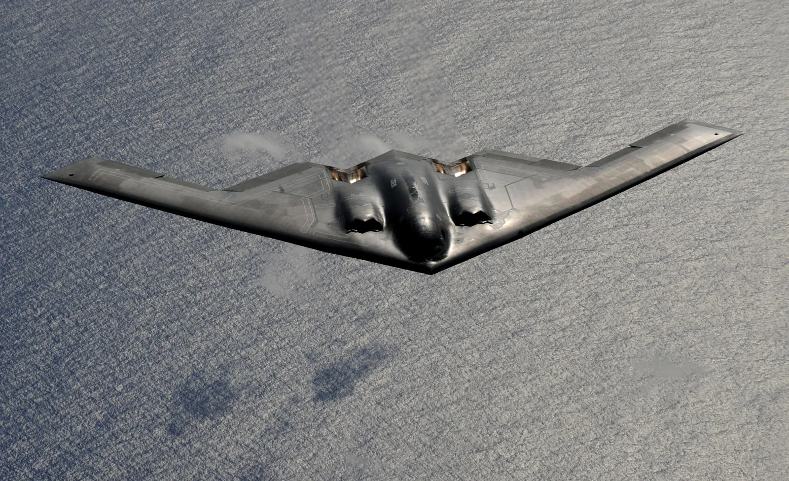
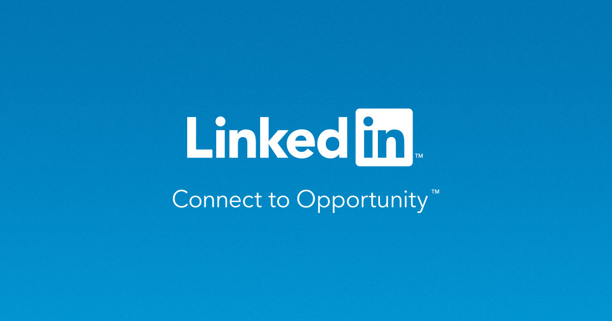
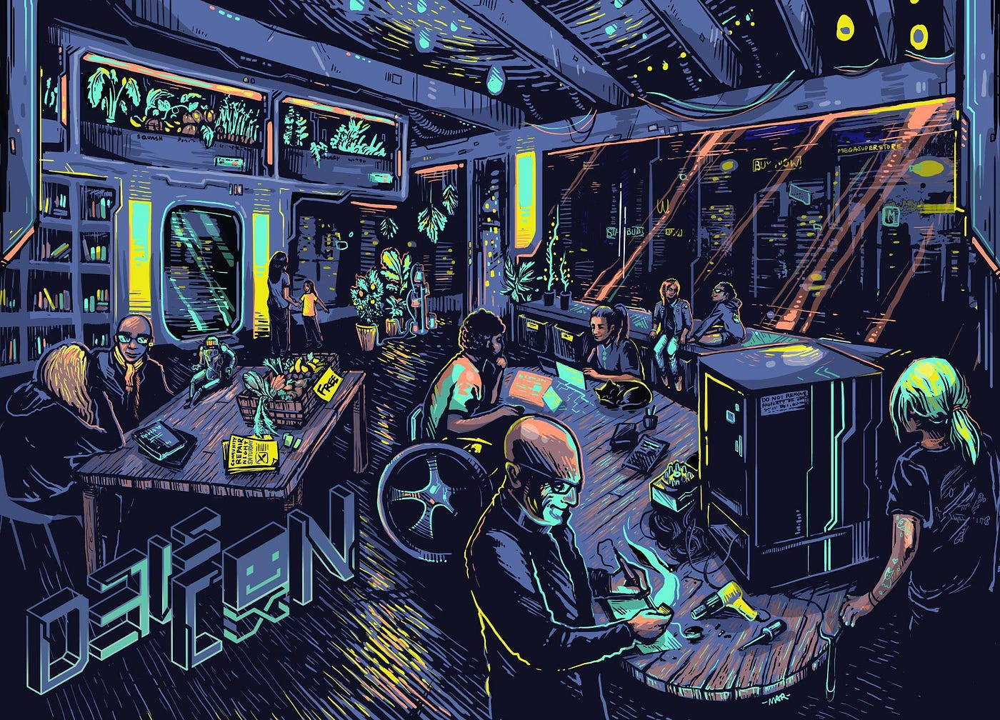

- Introduction to Cybersecurity
	- Personal story: Early interest sparked by high school competitions (CSAW HSF).
	- 
- College Journey
	- Joining a cybersecurity lab (OSIRIS LAB).
	- Engaging in Capture The Flag (CTF) competitions.
	- 
- Gaining Practical Experience
	- Internships at Northrop Grumman and BAE systems.
	- 
	- Real-world impact: Working on mobile security at Uber.
	- 
- Entrepreneurial Venture
	- Co-founding Refinery and developing LunaDefend.
	-
- Continuous Learning and Adaptation
	- Responding to the Log4j vulnerability.
	- 
- Networking and Community Engagement
	- Building and leveraging a professional network.
	- 
	- Go to conferences, make friends.
	- 
- Conclusion
	- Encouragement to pursue passion, continuously learn, and engage with the cybersecurity community​
- References
	- https://breadchris.com/pages/how-i-got-to-where-i-am/